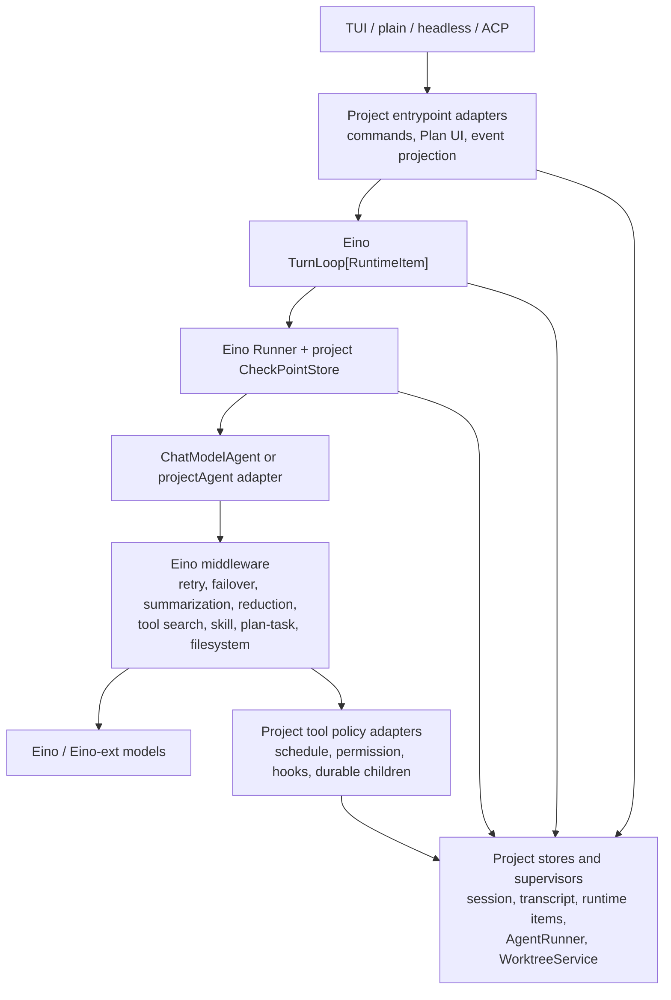
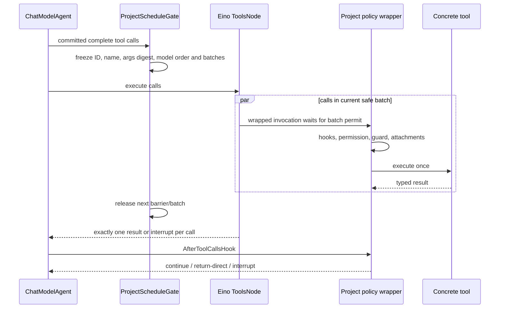

# P12-P21 Eino Lossless Replacement Design

**Status:** reference-snapshot
**Snapshot:** 2026-07-26; Eino-Agent master
`1dbfc13c2e39a370a035bc2be91326d1e2d3085c`; Eino pinned `v0.9.12`;
latest stable Eino `v0.9.13`
(`c5e6aef927cca02bea934541f8dff2ea711b2ca7`); Eino-ext main
`c9a5dc923462375b020ed7b2bbbbef9971d9ce6b`

> **Ownership:** this document is a source-backed replacement design and
> equivalence contract. It corrects the overly restrictive conclusion that the
> absence of a one-to-one Eino primitive prevents migration. It does not change
> current runtime truth or accept delivery order. Verified state belongs in
> [`migration/STATUS.md`](../../STATUS.md), confirmed unresolved gaps belong in
> [`migration/REMAINING.md`](../../REMAINING.md), and accepted execution order
> belongs only in [`migration/PLAN.md`](../../PLAN.md).

## Conclusion

Most of the current Query Loop mechanics **can be migrated to stable Eino APIs
without intentionally changing observable behavior**. The correct target is
not a wholesale replacement of every project contract and not a permanent
project-owned duplicate loop. It is:

1. let Eino own reusable run, turn, model, tool, middleware, checkpoint, and
   agent-composition mechanics;
2. express the project's stronger scheduling, permission, persistence,
   recovery, and product rules through typed adapters and middleware;
3. freeze observable traces before each cutover;
4. delete the old mechanical owner only after the adapter path proves
   equivalence.

The earlier wording that treated some of these areas as unsuitable for Eino
replacement was too broad. A stable primitive does not need to expose every
project rule as a first-class option. A lossless adapter is valid when it maps
those rules into Eino extension points while leaving one production owner.

There are still concrete non-overlaps:

- Eino does not implement Bubble Tea terminal delivery or TUI layout;
- Eino does not implement Git worktree identity, handoff, cleanup, or recovery;
- Eino does not implement a user-facing slash-command registry;
- Eino does not define this product's reviewed Plan approval and permission
  semantics.

These facts do **not** make deeper Eino adoption impossible. They define the
project-owned policy and adapter boundary around the Eino runtime. Adding an
Eino wrapper to P12, P15, or P19 alone would not replace any old logic, because
there is no overlapping Eino implementation to transfer ownership to.

The formal adoption recommendation is **combine**: migrate reusable mechanics
to Eino and retain only the project-specific semantics that have no framework
equivalent or deliberately strengthen the framework contract.

## What “lossless replacement” means

“The code compiles” and “the happy-path answer is the same” are insufficient.
A replacement is lossless only if all of the following hold for the frozen
compatibility scope:

| Dimension | Required invariant |
|---|---|
| Observable result | The same terminal category, assistant content, tool results, `QueryEvent` order, transcript projection, and entrypoint behavior are produced. |
| Side effects | Cancellation, truncation, retry, permission denial, and process failure produce the same side-effect prefix. A tool never runs before its complete streamed call is committed. |
| Identity and ordering | Tool-call ID, argument digest, model order, stable safe batches, child identity, Plan request identity, and runtime-item sequence remain stable. |
| Persistence | Checkpoint, replay, delivery deduplication, transcript identity, and fail-closed corruption behavior are equivalent. |
| Policy | Permission precedence, hooks, Plan containment, retry/fallback, recovery, token limits, and return-direct behavior remain authoritative. |
| Performance | Independent safe tools remain parallel; unsafe calls and barriers remain serial. Any regression requires an explicit accepted trade-off. |
| Ownership | The old mechanical owner is deleted after cutover. Keeping two executable loops is not a completed replacement. |
| Rollback | Dependency and adapter changes can be reverted without migrating durable data irreversibly. |

This is an equivalence claim over an observable contract, not a promise that
two internal implementations are byte-for-byte identical.

## Target ownership



The project-owned boxes are not a second agent loop. They provide policy,
durability, product interaction, and external side effects to the Eino-owned
execution path.

## P12-P21 replacement map

| Program | Eino-replaceable logic | Project logic that remains | Replacement class |
|---|---|---|---|
| **P12 disconnected TUI removal** | None: the removed code was unreachable scaffolding, not an agent-runtime implementation. | Source reachability and deletion evidence. | No overlapping capability. Historical closeout only. |
| **P13 Query Loop** | Graph traversal already moved to Compose. Runner, TurnLoop, ChatModelAgent, retry/failover, tool node mechanics, summarization, reduction, patching, checkpoint and event iteration can move further. | Observable trace, complete-stream commit, scheduling policy, permission, recovery taxonomy, transcripts, and entrypoint projection, expressed through adapters. | Full mechanical migration is feasible in staged cuts. |
| **P14 async children** | Foreground agent invocation can move to `AgentTool`; each child execution can move to `Runner`; nested event forwarding can use internal events. | Durable background supervisor, detach, identity, transcript/output retention, steering, monitoring, concurrency and worktree binding until represented by an `EinoAgentSupervisor`. | Adapter-backed replacement. |
| **P15 terminal resilience** | No Eino terminal primitive exists. Eino events can be an upstream input to the TUI only. | Bubble Tea command delivery, PTY writes, wake-up, shutdown and post-shutdown rejection. | No direct replacement; integration only. |
| **P16 command/services** | Model-visible tool projection can move to `ToolSearch`; skill/workflow invocation can move to Skill middleware; provider control remains through Eino-ext. | User-visible command metadata, entrypoint availability, aliases, diagnostics, sessions and service actions. | Partial replacement through registry adapters. |
| **P17 Plan runtime** | Generic interrupt/resume transport can move to `Runner.ResumeWithParams`; task CRUD tools can move to `PlanTask`; turn preemption can move to `TurnLoop`. | Plan phase, reviewed digest, exact Plan-file scope, permission precedence, return mode, live revalidation and product event shape. | Adapter-backed replacement. |
| **P18 worktrees** | Leaf file read/write/edit/grep/glob mechanics can move to Filesystem middleware through a rooted backend. | Git worktree creation, ownership, dirty handoff, CWD binding, cleanup and crash recovery. | Partial replacement below `WorktreeService`. |
| **P19 TUI identity** | No theme, layout, display-cell, viewport or presentation primitive exists in Eino. | Revontuli presentation, renderer geometry and terminal interaction. | No direct replacement; runtime events remain input data. |
| **P20 Plan interaction** | Generic decision interruption and targeted resume transport can move to Runner/TurnLoop. | Typed feedback/bypass/cancel intent, two-step confirmation, focus/caret/editor behavior and cross-entrypoint rendering. | Transport replacement, product semantics retained. |
| **P21 command simplification** | Model-side deferred tool discovery and skill disclosure can move to ToolSearch/Skill middleware. | Slash-command navigation, palette/help projection, phase/context availability and compatibility aliases. | Partial replacement; no user-command primitive exists. |

The matrix does not use “not Eino” as a value judgment. It asks whether a
framework implementation overlaps the old owner closely enough that old logic
can actually be deleted.

## Query Loop: detailed old-to-Eino mapping

### Outer invocation, resume, and turn input

| Current owner | Current responsibility | Eino replacement | Required adapter | Old logic removable after proof |
|---|---|---|---|---|
| `Query` → `productionQueryKernel` → `projectGraphQueryKernel` | Production invocation, kernel pinning, run/resume entry | `Runner.Run`, `Runner.Resume`, `Runner.ResumeWithParams` | `projectAgent` initially implements `TypedAgent` by invoking the existing ProjectGraph. `ProjectCheckPointStore` maps Eino checkpoint bytes to current protected storage. | Direct Graph invocation/resume plumbing can be deleted; kernel-version and durable-session validation remain in the adapter. |
| `RuntimeInputCoordinator` | Priority `now/next/later`, scope, sequence, claim/ack, persistence, dedup and wake-up | `TurnLoop[RuntimeItem]` | `GenInput` performs project priority/scope selection; `GenResume` maps exact permission/question/Plan decisions; `PrepareAgent` returns the invocation agent; `OnAgentEvents` projects events and transcript delivery. | The hand-written turn polling/dispatch loop can be deleted after restart, dedup and ordering fixtures pass. The durable store schema can remain behind the adapter. |
| Graph HITL and sidecar | Targeted durable tool/Plan interruption | Runner checkpoint plus `ResumeWithParams.Targets` | Store the existing immutable request identity and protected opaque payload in `ProjectCheckPointStore`; map typed decisions to exact resume targets; revalidate live policy before dispatch. | Graph-specific resume transport and target plumbing can be deleted. The reviewed decision envelope and live authority checks remain. |

Stable `TurnLoop` already supports a typed turn item, `GenInput`, optional
`GenResume`, `PrepareAgent`, `OnAgentEvents`, a checkpoint ID, and persisted
preempted/unhandled input. The project does not need to discard its durable
runtime-item schema; it needs to present that schema through these hooks.

### Model round and retry/failover

| Current owner | Eino replacement point | Lossless mapping |
|---|---|---|
| Round preparation and model-input assembly | `ChatModelAgent.GenModelInput`, `BeforeModelRewriteState` | Build the same compacted transcript, attachments, memory, skill context, tool projection and provider options. Keep invocation-local mutable state out of serialized agent state. |
| Provider retry and fallback loop | `ModelRetryConfig.ShouldRetry`, `ModelFailoverConfig.ShouldFailover/GetFailoverModel` | Classify the fully concatenated streamed response/error with the current taxonomy; preserve retry count, backoff, provider eligibility, model selection and terminal mapping. |
| Stream commit classification | Model event wrapper plus `AfterModelRewriteState` | Buffer or suppress externally visible failed-attempt chunks, classify the complete response, and only expose a committed assistant/tool-call event sequence. |
| Classic/Agentic provider bridge | Classic `schema.Message` path first; later end-to-end `AgenticMessage` | The low-risk cut keeps the current `BaseChatModel` contract while ChatModelAgent owns ReAct. A later cut removes the lossy user multimodal conversion by retaining content blocks end to end. |
| Recovery categories | Retry/failover callbacks plus project recovery middleware | Preserve PTL, media, max-output, malformed-call and terminal categories. Recovery remains project policy even when Eino drives the retry mechanics. |

`ChatModelAgent` does support full ReAct traversal for both classic and Agentic
messages in stable `v0.9.13`. The existence of project-specific retry and
commit rules is therefore not a reason to reject it. The cutover condition is
that the event wrapper must not expose failed attempt chunks as committed
project events.

### Tool scheduling, execution, and continuation

Stable `ToolsNodeConfig` exposes aliases, an unknown-tool handler, argument
handling, tool-call middleware, a global sequential option, and custom tool
wrappers. Its built-in scheduling switch is less expressive than the project's
stable-batch policy, but the extension points are sufficient for an adapter:



| Current logic | Eino replacement | Adapter detail | Equivalence proof |
|---|---|---|---|
| `newToolSchedule` freezes call identity/order and safe batches | `AfterModelRewriteState` plus invocation-local `ProjectScheduleGate` | Compute the same schedule from the committed assistant message. Tool wrappers block until their batch permit is released. | Same start/finish partial order; safe siblings overlap; unsafe calls never overlap; digests remain stable. |
| `executeToolCall` policy pipeline | `ToolCallMiddleware` / tool wrappers | Preserve repeated-call guard, Plan containment, pre/post hooks, permission, attachments, offload, file state and endpoint dispatch in the same order. | Failure-injection tests at every boundary; no tool body before full stream commit or permission. |
| `decideAfterToolRound` | `AfterToolCallsHook` plus invocation-local control state | Validate exact cardinality and store the typed continuation. Map return-direct to `ReturnDirectly`; map durable questions/permissions to Runner interrupt; use a sentinel/control adapter when a typed decision must exit the hook's error-only surface. | No extra model call after terminal/interrupt; exact one result/interrupt per call; same terminal category. |
| Deferred project tool branch | ChatModelAgent ReAct plus ToolsNode | Run only the Eino-owned tool traversal after equivalence. | Delete the production-unreachable non-deferred branch and later the duplicate project loop mechanics. |

The error-only `AfterToolCallsHook` is a concrete API mismatch, not a
non-replaceability proof. The adapter must encode typed control in
invocation-local state and translate a dedicated sentinel into the same
Runner/Query terminal or interrupt event. That translation must be covered by
a “no additional model request” fixture.

### Middleware replacements

| Stable Eino middleware | Current logic it can replace | Project adapter/constraint |
|---|---|---|
| Model retry/failover | Provider retry and fallback mechanics | Reuse current classifiers, model router, backoff and event commit policy. |
| Summarization | Compaction/summarization mechanics | Custom trigger, token counter, `GenModelInput`, `Finalize`, callback, retry and failover preserve the current compacted transcript contract. |
| Reduction | Large tool-result reduction/offload mechanics | Project backend and handlers preserve durable output references and transcript-visible summaries. |
| PatchToolCalls | Malformed or incomplete tool-call correction | Custom patched-message generator preserves the current recovery taxonomy and audit events. |
| ToolSearch | Model-visible dynamic tool selection | `DynamicTools` derives candidates from the project registry and permission/phase context. It does not become the slash-command registry. |
| Skill | Background skill match, progressive disclosure and skill-agent invocation | A project `Backend` exposes the versioned SkillRegistry; `AgentHub` maps fork/fork-with-context to durable project children. The current `SkillPrefetch` owner can then be deleted. |
| PlanTask | Task create/get/update/list tool schemas and CRUD mechanics | A Backend maps Eino task operations onto the richer project task records, preserving owner, blocks, metadata, output and lifecycle events. Background task execution remains in the supervisor. |
| Filesystem | Leaf list/read/write/edit/grep/glob tools and result formatting | `projectFilesystemBackend` resolves every path through `WorktreeService`, permission and current CWD. Git worktree lifecycle remains above it. |

### Child-agent migration

`AgentTool` is sufficient for a foreground nested-agent invocation, but not by
itself for background/detached durability. A complete replacement uses both an
Eino primitive and a project supervisor:

```text
AgentTool
  -> EinoAgentSupervisor.Start(child spec)
       -> Runner.Run(childAgent)
       -> project session/transcript/output/worktree stores
       -> event projection and steering
```

Migration can proceed in two cuts:

1. replace the foreground `Agent` tool wrapper with `AgentTool` backed by a
   `TypedAgent` adapter over the existing durable `AgentRunner`;
2. move each child execution to an Eino `Runner` and reduce `AgentRunner` to
   durable supervision, identity, storage, steering and worktree integration.

The old invocation loop is removable after the second cut. Background process
ownership remains project-specific because Eino's nested `runSession` does not
persist all inner events as the parent's durable transcript and does not define
detach/restart supervision.

## Exact reasons for the remaining non-overlaps

The following claims are deliberately narrow. They identify missing framework
surface, not an inability to integrate Eino.

| Area | Concrete reason Eino cannot directly replace it | What can still be Eino-backed |
|---|---|---|
| P12 reachability/deletion | Eino exposes no source/package reachability analyzer or dead-code removal lifecycle. Adding a Runner or middleware deletes none of the historical P12 logic. | None required. |
| P15 terminal lifecycle | No Eino API owns Bubble Tea `Cmd` delivery, PTY writes, terminal wake-up, shutdown ordering, or post-shutdown rejection. | TUI consumes Runner/agent events. |
| P18 Git lifecycle | Filesystem middleware exposes file operations, not `git worktree` identity, branch/dirty-state handoff, child owner binding, cleanup or restart recovery. | All leaf file tools can use a Worktree-rooted Filesystem backend. |
| P19 presentation | Eino has no theme, renderer, display-cell width, viewport, caret, hit-test or responsive-layout API. | Model/tool/agent events supply presentation data. |
| P16/P21 user commands | ToolSearch changes the model-visible tool set. It has no TUI/plain/headless/ACP command metadata, aliases, argument grammar, phase availability, palette or help projection. | Model tool discovery and skill/workflow disclosure can migrate. |
| P17/P20 Plan product semantics | Runner transports interrupts and resume parameters but does not define reviewed Plan digest, exact file containment, permission precedence, feedback/bypass confirmation, editor focus or cross-entrypoint event shape. | The transport and task CRUD mechanics can migrate. |

Trying to label these product-specific owners as Eino replacements would be
incorrect because no old logic would be removed. Keeping them as adapters is
not incomplete migration; it is the necessary boundary of a general-purpose
agent framework.

## Equivalence suite required before cutover

Each slice must first run the existing implementation as the oracle and record
normalized traces. The new Eino path then runs the same fixture. Volatile
timestamps and generated IDs may be normalized only when identity relationships
remain checked.

### Canonical traces

1. text-only answer;
2. one safe tool;
3. parallel independent safe tools;
4. unsafe tool barrier between safe batches;
5. streamed multi-chunk tool call merged and executed once;
6. truncated/cancelled streamed call with zero tool side effects;
7. permission allow, deny, ask, coalesced ask and resume;
8. Plan exact-file write, out-of-scope denial, feedback, bypass and cancel;
9. retry then success, provider failover, PTL/media/max-output recovery;
10. return-direct and structured-output terminal paths;
11. runtime `now/next/later` preemption, replay and delivery dedup;
12. foreground child, background child, steering, detach, completion and restart;
13. user multimodal text/image/PDF/mixed input through each Agentic provider;
14. corrupted/missing/mismatched checkpoint and sidecar fail closed.

### Assertions

- normalized `QueryEvent` and transcript traces are equal;
- model call count and tool call count are equal;
- tool start/finish happens-before relations are equal;
- filesystem/process side-effect logs are equal;
- resume target and immutable request identity are equal;
- a terminal decision never causes an extra model call;
- restart produces no duplicate delivery or tool execution;
- race tests and cancellation/interrupt contention tests remain green.

Shadow comparison may execute fake models and fake tools. It must not execute
real side-effecting tools twice.

## Staged migration candidates

This is a dependency-aware design sequence, not accepted PLAN order.


| Slice | Ownership transfer | Exit condition |
|---|---|---|
| L0 | No runtime owner change | Latest stable core/provider versions compile in an isolated canary and pass provider conversion, cancellation, checkpoint and HITL fixtures. |
| L1 | Runner becomes the outer run/resume API; ProjectGraph remains the inner agent | All entrypoints and targeted resume traces match; direct invocation glue is deleted. |
| L2 | Eino callbacks and model middleware own retry/failover/patch mechanics | Failed-attempt event suppression, recovery and provider routing traces match; duplicate mechanics are deleted. |
| L3 | Summarization/Reduction own compact/reduction mechanics | Token thresholds, summaries, offload references and replay match; old mechanic is deleted. |
| L4 | Eino tool wrappers/ToolsNode own invocation mechanics | Complete-stream barrier, stable batches, permissions, hooks and cardinality match. |
| L5 | ChatModelAgent owns the model↔tool ReAct loop | All canonical Query Loop traces and race tests match; duplicate model/tool traversal is deleted. |
| L6 | TurnLoop owns cross-turn intake and preemption | Priority, scope, ack, replay, restart and dedup match; hand-written loop mechanics are deleted. |
| L7 | AgentTool/Skill/PlanTask/Filesystem own their overlapping tool mechanics | Foreground/background child, skill, task and worktree-rooted file fixtures match; old leaf wrappers/CRUD are deleted. |
| L8 | Agentic messages remain typed end to end | No user multimodal loss; every provider fixture and fallback path passes before the classic bridge is removed. |

Each accepted slice should remain independently rollbackable. A slice that only
adds the new Eino path without deleting the proven old owner is an experiment,
not a completed migration.

## Eino and Eino-ext update assessment

### Core Eino

The project pins `v0.9.12`; stable `v0.9.13` contains a relevant immediate
interrupt/cancellation ordering correction. It should be qualified in L0 rather
than bundled into the first ownership transfer. `v0.10.0-alpha.*` is excluded
from the stable migration target.

### Agentic Eino-ext providers

At this snapshot the project pins:

| Module | Pinned | Latest stable checked | Relevant upstream changes |
|---|---:|---:|---|
| `agenticark` | `v0.2.0` | `v0.2.4` | Reasoning extensions, unknown stream-variant tolerance, ToolSearch decoding and API alignment. |
| `agenticclaude` | `v0.1.0-beta.1` | `v0.1.3` | Request timeout, system messages inside conversations, auth precedence, adjacent tool-result merge, cache control and ToolSearch decoding. |
| `agenticdeepseek` | `v0.1.0` | `v0.1.0` | No stable version delta. |
| `agenticgemini` | `v0.2.0-beta.1` | `v0.2.2` | Mid-conversation system messages, adjacent tool-result merge, server tools, image configuration and cache control. |
| `agenticopenai` | `v0.2.0-beta.1` | `v0.2.2` | Reasoning extensions, unknown stream-variant tolerance, ToolSearch decoding, package flattening and cache control. |
| `agenticqwen` | `v0.1.0` | `v0.1.0` | No stable version delta. |

The version deltas are useful for the target migration, but they can change
provider API shape and wire behavior. This review therefore does not mutate
`go.mod`. A dependency-only qualification slice must use fake/recorded provider
fixtures plus all repository gates before accepting the upgrades.

### Project Eino skills

The official Eino-ext skills at
`c9a5dc923462375b020ed7b2bbbbef9971d9ce6b` are:

- `eino-agent`;
- `eino-compose`;
- `eino-guide`;
- `eino-component`.

The existing project `eino-agent` and `eino-compose` skill content already
matches that upstream snapshot. The missing official `eino-guide` and
`eino-component` skills are added project-locally. The upstream component skill
does not yet include a detailed Agentic Claude component reference even though
this project depends on it, so the project adds a bounded
`reference/model/agenticclaude.md` supplement covering stable `v0.1.3`
configuration, request options, authentication and qualification fixtures.

Skills track how agents should use the SDK; they do not silently upgrade
runtime dependencies. Provider upgrades remain a separately reviewed source
change.

## Source anchors

### Project

- [`engine/query.go`](../../../../engine/query.go),
  [`engine/query_kernel.go`](../../../../engine/query_kernel.go), and
  [`engine/graph_query_kernel.go`](../../../../engine/graph_query_kernel.go):
  production invocation and resume.
- [`engine/model_round.go`](../../../../engine/model_round.go),
  [`engine/round_lifecycle.go`](../../../../engine/round_lifecycle.go), and
  [`engine/tool_round.go`](../../../../engine/tool_round.go): canonical
  model/tool lifecycle.
- [`engine/tool_schedule.go`](../../../../engine/tool_schedule.go): stable tool
  identity, batching and continuation.
- [`engine/input_coordinator.go`](../../../../engine/input_coordinator.go):
  durable
  runtime items and priority/scope semantics.
- [`tools/agent_runner.go`](../../../../tools/agent_runner.go): durable child
  lifecycle.
- [`tools/task_store.go`](../../../../tools/task_store.go): richer task records.
- [`engine/provider/provider.go`](../../../../engine/provider/provider.go):
  classic/Agentic conversion boundary.

### Upstream stable API

- [Eino v0.9.13](https://github.com/cloudwego/eino/releases/tag/v0.9.13)
- [Runner](https://github.com/cloudwego/eino/blob/v0.9.13/adk/runner.go)
- [TurnLoop](https://github.com/cloudwego/eino/blob/v0.9.13/adk/turn_loop.go)
- [ChatModelAgent](https://github.com/cloudwego/eino/blob/v0.9.13/adk/chatmodel.go)
- [AgentTool](https://github.com/cloudwego/eino/blob/v0.9.13/adk/agent_tool.go)
- [ToolSearch](https://github.com/cloudwego/eino/blob/v0.9.13/adk/middlewares/dynamictool/toolsearch/toolsearch.go)
- [PlanTask](https://github.com/cloudwego/eino/blob/v0.9.13/adk/middlewares/plantask/plantask.go)
- [Filesystem](https://github.com/cloudwego/eino/blob/v0.9.13/adk/middlewares/filesystem/filesystem.go)
- [Eino-ext current snapshot](https://github.com/cloudwego/eino-ext/commit/c9a5dc923462375b020ed7b2bbbbef9971d9ce6b)
