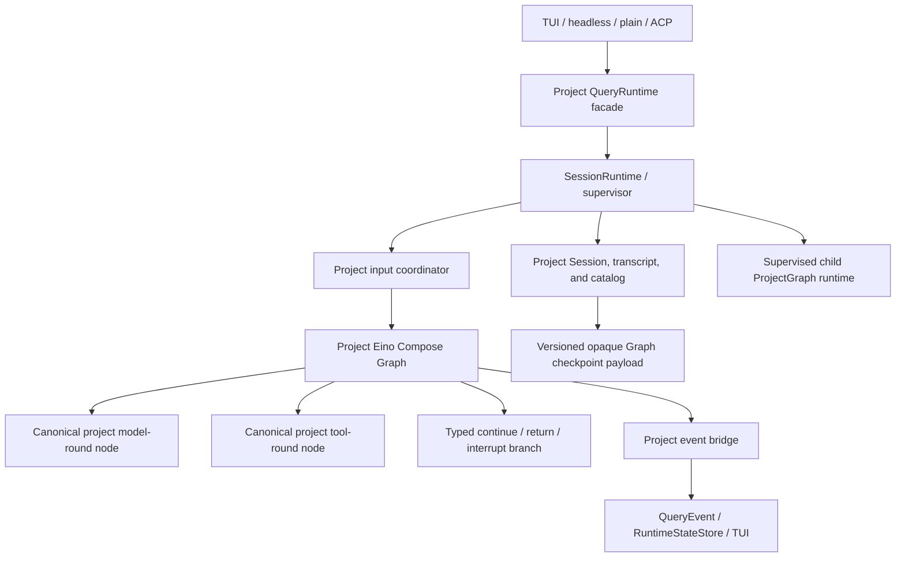

# Query Engine Eino Convergence Audit

**Status:** reference-snapshot
**Last verified:** 2026-07-17
**Snapshot:** Eino v0.9.12 plus main at `a737972f2048` (2026-07-17)
**Plan sync:** 2026-07-17; project-native Compose Graph accepted, P13.5c0 ready
**Current replacement:** P13.6b retired the ADK evidence adapters; current
schedule and decision ownership is documented in
[`architecture/runtime/query-engine.md`](../../../architecture/runtime/query-engine.md).

> **Ownership:** this report owns the source-backed P13 capability comparison,
> target ownership, risks, and the decision basis. The completed slice
> contracts and rollback gates are retained in [`migration/plans/p13-project-graph-kernel.md`](../../plans/p13-project-graph-kernel.md).
> Current accepted order belongs in [`migration/PLAN.md`](../../PLAN.md), unresolved
> gaps belong in [`migration/REMAINING.md`](../../REMAINING.md), current verified runtime
> facts belong in [`migration/STATUS.md`](../../STATUS.md), and completed evidence belongs
> in history or a closeout report.

## Observable Question

Which Eino mechanisms can reduce custom Agent-loop machinery without moving
project policy into framework internals, and can a project-owned
`compose.Graph` become the single production control-flow owner while preserving
the high-risk scheduling, continuation, event, queue, persistence, and subagent
contracts?

The objective is not to maximize Eino API usage or reduce `query.go` line count
in isolation. The objective is one authoritative owner for generic Agent
mechanics, one project owner for product policy, and measurable deletion of the
old owner after cutover.

## Decision

**Adoption decision: `combine` with a `project-native` control kernel.** P13
uses public Eino model, schema, retry, tool, checkpoint, and `compose.Graph`
mechanisms, but Eino `ChatModelAgent`, `Runner`, and `TurnLoop` are no longer
required production owners. The project Graph owns explicit ReAct topology and
typed branches; project nodes retain provider, tool-policy, compact/recovery,
outward-event, transcript, session, live-input, and TUI contracts.

This changes the earlier ADK ownership recommendation without invalidating its
source evidence. The isolated structured-decision candidate remains useful,
but upstream contribution, merge, and release are no longer promotion gates.
The accepted Graph is not a copy of Eino's internal ReAct implementation and is
not a line-by-line rendering of `queryLoop`.

The active order is owned by [`migration/PLAN.md`](../../PLAN.md). The accepted
sequence is:

1. establish a canonical behavioral trace before changing dependencies or
   production boundaries;
2. upgrade independently to the verified stable Eino v0.9.12 baseline;
3. add an internal Legacy/ADK compatibility boundary and project adapters for
   deterministic fixture/read-only shadow use only;
4. preserve the completed scheduler, recovery, and executed-result evidence,
   while superseding the external after-tool API gate;
5. replace the disconnected Graph experiment with one typed compiled Runnable;
6. bind canonical model, tool, and between-round mechanics through P13.5c0-c3;
7. canary one ProjectGraph kernel per session without duplicate side effects;
8. add one project input coordinator, durable Compose Graph HITL, and
   supervised foreground/background subagents; and
9. delete the corresponding legacy loop, unused adapters, retry, and live-queue
   owners.

`engine/query.go:queryLoop` remains the current production source of truth until
each capability is cut over, but it is not the permanent target owner. No
session may switch kernels mid-run or execute both live paths. `engine/graph.go`
is now the replacement target, not evidence of readiness: no production caller
was found, it discards the compiled Runnable, its local state does not own
conversation history, and its stream branch decides after reading only one
chunk. P13.5c0 replaces that experiment instead of promoting it.

The installed project development skills under `.agents/skills/eino-*` came
from `cloudwego/eino-ext/skills`. They guide implementation and review; they are
not application runtime skills and must not be loaded into the product model's
skill registry. Eino's runtime Skill middleware remains a separate core ADK
capability.

## Replacement Ledger After P13.5a

The production answer is intentionally narrower than the feasibility work:
P13.1-P13.5a have not replaced a live `queryLoop` owner. They upgraded the Eino
baseline and proved the adapters needed for later ownership transfer while
`productionQueryKernel` remains fixed to Legacy.

| Boundary | Eino use now | Production ownership after this iteration |
|---|---|---|
| Model interface and stream call | [`execution.CallModel`](../../../../engine/execution/call.go#L70) actively uses Eino `BaseChatModel.Stream`; P13.1 upgraded the dependency to v0.9.12. | Active Eino component seam, but request preparation, retry routing, recovery, and iteration remain project-owned. |
| Agent/Runner construction and events | P13.2 constructs real `ChatModelAgent`/`Runner` fixtures, immutable tool adapters, strict runtime items/checkpoints, and an event projector. | Fixture-only; the [historical `adkQueryKernel.run`](https://github.com/abietic/eino-agent/blob/428e1b37a1cceb09b012758010b932d6bce50557/engine/adk_compat.go#L36) failed closed before `Runner.Run`. |
| Model attempts and recovery mechanics | P13.4 proves Eino retry/failover execution with project classifiers, routes, persisted rewrites, and tombstones. | Fixture-only; production `queryLoop` still owns attempts and recovery. |
| Tool scheduling | P13.3 runs a real Eino `ToolsNode` behind project stable-batch middleware and validates model-order output. | Fixture-only; production batch/stream schedulers still own live calls. |
| Executed-result resume | Historical [`adkToolResumeBridge.Invoke`](https://github.com/abietic/eino-agent/blob/428e1b37a1cceb09b012758010b932d6bce50557/engine/adk_tool_resume.go#L217) filtered unresolved calls into a public `ToolsNode`, restored strict settled results, and merged one complete model-ordered round. | Fixture-only; Session persistence and production tool execution were unchanged. |
| Complete-round decision | Historical [`decideADKAfterTool`](https://github.com/abietic/eino-agent/blob/428e1b37a1cceb09b012758010b932d6bce50557/engine/adk_scheduler.go#L629) returned typed `continue`, successful `return`, or `interrupt`; an isolated Eino main patch proved a matching public Runner seam viable. | Project test oracle only; the candidate was not merged upstream, pinned by `go.mod`, or bound to the project Runner. |
| ReAct iteration, live input, interrupt/resume, child execution | Eino capabilities are accepted target mechanics for later slices. | At this snapshot, production remained owned by [`queryLoop`](../../../../engine/query.go#L112), `queue.Manager`, project Session, and `AgentRunner`; [`productionQueryKernel`](../../../../engine/query_kernel.go#L46) remained Legacy. Current canary ownership is tracked in [`architecture/runtime/query-engine.md`](../../../architecture/runtime/query-engine.md). |

This distinction prevents “uses an Eino type in a fixture” from being reported
as production replacement. The iteration reduced migration uncertainty and
closed the executed-result resume gap; it did not yet delete or bypass any live
query-loop owner.

## Evidence Labels

- **Verified:** observed in current eino-agent source/tests, the local Claude
  reference, or the named Eino v0.9.12/main source snapshot and official
  documentation.
- **Prototype-verified:** observed in an isolated patch against the named Eino
  main snapshot; proves feasibility but not upstream availability or current
  project wiring.
- **Inference:** a consequence derived from verified source, not yet proved by
  an eino-agent fixture.
- **Recommendation:** the proposed project decision.
- **Unresolved:** requires a later spike, upstream API, or differential test.

## Benefit And Cost Assessment

| Outcome | Expected benefit | Realization condition |
|---|---|---|
| TUI steering and preemption | High: new input can interrupt at model/tool safe points instead of waiting for the current imperative turn to settle. | One project input coordinator owns live input and injects only at explicit Graph safe points. |
| Cancellation and stop modes | High: graceful and immediate stop share one lifecycle instead of entrypoint-specific cancellation paths. | TUI, plain, ACP, leader, and child paths map to one session runtime. |
| Durable HITL | High: a permission or question interrupt can survive process restart and resume the exact invocation. | Project Session stores a versioned Eino checkpoint payload and resume re-evaluates current policy. |
| Retry and failover | High maintenance benefit: input rewrite, backoff, route change, and successful history can share the Agent lifecycle. | Failed-attempt output is identified, provider streams are normalized, and project routing policy remains authoritative. |
| Middleware and dynamic tools | High extensibility benefit: model/Agent/tool phases and run-local state gain standard extension points. | Middleware cannot bypass canonical project admission, permission, hooks, or event identity. |
| Subagent consistency | Medium-high: foreground nested interrupts and background steering can use the same runtime vocabulary. | Background Agents receive supervised child Graph runtimes rather than being forced through synchronous AgentTool. |
| Runtime slimming | Low initially, high after cutover: compatibility code adds weight first, then legacy loop/retry/queue owners can be deleted. | Every promoted owner has a deletion and sunset gate; permanent dual ownership is rejected. |
| Performance | Uncertain: fewer custom transitions may help, while checkpoint/event bridges may add cost. | Benchmarks cover first-token latency, event throughput, safe preemption, checkpoint size, and long-session recovery. |

The migration is worthwhile because it unlocks interaction and recovery
capabilities that leaf-level SDK reuse cannot provide. Risk alone is not a
rejection criterion. A slice is rejected when it cannot deliver the named
benefit without semantic degradation or permanent duplicate ownership.

## Current Runtime Baseline

| Area | Verified current evidence | Planning consequence |
|---|---|---|
| Production authority | `engine/query.go:queryLoop` owns preparation, model invocation, streaming execution, recovery, queue drain, tool refresh, and state transition. | Replace one boundary at a time; do not introduce a second production loop. |
| Model seam | `engine/execution.CallModel` already calls Eino `BaseChatModel.Stream` with Eino model options and tool schemas. | Model invocation is the narrowest existing Eino boundary. |
| Dependency baseline | `go.mod` pins `github.com/cloudwego/eino v0.9.12`, which remains the latest stable tag verified on 2026-07-17. Main resolves to `a737972f2048`; its checkpoint-aware child-cancellation changes do not close the P13.5b API gap. An isolated patch against that base proves a candidate seam, but it is not upstream-current. | Keep the stable pin; treat the candidate as contribution evidence, not a production dependency or permanent fork. |
| Stream assembly | `engine/execution.mergeAssistantChunk` merges usage/finish metadata and treats non-empty streamed tool arguments as cumulative snapshots. | `schema.ConcatMessages` requires provider fixtures before replacement. |
| Tool registry | `tools.Registry` is the complete dispatch/metadata registry; model visibility is a filtered projection refreshed at round boundaries. | An Eino tool adapter must never become a second registry. |
| Tool admission | `engine.executeToolCall` owns validation, plan guard, hooks, deny/permission precedence, result offload, attachments, file state, and context transition. | Middleware may wrap this pipeline but cannot reorder or redefine it. |
| Tool scheduling | `partitionToolCalls` performs stable per-input concurrency grouping; streaming execution also preserves model order, sibling cancellation, and interrupt behavior. | Eino ToolsNode cannot take over until the scheduler and result envelope are expressible. |
| Context management | preparation runs tool budget, snip, microcompact, collapse, auto-compact, hooks, transcript flush, cleanup, and reinjection; recovery has ordered PTL, media, and max-output cascades. | Reduction and Summarization may supply stages, not policy ownership. |
| Retry/fallback | `CallModelWithRetry` owns 429/529 behavior, persistent retry, warning projection, and the fallback trigger; provider runtime resolves cross-provider routes. | Eino can later own attempt mechanics only behind project classifiers and routing. |
| Event protocol | `QueryEvent` and `RuntimeEventEnvelope` define outward identity, lossless families, coalescible families, and terminal projection. | Eino callbacks are additive telemetry unless explicitly mapped to one canonical event. |
| Queue/session | `QueryParams.QueueManager` holds the production `*queue.Manager` for inter-turn command selection; project transcript/session state owns resume and replay. The separate `queue.QueueManager` type has no production caller. | P13.7 replaces the `queue.Manager` live command path with one project input coordinator, not the unrelated type; Graph input and checkpoint state cannot become parallel truths. |
| Compose graph | `BuildQueryGraph` has no in-repository production caller and discards the compiled runnable. | Audit or remove it separately; do not repurpose it as evidence that the main loop is graph-ready. |

## Eino Capability Matrix

| Capability | Evidence and semantic fit | Classification | P13 decision |
|---|---|---|---|
| `BaseChatModel.Stream` and model options | Already used by `engine/execution.CallModel`. | Verified / reuse directly | Keep and make it the model-round adapter seam. |
| `schema.ConcatMessages` | Merges standard message fields and concatenates indexed ToolCall arguments; project code also accepts cumulative provider snapshots. | Verified mismatch | Normalize provider chunks before ADK ownership; retain the project merge until differential fixtures pass. |
| ChatModelAgent handlers and middleware | v0.9.12 exposes before/after Agent and model handlers, tool wrappers, dynamic state rewrite, run-local serializable values, and custom events. | Verified strong fit | Use project handlers and tool adapters as the policy boundary; map custom events through one ADK event bridge. |
| ChatModelAgent retry/failover | Retry decisions can rewrite/persist messages, alter options, back off, or reject; failover can select another model using the last output/error. | Verified strong fit | Move attempt execution in P13.4 while project classifiers, provider routing, compact policy, and diagnostics remain authoritative. |
| `tool.BaseTool` adapters | Suitable for model-visible schema and invocation, but project execution returns before/after messages, attachments, continuation, and context modifiers. | Verified partial fit | Adapt every Eino call back into canonical `executeToolCall`; carry rich outcome state by call ID until a structured Eino result boundary exists. |
| `compose.ToolsNode` scheduling | v0.9.12 still selects one global sequential or parallel mode; no public per-call stable batch planner is exposed. P13.3 proved a cancellation-safe run-scoped middleware barrier. | Verified / adapted | Reuse the real node and ordered collection behind the project stable-batch coordinator; reject global all-serial/all-parallel substitution. |
| `compose.ToolsNode` executed-result resume | Exported interrupt metadata contains original calls and executed result bodies, but the resume state consumed by `ToolsNode` is unexported. A project filter/merge can still invoke the public node for only unresolved calls. | Verified partial fit | P13.5a now adapts the public invocation: validate the original complete message and strict settled results, consume one bridge instance, filter unresolved calls, and merge persisted/fresh results in model order without reflection or a fork. |
| After-tool continuation | v0.9.12 and main at `a737972f2048` expose an error-only `WithAfterToolCallsHook`; `ReturnDirectly` selects tool names before execution. An isolated source patch adds a typed post-result decision and passes classic/Agentic checkpoint, cancellation, and race fixtures. | Prototype-verified / superseded gate | Retain the candidate as a semantic oracle; implement the decision as a project Graph branch. Sentinel errors, private `adk.State`, dummy direct-return branches, cancellation-error translation, synthetic model rounds, outer-event races, and a fork remain rejected. |
| Reduction and Summarization | Provide reusable storage, truncation, token counting, custom handlers, trigger, retry/failover, finalization, and manual summarization. | Verified reusable mechanism | Reuse as mechanics only after project pairing, compact trigger/order, hooks, transcript, and reinjection remain explicit. |
| ChatModelAgent events | Internal events can represent Agent/model/tool lifecycle; retries may have already produced observable stream output before rejection. | Verified conditional fit | Bridge every attempt with causation and rejection/tombstone semantics; `QueryEvent` remains the sole outward protocol. |
| TurnLoop | Provides thread-safe Push, safe-point preemption, graceful/immediate stop, input preparation, event handling, and checkpoint lifecycle, but its native owner is an ADK Agent rather than a compiled project Graph. | Verified partial fit | Do not require it for P13.7. Reuse only if a later fixture proves a thin Graph adapter without restoring ChatModelAgent/Runner ownership. |
| Compose checkpoint and interrupt/resume | Graph supports run-local state, `StatefulInterrupt`, checkpoint stores, and resume modifiers. | Verified target fit | Store versioned Graph checkpoint bytes inside project Session; reject unsupported versions and re-evaluate permissions on resume. |
| AgentTool | Can forward nested events and propagate composite interrupts, but it executes as a foreground nested tool and is not the durable parent session. | Verified partial fit | Keep only where foreground semantics fit; give each asynchronous child a supervised project Graph runtime and transcript identity. |
| Skill middleware | Supports runtime skill loading and execution modes, but project skills currently follow `.claude/skills` discovery and precedence. | Verified partial fit | Consider only after core cutover; exclude project-development `.agents/skills`. |
| Graph/Chain/Workflow | `compose.Graph` supports cycles, typed branches, per-run local state, compiled Runnable execution, checkpoint stores, and stateful interrupts. | Verified target fit | Use a project-owned cyclic Graph for explicit control flow; keep hidden imperative policy inside typed boundary nodes rather than translating every statement into a node. |

## P13.5 Gate Rescan

The 2026-07-17 rescan asks two narrower questions instead of treating all tool
resume and continuation behavior as one SDK gate.

| Question | Stable and main evidence | Project evidence | Verdict |
|---|---|---|---|
| Can an original complete tool-call message resume without re-executing settled calls? | [`ToolsInterruptAndRerunExtra`](https://github.com/cloudwego/eino/blob/v0.9.12/compose/tool_node.go#L287-L303) exports original calls and executed outputs, while [`ToolsNode.Invoke`](https://github.com/cloudwego/eino/blob/v0.9.12/compose/tool_node.go#L1053-L1139) reads those outputs only from an unexported state type. Main retains the same boundary. | Historical [`newADKToolSchedule`](https://github.com/abietic/eino-agent/blob/428e1b37a1cceb09b012758010b932d6bce50557/engine/adk_scheduler.go#L38) froze call identity/order; [`adkToolBatchCoordinator`](https://github.com/abietic/eino-agent/blob/428e1b37a1cceb09b012758010b932d6bce50557/engine/adk_scheduler.go#L327) restored only unsettled scheduling; [`adkToolResumeBridge.Invoke`](https://github.com/abietic/eino-agent/blob/428e1b37a1cceb09b012758010b932d6bce50557/engine/adk_tool_resume.go#L217) supplied the strict single-use filter and merge. | **Adapt / proven:** focused real-node, strict-codec, mutation, repeated/concurrent invocation, cancellation, failure, panic, and race fixtures closed P13.5a without private state or an Eino fork. |
| Can a completed result batch select continue, successful return, or interrupt before another model call? | [`WithAfterToolCallsHook`](https://github.com/cloudwego/eino/blob/v0.9.12/adk/chatmodel.go#L125-L133) returns only `error`. The ReAct graph chooses [`ReturnDirectly`](https://github.com/cloudwego/eino/blob/v0.9.12/adk/react.go#L414-L548) from tool names before execution. Main at [`a737972f2048`](https://github.com/cloudwego/eino/commit/a737972f2048) retains both shapes. An isolated patch on that base adds a typed post-result decision. Public `compose.Graph` already permits a project-owned typed branch at this boundary. | Historical [`decideADKAfterTool`](https://github.com/abietic/eino-agent/blob/428e1b37a1cceb09b012758010b932d6bce50557/engine/adk_scheduler.go#L630) validated the ordered rich outcomes and returned the matching typed decision. | **Project-native / ready to implement:** retain the upstream candidate as evidence, but express the decision through an ordinary project Graph branch with no external availability gate. |

The first verdict changed execution order but not production behavior: P13.5a
is now a completed fixture-only adapter and `productionQueryKernel` remains
Legacy. The second verdict moved from unknown feasibility to a verified
upstream candidate. The later project-native decision removes its
public-availability gate while preserving the same semantic test oracle. A
Graph branch that merely makes a fixture stop is still insufficient if it
reports successful return as cancellation/failure, races a next model request,
or depends on unregistered/private checkpoint state.

### P13.5b alternative analysis

| Candidate | Verified behavior | Decision |
|---|---|---|
| Public structured after-tool branch | No such stable/main API exists. The isolated candidate proves the current hook location can be extended with a typed decision, normal return branch, and resumable interrupt without copying the graph into the project. | **Evidence only:** technically valid, but no longer required or scheduled as an upstream contribution. |
| Static or run-local `ReturnDirectly` map | The matching tool-call ID is selected before tool execution. A result-dependent project decision cannot both continue and stop through this branch. | **Reject:** it changes observable continuation for tools whose result is not always terminal. |
| `SendToolGenAction(..., NewExitAction())` plus an outer Agent/Workflow | The action is attached to the tool event, but the ChatModelAgent graph does not branch on that action. `flowAgent` evaluates the last action only after the inner iterator drains. An outer wrapper that stops draining cannot prove the inner graph did not issue the next model call. | **Reject:** either the action is observed too late or the wrapper races/leaks inner execution. |
| `CancelAfterToolCalls` | The safe point is correctly located after the hook, but cancellation is surfaced as `CancelError`; active cancellation also absorbs business interrupts into that error class. | **Reject:** cancellation is not successful return and cannot be translated without corrupting terminal/checkpoint meaning. |
| Structured interrupt returned as hook error | Compose can represent an interrupt, but the hook still has no sibling successful-return value and would require explicit resume/idempotency handling at an error-shaped boundary. | **Defer as insufficient alone:** it cannot satisfy the three-way contract. |
| Synthetic next-model wrapper | A wrapper can avoid a provider request by manufacturing a final model message or interrupt on the next model node. | **Reject:** it creates a fake model attempt/message, changes transcript, event, retry, cache, and checkpoint semantics, and no longer returns the selected tool-round terminal directly. |
| Private `adk.State` mutation or copied Eino internal ReAct graph | Either can force a branch. | **Reject:** the first binds to unstable internals; the second inherits an implementation the project cannot safely own. |
| Project-owned typed `compose.Graph` | Public Graph branches can route a committed project result directly to continue, successful return, or typed interrupt. Project nodes can call canonical model/tool boundaries without copying ChatModelAgent internals. | **Project-native / accept:** one Graph becomes the explicit inner-loop owner; policy-heavy imperative behavior remains inside typed nodes and legacy ownership is deleted after canary. |

### Isolated candidate result

The prototype-verified candidate uses a typed decision input containing the
complete result batch, whether the decision was interrupted, the caller's
interrupt state, and targeted/implicit resume data. The decision selects
`continue`, a tool result by call ID, or structured interrupt info/state.
Internally, the ReAct node:

1. persists results and runs the legacy side-effect hook only on first entry;
2. restores exact results and caller state from a registered wrapper on resume;
3. runs the typed decision again, failing closed if the resume option is absent;
4. branches `return` and `interrupt` before `CancelAfterToolCalls`; and
5. sends only `continue` through existing cancellation and static
   `ReturnDirectly` policy.

Classic fixtures cover continue/return, targeted and implicit
interrupt/resume, non-target re-interrupt, failure and invalid decisions,
return-versus-cancel ordering, Continue-to-Cancel checkpointing, registered
custom state, and concurrent sessions. Agentic fixtures cover return, targeted
interrupt/resume, and Continue-to-Cancel. Full repository tests,
full-repository `-race`, vet, and independent review also passed. The detailed
historical candidate and current Graph consequence remain owned by the
[`P13 plan`](../../plans/p13-project-graph-kernel.md#p135b-structured-after-tool-runner-decision).

### Structured decision semantic oracle

Exact upstream names are non-normative. Under the former ADK plan, P13.5b
required an exported equivalent of:

```go
type AfterToolCallsDecisionKind uint8

const (
    AfterToolCallsContinue AfterToolCallsDecisionKind = iota
    AfterToolCallsReturn
    AfterToolCallsInterrupt
)

type AfterToolCallsDecision struct {
    Action           AfterToolCallsDecisionKind
    ReturnToolCallID string
    InterruptInfo    any
    InterruptState   any
}

type AfterToolCallsDecisionInput struct {
    ToolResults    []*schema.Message
    WasInterrupted bool
    InterruptState any
    IsResumeTarget bool
    HasResumeData  bool
    ResumeData     any
}

type AfterToolCallsDecisionHook func(
    context.Context,
    *AfterToolCallsDecisionInput,
) (AfterToolCallsDecision, error)
```

The current project Graph does not need this public hook shape, but the
observable contract remains the P13.5c2/P13.8 test oracle:

1. invoke once after the complete ordered tool results are persisted and before
   cancellation checks or another model request;
2. branch `continue` to exactly one next model call;
3. branch `return` to the normal successful terminal with the selected result
   and no synthetic model event, cancellation checkpoint, or error;
4. branch `interrupt` to one structured interrupt/checkpoint and resume without
   repeating settled tool effects or reclassifying the interrupt as
   cancellation;
5. serialize the tagged decision and required payload through Compose Graph
   checkpoint/resume; and
6. reserve `error` for real failures and isolate hook state per run.

The project acceptance harness must cover continue, return, interrupt, resume,
failure, cancellation, repeated resume, concurrent sessions, and proof that the
provider and side-effecting tools are each invoked exactly as specified.

**Superseding recommendation: `project-native`.** Retain the overall P13
`combine` use of Eino mechanisms, but implement control flow with a
project-owned typed `compose.Graph`. The upstream candidate remains evidence;
P13 neither contributes nor waits for it. This does not reverse the completed
P13.1-P13.5a evidence and does not authorize a second production loop.

## Target Ownership



### Permanent project ownership

- model-visible tool projection and safe refresh boundaries;
- tool validation, plan-mode availability, permission, hooks, and result
  envelope;
- dynamic scheduling, ordered results, sibling cancellation, and interrupt
  policy until Eino exposes an equivalent planner accepted by the project;
- compact trigger/order, recovery classification, boundary messages, and
  context reinjection;
- provider routing, fallback eligibility, warnings, request options, and
  secret-safe diagnostics;
- `QueryEvent` identity/order, runtime reducer, transcript, catalog,
  user-visible Session, TUI projection, and stable parent/child identity.

### Target Eino mechanism ownership after promotion

- provider-neutral model and stream interfaces;
- Compose Graph scheduling, typed edges, branching, run-local state, and safety
  step ceiling;
- retry/failover attempt execution after project classification and routing;
- stream primitives and normalized message mechanics;
- Compose stateful interrupt, checkpoint serialization, and resume execution;
- generic reduction and summary execution behind project policy.

### Project adapters

- `QueryKernel` compatibility boundary selected once per session;
- compiled typed Graph Runnable and per-run plain-data state;
- model request/result and provider-stream normalization;
- immutable model-visible tool snapshot;
- `ToolImpl` to Eino tool adapter that calls canonical project admission;
- rich tool-outcome side channel keyed by stable call ID;
- reduction backend and custom handlers;
- summary finalizer and compact event bridge;
- Graph node/attempt to `QueryEvent` mapping and deduplication;
- versioned Graph checkpoint envelope inside project Session;
- `RuntimeItem` priority, scope, steering, approval, and task-notification
  mapping.

### Ownership transition rules

- Before P13.6, Legacy remains the only production kernel; ProjectGraph
  execution is
  deterministic fixture or read-only shadow only.
- P13.6 selects Legacy or ProjectGraph when a new session starts. A running
  session does not switch kernels and does not dual-execute.
- Before P13.7, `QueryParams.QueueManager` (`*queue.Manager`) remains the
  live-input owner. P13.7 transfers that ownership atomically to one project
  input coordinator and removes that command path. The disconnected
  `queue.QueueManager` type is not the migration target.
- Project Session remains durable user truth throughout. Eino checkpoint bytes
  are private mid-turn implementation state, not a second catalog or transcript.
- Rollback affects a later turn: resume from durable project transcript using
  Legacy and expire unsupported Graph checkpoint state. Never reinterpret a
  pending approval as granted.

## Indicative Boundary Types

These types describe ownership and test seams. Their names and exact public API
are not accepted until the corresponding slice is promoted.

```go
type QueryKernel interface {
    Run(context.Context, RuntimeInput) iter.Seq2[*QueryEvent, error]
    Resume(context.Context, ResumeInput) iter.Seq2[*QueryEvent, error]
}

type RuntimeItem struct {
    Kind     RuntimeItemKind
    Priority QueuePriority
    Scope    ThreadScope
    Payload  []byte
}

type ToolSnapshot struct {
    Revision  uint64
    Infos     []*schema.ToolInfo
    EinoTools []tool.BaseTool
}

type ToolOutcomeStore interface {
    Put(callID string, outcome ToolExecutionOutcome) error
    Take(callID string) (ToolExecutionOutcome, bool)
}

type EinoCheckpointEnvelope struct {
    Version            int
    SessionID          string
    ThreadID           string
    TurnID             string
    QueryStateRevision uint64
    KernelVersion      string
    InvocationDigest   string
    Payload            []byte
}
```

`RuntimeItem` payloads and run-local values must use checkpoint-safe,
versioned, serializable types. High-frequency events continue through one
event sink rather than accumulating in kernel outputs. The compatibility API
must stay internal until one ADK production canary proves that its shape does
not encode temporary dual-runtime state.

## Frozen Observable Contract

### Tool projection and dispatch

- the complete registry remains available for dispatch, metadata, aliases,
  hooks, permission, ToolSearch, and MCP resolution;
- a model-visible snapshot is filtered and ordered separately;
- built-in precedence, hidden/disabled filtering, simple mode, explicit tool
  selection, MCP visibility, and sub-agent scope remain deterministic;
- refresh happens between tool rounds, never during an active model stream or
  tool batch.

### Tool admission and scheduling

The canonical order remains:

```text
parse -> schema coercion -> schema/custom validation -> plan guard
-> pre-tool hooks and input rewrite -> deny/permission/classifier/prompt
-> execute -> attachments/offload/file state -> post-tool hooks
-> plan/context transition
```

- permission and hook decisions remain defense in depth even if a model-visible
  projection omits a tool;
- concurrency safety remains a function of the canonical tool and normalized
  input;
- safe calls form stable adjacent parallel batches; unsafe calls remain serial
  barriers;
- results re-enter history in model order;
- Bash sibling failure, cancellation-chain release, and cancel/block interrupt
  behavior remain unchanged;
- one tool execution may emit before/result/after messages, prevent
  continuation, and modify serial tool context.

### Streaming and messages

- streamed chunks remain display events, not durable transcript entries;
- a finalized assistant message preserves content, reasoning, multi-content,
  ToolCalls, usage, cached/reasoning token details, and finish reason;
- no partial `{}` ToolCall executes before final arguments are available;
- missing tool results, orphan results, adjacency, tombstones, and failed
  fallback output retain current semantics;
- provider delta and cumulative argument formats must both have explicit
  differential fixtures.

### Compact and recovery

Preparation order remains:

```text
compact boundary -> tool-result budget -> snip -> microcompact -> collapse
-> pre-compact hook -> auto-compact -> transcript flush -> post-compact hook
-> cleanup -> file/plan/skill reinjection -> blocking-limit check
```

Recovery order remains:

```text
PTL: collapse drain -> reactive compact -> terminal
media: reactive strip/compact -> terminal
max output: one 64K escalation -> bounded continuation messages -> terminal
```

Reduction or summarization cannot independently emit a second compact boundary,
replace transcript ownership, or count an empty transform as progress.

### Events, queue, persistence, and entrypoints

- every outward event remains one `QueryEvent` with project runtime identity;
- lossless permission, Agent lifecycle, and terminal events cannot be dropped;
- Eino callback spans do not become semantic events without an explicit one-to-
  one mapping and deduplication key;
- before P13.7, the production `queue.Manager` remains the only source of
  next-command priority, main/child scope, SendMessage injection, and
  notification drain;
- after P13.7, `RuntimeItem` plus one project input coordinator become that sole
  live source and the `queue.Manager` live command path is removed rather than
  mirrored;
- project transcript/session storage remains the only user-visible replay and
  resume truth; checkpoint bytes are opaque mid-turn state inside it;
- TUI, headless, plain, ACP, subagent, and applicable side-query paths share
  the same project policy; kernel selection is fixed once per new session.

## Detailed Contract Ownership

Current accepted execution order is owned by
[`migration/PLAN.md`](../../PLAN.md). The completed P13.H0-P13.10 contracts,
frozen invariants, fixture matrix, promotion gates, rollback conditions, and
source owner index are retained in
[`migration/plans/p13-project-graph-kernel.md`](../../plans/p13-project-graph-kernel.md).

This audit does not duplicate that historical contract. The sections below
retain the comparison evidence, risks, rejected alternatives, and source
anchors that justified it.

## Risk And Decision Ledger

| Risk | Consequence | Required control |
|---|---|---|
| Provider stream shape mismatch | Invalid JSON, duplicate arguments, or premature tool execution. | Normalize cumulative snapshots to deltas and run provider differential fixtures before ProjectGraph ownership. |
| Failed-attempt event leakage | TUI shows content that is absent from durable successful history. | Attempt identity plus explicit retry/tombstone projection and one terminal event. |
| Tool outcome information loss | Missing attachments, context transition, or stop behavior. | Stable call-ID outcome store and complete after-batch decision before full tool cutover. |
| Scheduler mismatch | Behavioral and performance regression, unsafe parallelism. | P13.3 hard gate; prove middleware barrier or add upstream scheduler control. |
| Middleware reorder | Permission, hook, compact, or pairing contract changes. | One canonical project pipeline and explicit handler order. |
| Duplicate callback projection | Duplicate UI rows, transcript messages, or terminals. | Additive internal trace plus causation-based deduplication. |
| Retry ownership split | Extra billed requests or inconsistent fallback history. | One project classifier/router and one active attempt executor. |
| Dual live queue | Lost, duplicated, or reordered steering/input. | Atomic P13.7 ownership transfer; one project input coordinator replaces rather than mirrors the production `queue.Manager` path. |
| Checkpoint becomes session truth | Incompatible replay or corrupted cross-version recovery. | Opaque versioned payload inside project Session with explicit expiry and transcript-safe rollback. |
| Stale approval replay | A tool executes under policy that no longer allows it. | Persist intent/request identity only; reconstruct exact invocation and re-evaluate current policy on resume. |
| AgentTool used for background work | Parent call blocks and child lifecycle/replay becomes incomplete. | Keep lifecycle ownership in `AgentRunner`; use one supervised ProjectGraph runtime per asynchronous Agent. |
| Eino patch-version drift | Snapshot churn or hidden runtime changes. | Dependency-only P13.1 and pinned-source audits per promoted slice. |
| Shadow side effects | Duplicate shell/file/network/task actions. | Fixture/read-only shadow only; assert invocation counts. |
| Premature mega-interface | Existing coupling becomes harder to reason about. | Extract one seam per PR and delete unused abstraction immediately. |
| Adapter accumulation without deletion | More complexity with none of the lifecycle or slimming benefit. | Adapter sunset within two later slices/PRs and P13.10 deletion gate. |

## Rejected Alternatives

- replace `queryLoop` with either ChatModelAgent or ProjectGraph in one change
  instead of staged per-owner cutover;
- copy Eino's internal ReAct graph or translate every imperative statement into
  a decorative Graph node;
- use all-sequential or all-parallel tools as a temporary production bridge;
- keep two production loops, live queues, retry executors, event protocols, or
  checkpoint stores after their migration slice;
- use error values as the permanent after-tool continue/return/interrupt API;
- treat AgentTool as the asynchronous background Agent supervisor;
- load `.agents/skills` as product runtime skills;
- adopt v0.10 alpha to obtain a newer API before the stable line supports it;
- rewrite Provider-specific DeepSeek, Qwen, Gemini, or Anthropic adapters as a
  single generic OpenAI-compatible route;
- accept golden snapshot updates without explaining each semantic difference.

## Production Go And No-Go Gates

Production migration proceeds when all of these are true:

1. the scheduler path preserves dynamic stable batches, model order,
   cancellation, interrupt, and checkpoint reconstruction without deadlock;
2. complete tool outcomes select continue/return/interrupt without permanent
   error-as-control-flow;
3. retry/failover preserves exact request count, provider route, successful
   history, stream normalization, warning order, and one terminal projection;
4. the project input-coordinator `RuntimeItem` fixtures preserve priority,
   scope, FIFO, steering, stop, persistence, and process-restart behavior;
5. HITL resume reconstructs the exact invocation and re-evaluates current
   permission policy; and
6. each cutover deletes or sunsets the corresponding legacy owner.

A production slice stops when it requires semantic degradation, cannot provide
transcript-safe rollback, or creates permanent dual ownership. It does not stop
merely because the implementation is high-risk.

## Execution and Closeout Ownership

Mutable slice contracts, source-owner mappings, verification gates, rollback,
and closeout steps live in
[`migration/plans/p13-project-graph-kernel.md`](../../plans/p13-project-graph-kernel.md). Repository-wide
documentation lifecycle rules live in
[`contributing/documentation-policy.md`](../../../contributing/documentation-policy.md).
This snapshot remains evidence for those decisions and does not maintain a
second executable checklist.

## Source Anchors

### Eino-agent and Claude reference

- `engine/query.go`: `Query`, `queryLoop`, message normalization, pairing;
- `engine/params.go`: `QueryDeps`, `QueryParams`, `ToolUseContext`;
- `engine/execution/call.go`: `CallModel`;
- `engine/execution/stream_processor.go`: `ProcessStream`,
  `mergeAssistantChunk`;
- `engine/execution/streaming.go`: `StreamingToolExecutor`;
- `engine/execution/retry.go`: `CallModelWithRetry`;
- `engine/tool_execution.go`: `executeToolCall`;
- `engine/tool_orchestration.go`: `partitionToolCalls`, `executeToolBatch`;
- `engine/events.go`: `QueryEvent`, `RuntimeEventEnvelope`;
- `engine/queue/manager.go`: production `queue.Manager` priority/scope command
  queue;
- `engine/queue/queue.go`: disconnected `queue.QueueManager`, explicitly not
  the P13.7 cutover target;
- `engine/graph.go`: `BuildQueryGraph`;
- `.reference/claude-code-ripe/src/query.ts`: `query`;
- `.reference/claude-code-ripe/src/QueryEngine.ts`: QueryEngine lifecycle;
- `.reference/claude-code-ripe/src/Tool.ts`: tool contract; and
- `.reference/claude-code-ripe/src/tools.ts`: tool assembly.

### Official Eino sources

- [Eino tags](https://github.com/cloudwego/eino/tags)
- [ChatModelAgent documentation](https://www.cloudwego.io/docs/eino/core_modules/eino_adk/agent_implementation/chat_model/)
- [ChatModelAgent v0.9.12 source](https://github.com/cloudwego/eino/blob/v0.9.12/adk/chatmodel.go)
- [ChatModelAgent handler v0.9.12 source](https://github.com/cloudwego/eino/blob/v0.9.12/adk/handler.go)
- [Retry v0.9.12 source](https://github.com/cloudwego/eino/blob/v0.9.12/adk/retry_chatmodel.go)
- [Failover v0.9.12 source](https://github.com/cloudwego/eino/blob/v0.9.12/adk/failover_chatmodel.go)
- [ToolsNode v0.9.12 source](https://github.com/cloudwego/eino/blob/v0.9.12/compose/tool_node.go)
- [Message concatenation v0.9.12 source](https://github.com/cloudwego/eino/blob/v0.9.12/schema/message.go)
- [Reduction documentation](https://www.cloudwego.io/docs/eino/core_modules/eino_adk/eino_adk_chatmodelagentmiddleware/middleware_toolreduction/)
- [Summarization documentation](https://www.cloudwego.io/docs/eino/core_modules/eino_adk/eino_adk_chatmodelagentmiddleware/middleware_summarization/)
- [TurnLoop documentation](https://www.cloudwego.io/docs/eino/quick_start/chapter_11_turnloop/)
- [Eino core Skill middleware](https://github.com/cloudwego/eino/tree/v0.9.12/adk/middlewares/skill)
- [Eino-ext project development skills](https://github.com/cloudwego/eino-ext/tree/main/skills)
