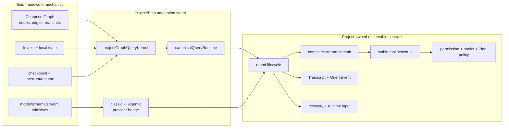
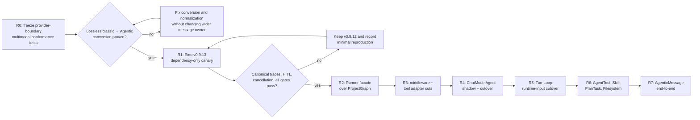

# Query Loop Eino Implementation Review

**Status:** reference-snapshot
**Snapshot:** 2026-07-26; Eino-Agent `1dbfc13c2e39a370a035bc2be91326d1e2d3085c`,
Eino pinned `v0.9.12`, latest stable Eino `v0.9.13`
(`c5e6aef927cca02bea934541f8dff2ea711b2ca7`)

> **Ownership:** this report evaluates the current Query Loop implementation,
> compares it with stable Eino SDK/framework primitives, and recommends
> selective next steps. Current implementation ownership belongs in
> [`architecture/runtime/query-engine.md`](../../../architecture/runtime/query-engine.md);
> accepted execution order belongs only in [`migration/PLAN.md`](../../PLAN.md);
> reproduced unresolved gaps belong only in
> [`migration/REMAINING.md`](../../REMAINING.md).

The cross-program classification and plan-coverage review for P12-P21 lives in
[`p12-p21-eino-adoption-review.md`](p12-p21-eino-adoption-review.md). This
document remains scoped to the production Query Loop and P13 boundary. The
corrected adapter contracts and lossless replacement design live in
[`p12-p21-eino-lossless-replacement-design.md`](p12-p21-eino-lossless-replacement-design.md).

## Review conclusion

The Query Loop has completed the first production cut of its Eino migration:
**Eino Compose owns the traversal control plane, while the project owns the
coding-agent policy and data plane.** ProjectGraph is the sole production
kernel; there is no Legacy fallback, shadow ADK agent, or duplicate model/tool
execution path.

This is a sound current architecture, but it does not prove that the remaining
mechanics should stay permanently project-owned. Stable Runner, TurnLoop,
ChatModelAgent and middleware extension points can host the stronger project
contracts through adapters.

The strongest implementation choices are the complete-stream commit barrier,
one canonical tool boundary, stable-batch scheduling, targeted durable HITL,
and fail-closed kernel/session validation. These become equivalence invariants
for deeper Eino replacement rather than reasons to reject it.

The immediate and staged work is:

1. fix the classic-message to Agentic-message user multimodal information-loss
   boundary;
2. qualify the latest stable Eino and Eino-ext releases against provider,
   cancellation and HITL traces;
3. freeze oracle traces and introduce Runner over the current ProjectGraph;
4. move retry/failover, compaction/reduction/repair and tool mechanics into
   Eino middleware and adapters;
5. cut the inner loop to ChatModelAgent, then the outer input loop to TurnLoop,
   deleting each old mechanical owner after equivalence;
6. move nested agent, skill, task and leaf filesystem mechanics to AgentTool,
   Skill, PlanTask and Filesystem adapters.

These are review recommendations, not accepted PLAN items.

## Question and evidence boundary

The review answers one observable product/runtime question:

> Which Query Loop responsibilities are already delegated to Eino primitives,
> which remain project-owned, and how can the project converge further without
> breaking permission, streamed-tool commit, recovery, and cross-entrypoint
> behavior?

### Project evidence

- Production entry: [`Query`](../../../../engine/query.go) and
  [`productionQueryKernel`](../../../../engine/query_kernel.go).
- Graph construction: [`buildProjectGraphKernel`](../../../../engine/graph.go).
- Invocation and resume:
  [`projectGraphQueryKernel.run`](../../../../engine/graph_query_kernel.go).
- Project policy owners:
  [`runCanonicalRoundPreparation`](../../../../engine/round_lifecycle.go),
  [`runCanonicalModelRound`](../../../../engine/model_round.go),
  [`runCanonicalAfterModelRound`](../../../../engine/round_lifecycle.go),
  [`runCanonicalToolRound`](../../../../engine/tool_round.go), and
  [`runCanonicalAfterToolRound`](../../../../engine/round_lifecycle.go).
- Stream commit:
  [`ProcessStream`](../../../../engine/execution/stream_processor.go).
- Tool identity and branching:
  [`newToolSchedule`](../../../../engine/tool_schedule.go) and
  [`decideAfterToolRound`](../../../../engine/tool_schedule.go).
- HITL and protected opaque state:
  [`graph_hitl.go`](../../../../engine/graph_hitl.go).
- Provider bridge:
  [`messagesToAgentic`](../../../../engine/provider/provider.go) and
  [`agenticToMessage`](../../../../engine/provider/provider.go).
- Historical design and closeout:
  [`query-engine-eino-convergence-audit.md`](query-engine-eino-convergence-audit.md)
  and [`p13-project-graph-kernel.md`](../../plans/p13-project-graph-kernel.md).

### Upstream evidence

- The repository pins `github.com/cloudwego/eino v0.9.12`.
- The latest stable release checked for this review is
  [Eino v0.9.13](https://github.com/cloudwego/eino/releases/tag/v0.9.13),
  released on 2026-07-22. The review excludes `v0.10.0-alpha.*` from production
  recommendations.
- Stable ADK model behavior was checked at
  [`adk/chatmodel.go` v0.9.13](https://github.com/cloudwego/eino/blob/v0.9.13/adk/chatmodel.go).
- Stable `ToolsNode` behavior was checked at
  [`compose/tool_node.go` v0.9.13](https://github.com/cloudwego/eino/blob/v0.9.13/compose/tool_node.go).
- Stable TurnLoop behavior was checked at
  [`adk/turn_loop.go` v0.9.13](https://github.com/cloudwego/eino/blob/v0.9.13/adk/turn_loop.go).
- The v0.9.13 Compose change checked here prioritizes an already-pending
  immediate cancellation/interrupt signal over task completion:
  [commit `c5e6aef`](https://github.com/cloudwego/eino/commit/c5e6aef927cca02bea934541f8dff2ea711b2ca7).

The upstream check proves that a relevant stable framework change exists. It
does **not** prove that the pinned project version currently reproduces that
race: ProjectGraph uses project-specific `StatefulInterrupt`, targeted resume,
and cancellation translation rather than the ADK helper path named in the
release notes.

## Current responsibility split

| Capability | Current owner | Assessment |
|---|---|---|
| Traversal topology and typed branching | Eino Compose through the project-compiled Graph | Framework use is direct and appropriate. |
| Per-invocation local Graph state | Eino Compose | Correctly restricted to reconstructable plain data. |
| Live hooks, cancellation, budgets, coordinator, and mutable query state | `canonicalQueryRuntime` in invocation context | Preserves isolation, but dependency visibility can be improved. |
| Model API and streamed schema | Eino `BaseChatModel`, `schema.Message`, and `StreamReader` | Mature integration; project stream classification remains necessary. |
| Provider-specific Agentic adapters | Eino-ext behind `agenticChatModel` | Correct provider specialization, with one conversion-fidelity defect described below. |
| Model retry/fallback and terminal mapping | Project canonical model round | Current owner is consistent; its mechanics can move to Eino retry/failover hooks while project classifiers remain policy inputs. |
| Tool scheduling and execution | Project `toolSchedule`, `StreamingToolExecutor`, and `executeToolCall` | Current policy is richer than built-in `ToolsNode` scheduling, but can be represented by a schedule gate and tool-call middleware. |
| Durable tool-boundary HITL | Eino checkpoint/interrupt mechanics plus project sidecar and revalidation | Strong integration; deliberately narrower than arbitrary graph recovery. |
| Session, transcript, events, runtime input, and child lifecycle | Project runtime | Correctly outside the framework Graph. |

## Implementation highlights

### 1. One production traversal owner

`productionQueryKernel` resolves one process-shared ProjectGraph kernel.
Supported sessions pin `project_graph/v1`; unsupported, retired, or unpinned
durable state fails before model/tool execution or transcript mutation. There
is no same-turn replay through a second kernel. This prevents the most
dangerous migration failure: two orchestration owners with slightly different
permission, retry, or persistence semantics.

### 2. Framework mechanics are separated from business semantics

Graph nodes are thin adapters over the five canonical lifecycle functions.
Eino owns traversal; project functions currently own compact, model request,
recovery, tool admission, permission, hooks, continuation, and terminal
decisions. This boundary made the first cut safe and supplies an oracle for
transferring more mechanics without forking Eino.

### 3. Model commit and tool execution are distinct phases

`ProcessStream` consumes and classifies the stream before executable tool calls
reach the Graph tool node. Truncated, cancelled, withheld, or failed calls do
not dispatch. This preserves complete-stream-before-tool-execution and makes
the Graph checkpoint boundary meaningful.

### 4. Tool policy remains richer than stable `ToolsNode`

`toolSchedule` freezes call identity, argument digest, model order, safe
parallel batches, and serial barriers. `executeToolCall` retains repeated-call
protection, Plan containment, pre/post hooks, permission, attachments,
offloading, file state, and endpoint dispatch. Stable Eino `ToolsNode` exposes
a global sequential-versus-parallel switch, but its argument handler,
tool-call middleware and wrappers allow an invocation-local schedule gate to
preserve the richer policy. A direct configuration-only replacement would lose
behavior; an adapter-backed replacement need not.

### 5. HITL composes Eino persistence with live project authority

The atomic `0600` sidecar envelope contains the opaque Compose checkpoint and a
versioned interrupt request, including the bounded tool input required for
resume. Session metadata and runtime events expose only the sanitized stable
identity. Resume requires exact envelope, scope, invocation-digest, and
decision identity, then rechecks current selection, schema, Plan scope, rules,
grants, hooks, and execution prerequisites before dispatch. Persisted intent is
never treated as durable permission authority.

### 6. Provider-native Eino adapters do not leak through the runtime

DeepSeek, Qwen, OpenAI-compatible, and other provider-specific Agentic models
are normalized behind `BaseChatModel`. The rest of the engine keeps one message
and stream contract while provider adapters retain provider-specific metadata
and tool-call streaming behavior.

## Defects, risks, and missing proof

| Priority | Finding | Evidence and impact | Required proof or correction |
|---|---|---|---|
| High | User multimodal content is dropped at the classic-to-Agentic provider boundary. | `messagesToAgentic` converts ordinary user messages with `schema.UserAgenticMessage(m.Content)` and does not project `Message.UserInputMultiContent`. The runtime creates that field for image/PDF input, while current provider tests cover text and assistant multi-content rather than user multi-content. Agentic providers can therefore receive text without the attached media blocks. | Add table-driven conversion tests for text, image URL/base64, file/PDF, mixed content, and consecutive user-message normalization; reproduce the request seen by a fake `AgenticModel`; then implement lossless content-block conversion. |
| Medium | A production-unreachable immediate tool-execution path remains inside the canonical model round. | ProjectGraph binds `deferToolExecution: true`; the production model node therefore always delegates committed calls to `runCanonicalToolRound`. The alternative path still constructs a `StreamingToolExecutor` inside `runCanonicalModelRound`, leaving a second semantic implementation that can drift. | Prove all production and fixture callers use deferred execution, freeze terminal/event traces, delete the alternative branch and obsolete input field, then run race and full repository gates. |
| Medium | Graph-level observability is not integrated. | ProjectGraph is invoked with `Runnable.Invoke`, while model chunks and runtime changes are emitted through project callbacks/events. No Eino Graph callback is attached to the production invocation, so Graph/node lifecycle is not part of a coherent internal span; branch and checkpoint/HITL timing also lack one correlated project projection. | Add invocation-scoped Eino callbacks for Graph/node/component start/end/error, add explicit project instrumentation for branch and checkpoint/HITL facts, correlate both with Session/turn/tool causation IDs, and keep `QueryEvent` as the only external event owner. |
| Medium | The project pins Eino v0.9.12 while v0.9.13 contains a relevant Compose immediate-interrupt race fix. | The upstream fix is stable, but current evidence does not reproduce the exact race through ProjectGraph's custom HITL path. Treating the version delta as a confirmed project bug would overstate the evidence. | Run a dependency-only v0.9.13 canary against canonical traces, targeted resume, interrupt-vs-completion, cancellation translation, and all Makefile gates. Promote only if compatibility is proven. |
| Medium | Node dependencies are partly implicit in an invocation-context side channel. | Graph local state is safely plain, but `projectGraphQueryRuntime(ctx)` supplies a large live runtime containing hooks, budgets, mutable `QueryState`, recovery, cancellation, event output, and input coordination. A node signature alone does not show which capabilities it needs. | Introduce a small explicit node-runtime/capability bundle or narrow per-node interfaces. Keep live objects out of checkpoint state and preserve one runtime instance per invocation. |
| Boundary | Durable resume is deliberately targeted, not arbitrary graph replay. | Only active permission/question/Plan tool-boundary interrupts have a stable decision envelope and live-policy revalidation. An ownerless or corrupt sidecar fails closed. A crash after an external side effect but before transcript/checkpoint cleanup is not transactionally exactly-once. | Keep this limitation explicit. Add an invocation journal or idempotency protocol only for a reproduced user-visible recovery failure; do not describe opaque Graph checkpoints as a transaction log. |
| Low | Some Graph comments still describe fixture-only or staged execution from before the P13 cutover. | The code is now the sole production kernel, so stale comments increase review cost and can mislead later lifecycle work. | Correct the comments in the same bounded cleanup that removes the non-deferred model path. |
| Low | The Graph's default run-step ceiling is effectively disabled with `math.MaxInt`. | This preserves the project contract that `MaxTurns == 0` means unlimited, but removes Compose's defense-in-depth against a topology/runaway defect. Project-owned guards remain the real limit. | Define a separate internal safety ceiling only if product semantics, diagnostics, and recovery behavior are specified; do not reinterpret `MaxTurns`. |

The first row is a source-proven information-loss defect, but this review did
not run a real provider request containing user media. The correction should
start with a failing fake-provider boundary test so the exact content-block
contract is frozen before implementation.

## Stable Eino primitives: current fit

| Stable primitive | Current fit | Reason |
|---|---|---|
| Compose Graph, typed branches, local state, checkpoint, and interrupt/resume | Direct | Already used at the correct control-plane boundary. |
| Compose callbacks | Conditional | Useful for Graph/node/component lifecycle observability if they do not become a second public event or transcript owner. Branch and checkpoint/HITL facts still require explicit project instrumentation. |
| Agentic message/content blocks | Staged replacement | First fix lossless conversion; later retain Agentic content blocks end to end and remove the classic bridge. |
| `Runner` | Adapter-ready | Wrap ProjectGraph as `projectAgent` first, preserving checkpoint/session validation through a project store; later run ChatModelAgent directly. |
| `ChatModelAgent` | Adapter-ready after oracle traces | Model input, retry/failover, ReAct, tool hooks and events have extension points. Complete-stream commit and project terminal mapping must be preserved by wrappers. |
| `ToolsNode` | Adapter-ready | Built-in scheduling alone is insufficient, but a schedule gate plus tool-call middleware can preserve per-call batches, barriers and policy order. |
| `TurnLoop` | Adapter-ready after Runner | A typed `RuntimeItem` plus `GenInput`, `GenResume`, `PrepareAgent` and `OnAgentEvents` can preserve coordinator priority, replay and projection semantics. |
| Eino v0.9.13 | Compatibility candidate | It is the current stable patch and includes relevant fixes, but must pass the project lifecycle and HITL traces before adoption. |

## Recommended convergence sequence

This sequence expresses dependency and risk, not accepted delivery order.

### R0: close the provider-boundary fidelity defect

1. Freeze a conversion matrix for user text, image, file/PDF, mixed content,
   tool results, assistant reasoning, and streamed tool calls.
2. Include consecutive user-message normalization because merge logic can also
   erase multi-content if only `Content` is joined.
3. Capture the exact `AgenticMessage.ContentBlocks` received by a fake
   `AgenticModel`.
4. Implement the smallest lossless conversion. Do not migrate transcript,
   runtime events, or all engine state to `AgenticMessage` in the same change.

Acceptance requires semantic block equality, provider-option preservation, no
tool-call regression, and entrypoint fixtures for at least direct Query and one
`QueryEngine` transport.

### R1: qualify the stable dependency baseline

Use a dependency-only slice for Eino v0.9.13. The proof set must include:

- canonical model-only, tool, truncated-stream, retry/fallback, compact, and
  max-turn traces;
- permission interrupt immediately before/after tool-node completion;
- targeted restart/resume and corrupt/mismatched sidecar rejection;
- foreground/background cancellation translation;
- `go test -race` for the affected Graph/HITL packages;
- `make fmt`, `make lint`, `make test`, and `make build`.

Do not mix dependency qualification with lifecycle refactoring. A clean
rollback must restore one known-good framework version without restoring a
second query kernel.

### R2: introduce Runner without replacing ProjectGraph yet

After R0/R1 evidence is stable:

- expose the current ProjectGraph through a `TypedAgent` adapter;
- use Runner as the one outer run/resume API;
- map the protected checkpoint and immutable decision identity through a
  project `CheckPointStore`;
- keep kernel version, Session validation and live permission authority in the
  adapter;
- delete direct Graph invocation/resume plumbing after all entrypoint traces
  match.

This is a mechanical owner transfer with a small blast radius. It also creates
the stable seam needed for a later ChatModelAgent cut.

### R3: move leaf model/tool mechanics into Eino extension points

Use independently reviewable cuts for:

- model retry/failover using the existing classifiers and router;
- Summarization, Reduction and PatchToolCalls using project triggers, backends
  and generators;
- invocation-scoped framework callbacks without moving `QueryEvent` ownership;
- a ToolsNode schedule gate and tool wrappers preserving complete-stream
  commit, stable batches, permission and hook ordering.

Remove each duplicate leaf mechanic only after its focused and canonical traces
match.

### R4: cut the inner ReAct loop to ChatModelAgent

Run the current path as an oracle with fake models and non-side-effecting tools.
The candidate path maps:

- round preparation to `GenModelInput` and state rewrite hooks;
- committed model events to a project event wrapper;
- the frozen schedule to invocation-local tool-call middleware;
- continuation to `AfterToolCallsHook`, return-direct configuration and a
  dedicated typed control/sentinel translator;
- durable tool questions and permissions to Runner interrupt/resume.

After equality and race proof, switch production once and delete the duplicate
canonical model/tool traversal. The shadow path must never execute real
side-effecting tools twice.

### R5-R7: outer loop, leaf capabilities, and typed provider messages

- R5 maps `RuntimeItem` priority/scope/persistence to TurnLoop hooks and deletes
  the hand-written dispatch loop after restart and dedup proof.
- R6 moves foreground invocation to AgentTool, per-child execution to Runner,
  skill mechanics to Skill middleware, task CRUD to PlanTask, and leaf file
  tools to a Worktree-rooted Filesystem backend.
- R7 retains Agentic content blocks end to end and deletes the classic/Agentic
  bridge only after every provider preserves text, image, PDF, mixed content,
  tool calls/results and fallback.

The exact adapter and deletion ledger is in the lossless replacement design.

## Review acceptance checklist

A future Query Loop Eino slice is acceptable only when all relevant answers are
“yes”:

- Does one component own model invocation for the turn?
- Are tool calls executable only after a complete committed stream?
- Does one component own call order, stable batching, and result identity?
- Are permission, Plan containment, and hooks re-evaluated at the actual
  execution boundary?
- Are Graph checkpoints kept separate from Session, Transcript, policy, and
  runtime-input truth?
- Do direct Query, TUI, plain, headless, ACP, and child paths preserve their
  documented interaction behavior?
- Do cancellation, retry/fallback, compact/recovery, and terminal events retain
  canonical trace order?
- Can the change roll back without reactivating Legacy or a shadow kernel?
- Do targeted, race, and final Makefile gates pass?

## Recommendation: `combine`

Preserve the current observable contracts as the oracle, then move reusable
run, turn, ReAct, model, tool and middleware mechanics into Eino through the
documented adapters. Project permission, recovery, persistence, durable child,
Plan and entrypoint semantics remain policy inputs and stores, not a second
loop. Complete each cut only when the old mechanical owner is deleted and the
equivalence suite leaves exactly one production path.
