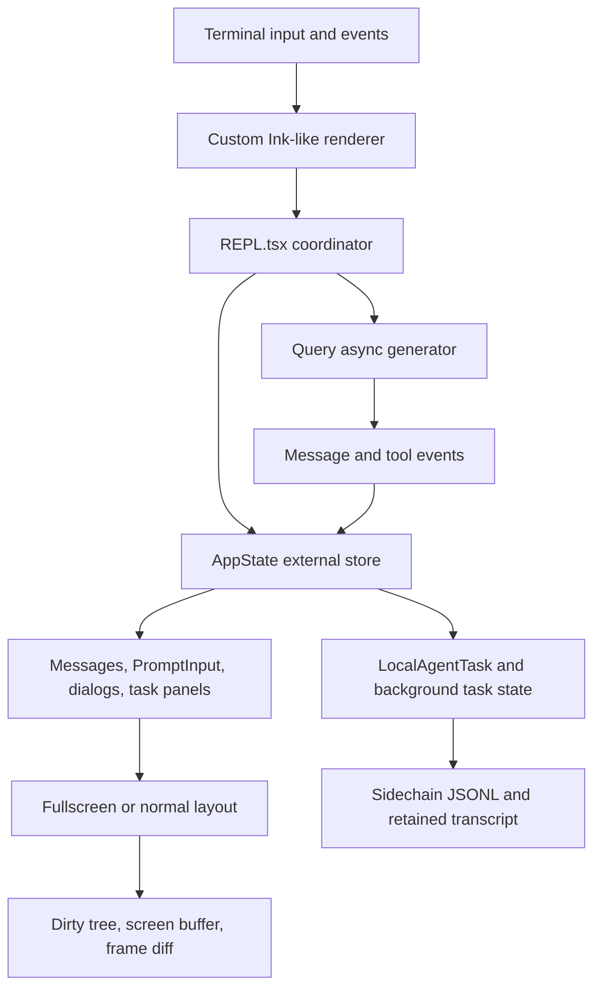

# Claude Code Ripe TUI Design Report

**Status:** reference-snapshot
**Research date:** 2026-07-10
**Local snapshot:** `.reference/claude-code-ripe` at `4b9d30f79532`
**Scope:** TUI framework, rendering, input, sessions, permissions, background
tasks, local agents, transcript navigation, and terminal performance

> **Ownership:** time-scoped Claude Code Ripe TUI evidence; current eino-agent
> behavior lives in [`architecture/tui/README.md`](../../../architecture/tui/README.md)

## Executive Summary

`claude-code-ripe` is the strongest reference for a complete interactive
coding-agent workflow. Its important advantage is not a particular visual
style. The advantage is that prompt editing, permissions, streaming, session
recovery, background tasks, agent transcripts, and terminal performance are
designed as one product.

The local snapshot uses React with a substantial custom Ink-like terminal
runtime. `src/screens/REPL.tsx` remains the central coordinator, while an
external AppState store, task objects, virtualized message list, prompt input
subsystem, and tool-specific permission components isolate the most expensive
or stateful behavior.

For `eino-agent`, the most valuable ideas are:

1. treat a local agent as retained task state with messages and progress;
2. let the same input surface target the leader or a viewed agent;
3. merge persisted sidechain transcript data with live messages by stable ID;
4. virtualize long transcripts and freeze stable off-screen content;
5. model pasted text, images, queued input, history, and draft stash as first-
   class composer state;
6. specialize permission UX by tool instead of rendering one generic dialog.

The least suitable part to port literally is the custom React terminal stack.
It solves real problems, but it also creates a large renderer and reconciliation
surface that is unnecessary for a Bubble Tea implementation.

## Research Boundary

This report describes the checked-out local reference, not an upstream release
claim. The snapshot appears to contain transformed production sources and
embedded source maps. It contains no discoverable `*.test.*`, `*.spec.*`, or
`__tests__` suite, so test-quality conclusions cannot be inferred from this
copy. Behavioral findings below are based on production source paths and state
transitions.

The inspected TUI-related surface spans roughly 610 TypeScript/TSX files and
131K lines across `src/components`, `src/screens`, `src/state`, `src/tasks`,
`src/ink`, and `src/hooks`. That number is a research-scope footprint, not a
claim that every line is user-interface code.

## Architecture

The architecture has four practical layers:

- **Terminal runtime:** `src/ink/` owns reconciliation, Yoga layout, terminal
  events, selection, scroll boxes, screen buffers, and frame diffing.
- **Application orchestration:** `src/screens/REPL.tsx` coordinates query
  execution, message state, permissions, sessions, overlays, backgrounding,
  viewed-agent state, and prompt submission.
- **Reactive product state:** `src/state/AppStateStore.ts` and
  `src/state/AppState.tsx` expose an external store consumed through selector-
  based `useSyncExternalStore` subscriptions.
- **Stateful workflows:** `PromptInput`, `Messages`, `VirtualMessageList`,
  `LocalAgentTask`, permission components, and background-task dialogs own
  focused workflow state.

## Primary Source Anchors

| Concern | Primary source |
|---|---|
| Main application loop | `src/screens/REPL.tsx` |
| Top-level state | `src/state/AppStateStore.ts`, `src/state/AppState.tsx` |
| Message pipeline | `src/components/Messages.tsx`, `src/components/MessageRow.tsx` |
| Transcript virtualization | `src/components/VirtualMessageList.tsx`, `src/hooks/useVirtualScroll.ts` |
| Off-screen stabilization | `src/components/OffscreenFreeze.tsx` |
| Prompt composer | `src/components/PromptInput/PromptInput.tsx` and sibling files |
| Keybindings | `src/keybindings/`, `src/hooks/useGlobalKeybindings.tsx` |
| Resume/fork | `src/screens/ResumeConversation.tsx`, `src/components/LogSelector.tsx` |
| Permissions | `src/components/permissions/`, `src/hooks/toolPermission/` |
| Local agents | `src/tasks/LocalAgentTask/LocalAgentTask.tsx` |
| Agent view switching | `src/state/teammateViewHelpers.ts`, `src/screens/REPL.tsx` |
| Background work | `src/components/tasks/BackgroundTasksDialog.tsx` |
| Terminal renderer | `src/ink/renderer.ts`, `src/ink/render-to-screen.ts`, `src/ink/components/ScrollBox.tsx` |

## State Ownership and Event Flow

`AppState` includes product state that must survive ordinary component
rerenders: tasks, agent names, `foregroundedTaskId`, `viewingAgentTaskId`,
notifications, permission-related state, model/mode state, token usage, and
expanded views.

The store is selector-driven. `useAppState(selector)` prevents broad whole-
state subscriptions and therefore limits rerender scope. This matters because
streaming can mutate the visible tail many times per second while most task,
session, and configuration state remains unchanged.

`REPL.tsx` still carries a high coordination load. It owns or connects:

- the async query iterator;
- message accumulation and replacement;
- active permissions and overlays;
- prompt input and queued commands;
- session transcript persistence;
- background/foreground query transitions;
- viewed-agent transcript selection;
- search, message actions, compaction, and recovery.

This provides product cohesion but also produces a 5K-line central component.
The design lesson is to preserve selector-based state and explicit workflow
objects while avoiding another all-purpose coordinator in Go.

## Message Rendering and Long-Session Performance

The message path is more than a direct `messages.map()`:

1. normalize raw message variants;
2. reorder and pair tool calls/results;
3. group or collapse related operations;
4. derive searchable/renderable messages;
5. render either a bounded normal view or a virtualized fullscreen view.

`Messages.tsx` memoizes expensive transformations independently from the
visible range. In non-virtual modes it applies bounded history limits. In
fullscreen mode, `VirtualMessageList` mounts only a window around the viewport.

`useVirtualScroll` maintains measured item heights, top and bottom spacers,
binary-search lookup, overscan, sticky-bottom behavior, and range clamping. The
implementation explicitly handles fast-scroll cases that otherwise produce
blank frames. Search and jump operations use the same measured index rather
than maintaining a second coordinate system.

`OffscreenFreeze` freezes completed off-screen subtrees so timers or spinners do
not invalidate old scrollback. The custom renderer adds another optimization
layer: dirty-node traversal, previous-frame blitting, persistent character
caches, double buffering, and an alternate-screen height invariant.

The important transferable invariant is:

> Work per frame should be proportional to the visible or changing region, not
> to total transcript size.

`eino-agent` can preserve this invariant with item-version caches and visible-
row rendering without adopting React virtualization.

## Streaming Behavior

Streaming content remains mutable at the tail while completed messages become
stable. The source includes explicit defenses against unnecessary render scope:

- deferred stream text updates;
- stable message keys and memoized rows;
- bounded non-fullscreen transcript windows;
- off-screen freezing;
- fullscreen virtualization;
- reduced-motion behavior;
- width-aware cache invalidation.

This model separates **semantic stability** from **visual animation**. A
completed message should no longer participate in streaming work even if other
parts of the screen animate.

## Prompt Composer

`PromptInput.tsx` is a product subsystem rather than a plain text box. It
supports:

- normal prompt and shell input modes;
- slash commands and unified suggestions;
- file and IDE `@` mentions;
- persistent and arrow-key history plus history search;
- Vim input and custom keybindings;
- prompt undo buffer;
- stashing and restoring a draft with cursor and attachments;
- command queuing while a turn is active;
- editing queued commands;
- direct messages to teammates;
- model, effort, thinking, and permission-mode controls;
- external editor round trips;
- feature-gated voice dictation;
- pasted text and image references.

Large pasted text is stored separately and represented by a short reference in
the editor. The threshold also considers rendered line pressure, because a
large prompt can force the terminal renderer to repaint the full screen.
Clipboard images are assigned stable IDs, stored asynchronously, represented as
chips/references, and pruned when the corresponding placeholder is removed.

Submission is target-aware. When an agent transcript is being viewed, the same
composer invokes `onAgentSubmit`; otherwise it targets the leader. This keeps
the interaction model consistent and avoids a separate mini-editor inside an
agent details panel.

## Sessions, Resume, and Fork

`ResumeConversation.tsx` progressively loads session metadata, supports current-
repository and all-project views, filters sidechains, restores session metadata,
file history, content replacements, worktrees, agent identity, cost state, and
context-collapse state, and supports fork semantics.

Important behavior includes:

- progressive enrichment rather than eagerly parsing every transcript;
- cross-project safety checks and explicit handoff commands;
- resume versus fork identity handling;
- restoration of non-message session state;
- optional pull-request filtering;
- lazy loading of additional history.

The main lesson is that “resume” is not only loading chat text. A modern coding
agent must restore the execution context that explains the transcript.

## Permission Experience

Permission rendering is dispatched by tool type in
`src/components/permissions/PermissionRequest.tsx`. Bash, PowerShell, file
edits, writes, filesystem reads, notebook edits, web fetch, skills, plan mode,
and user questions each have specialized views.

The permission contract carries:

- structured tool input and tool-use identity;
- current permission decision and proposed updates;
- worker/agent identity badges;
- classifier progress and auto-approval metadata;
- user-interaction notification to stop an async classifier from dismissing an
  actively used dialog;
- allow/reject feedback;
- sticky fullscreen footer support for long plans;
- delayed desktop notification when attention is required.

This is stronger than a generic risk label because the user can inspect the
actual command or diff in the format most relevant to the decision.

## Background Tasks and Local Agents

`LocalAgentTaskState` is the most important reference contract. It contains:

- stable task and agent identity;
- prompt, agent type, selected definition, and model;
- status, result, error, abort controller, and cleanup;
- bounded progress: tool count, token count, last and recent activity, summary;
- optional live messages;
- pending messages sent during a turn;
- foreground/background state;
- retention, disk-bootstrap, and eviction deadlines.

Progress is derived from assistant messages while execution is active. Input
tokens use the latest cumulative value while output tokens are summed per turn;
recent tool activity is bounded to five entries.

When a local agent is viewed:

1. `viewingAgentTaskId` selects it as the displayed conversation;
2. `retain` prevents its in-memory transcript from being evicted;
3. sidechain JSONL is loaded once and UUID-merged with live messages;
4. new stream messages append to the retained transcript;
5. the main `Messages` view renders the selected transcript;
6. prompt submission queues input to a running agent or resumes a terminal one;
7. switching away releases the retained transcript and starts an eviction grace
   period when appropriate.

`BackgroundTasksDialog` handles several task kinds and routes each to a
specialized detail view. It can stop running work, foreground teammates, and
return to the leader. The architecture supports both a compact task list and a
full conversation projection of an agent.

## Terminal and Compatibility Behavior

The custom renderer supports normal and alternate-screen layouts, terminal
focus, selection, scroll boxes, mouse events, and dirty screen updates. It
contains defensive logic for:

- alternate-screen content overflowing terminal rows;
- cursor restoration causing accidental terminal scroll;
- stale previous-frame cells after selection overlays or node removal;
- width changes invalidating measured heights;
- reduced motion and terminal-specific key reporting.

This depth demonstrates why terminal behavior must be tested as a runtime
contract, not only as string output.

## Strengths

- Most complete end-to-end coding-agent interaction model of the four projects.
- First-class local-agent progress, transcript retention, follow-up, and resume.
- Mature prompt composer with paste, images, queue, history, stash, and editor.
- Strong long-transcript performance architecture.
- Tool-specific permission experiences.
- Rich resume/fork restoration beyond message text.

## Costs and Risks

- `REPL.tsx` and `PromptInput.tsx` are very large coordination surfaces.
- The custom renderer has a high maintenance burden and many terminal-specific
  invariants.
- AppState, component-local state, task objects, and transcript persistence
  require careful synchronization.
- Feature gates and product-specific integrations complicate direct reuse.
- The local snapshot does not include tests, so production behavior is visible
  but verification practices are not.

## Applicable Decisions for Eino-Agent

Adopt:

- retained, message-bearing Agent runtime state;
- leader/agent target switching in one composer;
- disk plus live transcript merge by stable message ID;
- bounded activity and token progress;
- visible-range rendering and stable-item freezing;
- large-paste/image reference state;
- specialized permission projections;
- resume as execution-context restoration.

Adapt:

- implement selectors and reducers as Go snapshot APIs instead of React stores;
- use Bubble Tea item caches instead of React virtualization;
- use a small typed event log instead of component-driven transcript mutation.

Do not copy:

- the custom React terminal renderer;
- the 5K-line coordinator shape;
- product-specific feature-gate and analytics complexity;
- nickname-based routing where a stable Agent/thread ID is available.

## Related Reports

- [`codex.md`](codex.md)
- [`crush.md`](crush.md)
- [`eino-agent-2026-07-10.md`](eino-agent-2026-07-10.md)
- [`modern-coding-agent-synthesis.md`](modern-coding-agent-synthesis.md)
