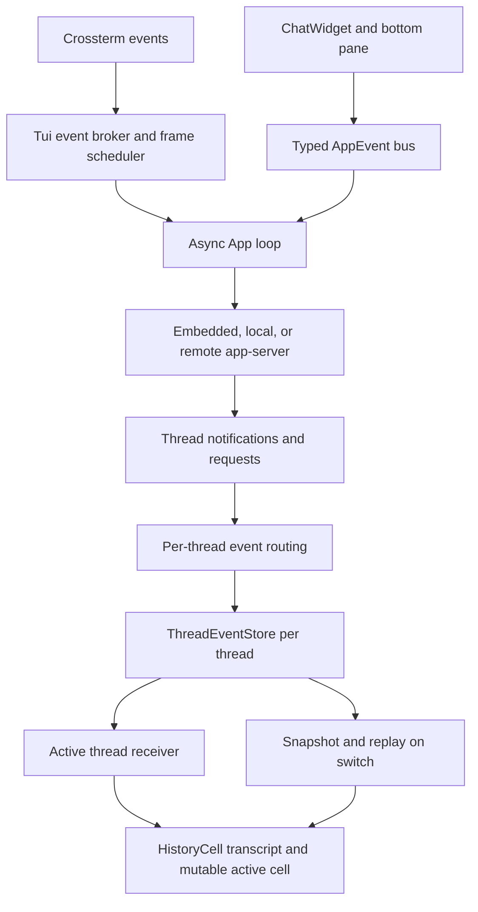

# Codex TUI Design Report

**Status:** reference-snapshot
**Research date:** 2026-07-10
**Local snapshot:** `.reference/codex` at `64bdeed9f7ad`
**Scope:** `codex-rs/tui`, app-server interaction, transcript rendering,
composer, resume/fork, approvals, and multi-agent thread navigation

> **Ownership:** time-scoped Codex TUI evidence; current eino-agent behavior
> lives in [`architecture/tui/README.md`](../../../architecture/tui/README.md)

## Executive Summary

The Codex TUI is the strongest reference for **protocol-backed thread state**.
Its defining choice is that the visible conversation is an app-server thread,
and main conversations, subagents, resumed sessions, and side conversations can
all be reconstructed from typed session, turn, item, request, and notification
data.

This gives Codex capabilities that are difficult to add as panel-only features:

- every agent has a stable thread identity;
- inactive threads continue buffering events;
- switching preserves and restores each composer draft;
- switching rebuilds the chat from a thread snapshot and event replay;
- unresolved approvals and user-input requests survive replay;
- closed agents stay inspectable;
- subagent lineage and collaboration operations are transcript items;
- the active thread can fail over to main if an agent closes unexpectedly.

The TUI also has the most mature input and snapshot-test surface among the four
projects. Its local `codex-rs/tui/src` tree contains 348 Rust files, roughly
209K lines including tests, and 525 checked-in `insta` snapshots.

For `eino-agent`, the key lesson is architectural: Agent switching requires a
per-thread event store and replay contract before it requires a new panel. The
full app-server split is too large to copy, but its thread/event vocabulary can
be implemented in-process.

## Research Boundary

This report describes the local checkout, not an upstream latest-version
claim. Codex is evolving rapidly and the checked-out source contains both
legacy collaboration paths and newer path-backed subagent behavior. Where the
source has transitional behavior, this report calls it out rather than
presenting one branch as a universal product contract.

## Architecture

The major layers are:

- **Terminal:** `tui.rs`, custom terminal, frame requester, event broker,
  keyboard enhancement, focus, suspend/resume, and scrollback insertion.
- **Application:** `app.rs` and `app/` modules own the async loop, app-server
  lifecycle, thread routing, resize/reflow, and global actions.
- **UI event bus:** `app_event.rs` decouples widgets from application actions.
- **Runtime protocol:** app-server `Thread`, `Turn`, `ThreadItem`, requests,
  notifications, and commands are the source data.
- **Conversation UI:** `ChatWidget`, `HistoryCell`, streaming controllers, and
  bottom-pane views render one selected thread.

## Primary Source Anchors

| Concern | Primary source |
|---|---|
| TUI startup and terminal modes | `codex-rs/tui/src/tui.rs`, `codex-rs/tui/src/lib.rs` |
| Application event bus | `codex-rs/tui/src/app_event.rs`, `app_event_sender.rs` |
| Main async loop | `codex-rs/tui/src/app.rs`, `app/event_dispatch.rs` |
| Per-thread event state | `codex-rs/tui/src/app/thread_events.rs` |
| Thread routing and replay | `codex-rs/tui/src/app/thread_routing.rs` |
| Session/agent switching | `codex-rs/tui/src/app/session_lifecycle.rs` |
| Stable agent navigation | `codex-rs/tui/src/app/agent_navigation.rs` |
| Multi-agent transcript rows | `codex-rs/tui/src/multi_agents.rs` |
| Agent status summary | `codex-rs/tui/src/app/agent_status_feed.rs` |
| Conversation cells | `codex-rs/tui/src/history_cell/` |
| Streaming markdown | `codex-rs/tui/src/streaming/controller.rs` |
| Prompt composer | `codex-rs/tui/src/bottom_pane/chat_composer.rs` |
| Resume/fork picker | `codex-rs/tui/src/resume_picker.rs` |
| Cross-thread approvals | `codex-rs/tui/src/bottom_pane/pending_thread_approvals.rs` |

## App-Server Boundary and Typed Events

The TUI can connect to an embedded, local daemon, or remote app-server. It does
not own the agent loop's canonical session data. This forces explicit contracts
for operations and events.

`AppEvent` is an internal UI/application command bus. Widgets send actions such
as open picker, select agent thread, resume session, submit an operation to a
specific thread, start search, change settings, or exit. The top-level app loop
performs IO and lifecycle work.

The app-server protocol is a separate event source. It emits typed thread
notifications and interactive requests. This distinction is useful:

- `AppEvent` means “the UI requests an application action”;
- `ServerNotification` means “runtime state changed”;
- `ServerRequest` means “runtime needs an interactive response”;
- `AppCommand` means “submit an operation to a thread”.

The separation makes causality and test setup clearer than a single union of
arbitrary `tea.Msg` values. Its cost is a very large event surface and a more
complex lifecycle than an in-process TUI needs.

## Per-Thread Event Store

`ThreadEventStore` is the core multi-agent primitive. Each thread owns:

- optional session state;
- persisted turns;
- a bounded `VecDeque` of notifications, requests, history responses, and
  feedback results;
- pending-interactive replay state;
- active turn identity;
- saved composer input state;
- capacity and active/inactive status.

The store updates active-turn state from `TurnStarted`, `TurnCompleted`, and
`ThreadClosed`. When the buffer evicts a request, the pending-interactive
tracker is informed so unresolved UI state is not silently forgotten.

Snapshots filter interactive requests: only unresolved approvals or user-input
requests are replayed. Answered prompts do not reappear after a thread switch.
Some events, such as active hooks, MCP status, feedback, and requests, survive a
session refresh; stale transcript notifications are replaced by canonical turn
data.

This is a more precise contract than “store all events and rerender them.” It
defines which state is canonical, replayable, bounded, and still actionable.

## Thread Switching

Thread switching is a lifecycle transaction:

1. capture the current `ChatWidget` composer state;
2. return the active event receiver to its thread channel;
3. activate the target channel and take a snapshot;
4. refresh the target from app-server if its local session data is incomplete;
5. construct a fresh `ChatWidget`;
6. transfer stable metadata such as terminal title and agent labels;
7. clear/rebase terminal transcript state;
8. restore the target draft and attachment/queue state;
9. replay canonical turns and buffered events;
10. suppress queue auto-send during replay;
11. resume live event draining and pending approval summaries.

The implementation supports live attach, replay-only fallback, and closed-
thread inspection. If a selected subagent closes unexpectedly, the app can
switch back to main. Closed threads remain in first-seen navigation order so
the user's mental map does not reshuffle.

`AgentNavigationState` deliberately separates identity from presentation:

- `ThreadId` is the routing key;
- nickname and role are labels;
- canonical `agent_path` is preferred for newer subagents;
- first-seen order drives traversal;
- closed and running are status flags, not identity changes.

Fast navigation uses `Alt+Left` and `Alt+Right`. On macOS, Option+b/f fallback
is only allowed when the composer is empty, preserving normal word motion when
editing a draft.

## Multi-Agent Transcript Model

Multi-agent actions are first-class `ThreadItem` variants rather than generic
tool text. `CollabAgentToolCall` represents:

- spawn agent;
- send input;
- resume agent;
- wait for one or more agents;
- close agent.

It includes sender/receiver thread IDs, status, prompt, model/reasoning details,
and per-agent states. `SubAgentActivity` carries agent thread ID, canonical
path, and started/interacted/interrupted kind.

`multi_agents.rs` renders these into semantic history cells with stable agent
labels, bounded prompt/response/error previews, and status-aware styling. The
same events populate navigation metadata and lineage.

There is currently a dual `/agent` behavior in the local snapshot:

- newer path-backed subagents produce a bounded status history cell for running
  agents;
- legacy/non-path-backed threads use a selectable agent picker;
- adjacent-thread shortcuts provide direct switching across known threads.

This is evidence of an evolving interface, not a pattern to copy exactly. The
stable event/thread model underneath it is the reusable part.

## Transcript Rendering

Codex does not keep every completed row in one ordinary fullscreen widget.
Completed `HistoryCell`s can be inserted into terminal scrollback, while the
active mutable cell and bottom pane remain in the inline viewport. `Ctrl+T`
opens a transcript overlay with a cached live tail.

`HistoryCell` is the semantic render interface. A cell can provide:

- rich display lines;
- raw copy-friendly lines;
- hyperlink-aware lines;
- measured height at a width;
- transcript-specific lines;
- transcript animation revision;
- stream-continuation semantics.

Concrete cells exist for assistant/user messages, exec output, patches, plans,
MCP, approvals, hooks, search, notices, and session information. This avoids a
single generic tool formatter and lets each domain define compact, expanded,
raw, and transcript forms.

On resize, source-backed cells can reflow transcript history. The custom
terminal distinguishes normal inline viewport rendering from temporary
alternate-screen overlays and can rebuild scrollback after width changes.

The approach is highly capable but terminal-specific. A simpler Bubble Tea app
should adopt the semantic cell interface and width-keyed caching, not direct
terminal scrollback mutation as its first step.

## Streaming Model

The streaming controller divides output into:

- **stable region:** newline-complete rendered lines queued for commit;
- **mutable tail:** content that can still reflow in the active cell.

Only complete source is committed. Markdown tables receive special holdback
because a new row can change every prior column width. During a live table, the
table header onward stays mutable while prose before it can become stable.

Width changes rerender from source and rebuild the stable queue without trying
to maintain byte-level line mappings. Finalization rerenders the complete raw
source to produce the canonical transcript representation.

This is a stronger streaming contract than rendering the entire accumulated
Markdown string on each token. `eino-agent` can adopt stable-chunk commit and
table holdback while preserving its existing batching and prefix cache.

## Prompt Composer

`ChatComposer` is a documented state machine. Its responsibilities include:

- editable text and structured text elements;
- slash, file, skill, and app-mention popups;
- normal and shell input;
- immediate submit versus queue-on-Tab while a task runs;
- persistent text history plus rich local history;
- `Ctrl+R` reverse incremental search;
- local image placeholders and remote image rows;
- attachment rehydration from local history;
- large-paste placeholders with collision-safe labels;
- trimming/rebasing structured element ranges on submit;
- pending-paste expansion;
- read-only/disabled mode;
- Vim and runtime keymaps;
- external editor integration.

The non-bracketed `PasteBurst` state machine is particularly mature. It
distinguishes rapid paste streams from typing, handles ASCII and non-ASCII/IME
input differently, flushes safely on mode changes, and prevents pasted shortcut
characters from opening UI overlays.

Per-thread composer state is captured before switching and restored after
replay. This includes more than text: queued input and attachments must remain
associated with the thread where the user created them.

## Sessions, Resume, and Fork

`resume_picker.rs` uses app-server pagination with a page size of 25 and loads
more rows near the end. It supports:

- resume and fork actions;
- current-directory versus all-session filtering;
- provider filtering;
- backend sort keys;
- typed local search over loaded rows;
- comfortable and dense density;
- lazy transcript preview;
- `Ctrl+E` full transcript overlay;
- persisted picker view preference;
- deduplication across moving pagination windows.

This is a strong model for large session histories because it does not parse
every transcript before the picker becomes usable.

## Approvals and Interactive Requests

Approvals are thread-scoped and survive focus changes. The TUI converts app-
server requests into typed overlays for command execution, file changes,
permissions, MCP elicitation, app links, and tool user input.

Pending requests on inactive threads remain in each `ThreadEventStore`.
`PendingThreadApprovals` lists up to three affected threads and tells the user
to switch. The thread snapshot replays only requests that remain unresolved.

This directly addresses a modern multi-agent failure mode: a background agent
can need approval without freezing or silently blocking the visible leader
conversation.

## Terminal Runtime

The Codex terminal layer supports:

- inline viewport with normal shell scrollback;
- alternate-screen overlays with restoration to the prior viewport;
- bracketed paste and keyboard enhancement probes;
- terminal focus events and focus-aware desktop notifications;
- hyperlinks;
- synchronized updates;
- Unix suspend/resume and raw-mode recovery;
- Windows compatibility paths;
- resize/reflow and history reinsertion;
- bounded frame scheduling.

The source contains tests for stale-cell clearing, focus notification policy,
resize, transcript reflow, and terminal state transitions. This treats terminal
compatibility as core behavior.

## Verification Strategy

The TUI has a broad mixture of:

- pure state and reducer tests;
- async app/thread lifecycle tests;
- terminal backend tests;
- composer and paste state-machine tests;
- replay and approval tests;
- 525 `insta` snapshots across widths, platforms, permissions, session picker,
  history cells, multi-agent transcript, and overlays.

Snapshot density does not replace behavioral assertions, but it makes visual
and wrapping regressions explicit. Eino-Agent still has fewer visual fixtures,
but M7.4 now supplements its six scenario harness with product-state goldens,
transition/property tests, a full interactive PTY workflow, and performance
budgets. Codex itself is now invoked in that harness only through a fresh,
logged-out, two-run-deterministic startup boundary.

## Strengths

- Best separation between runtime truth and TUI projection.
- Best first-class agent thread switching and event replay.
- Strongest inactive-thread approval handling.
- Most robust composer and paste behavior.
- Rich semantic history cell architecture.
- Excellent resume/fork scalability and transcript preview.
- Broad snapshot and lifecycle verification.

## Costs and Risks

- The app-server boundary adds large protocol and lifecycle complexity.
- `AppEvent` and application coordination surfaces are very large.
- `chat_composer.rs` is itself a very large module despite recent subdivision.
- Custom terminal scrollback insertion and reflow are difficult to maintain.
- The current `/agent` behavior includes transitional legacy/v2 paths.
- Copying the full architecture would delay user-facing improvements in a
  smaller in-process Go runtime.

## Applicable Decisions for Eino-Agent

Adopt:

- stable `ThreadID`/`AgentID` routing and explicit parent lineage;
- bounded per-thread event stores;
- saved per-thread composer state;
- replay filtering for unresolved interactive requests;
- closed-thread inspection and stable spawn order;
- fast adjacent-agent navigation;
- typed collaboration events;
- semantic message/tool cell interfaces;
- stable streaming region plus mutable tail;
- lazy session previews and pagination;
- snapshot-heavy TUI regression tests.

Adapt:

- keep the event store in-process behind `QueryEngine` instead of requiring an
  app-server;
- use Bubble Tea messages to notify that a snapshot changed, not as the source
  of runtime truth;
- start with bounded memory plus existing transcript files before adding a
  database.

Do not copy first:

- the full app-server transport layer;
- direct terminal scrollback insertion and resize reconstruction;
- the entire `AppEvent` surface;
- dual legacy/v2 agent UX.

## Related Reports

- [`claude-code-ripe.md`](claude-code-ripe.md)
- [`crush.md`](crush.md)
- [`eino-agent-2026-07-10.md`](eino-agent-2026-07-10.md)
- [`modern-coding-agent-synthesis.md`](modern-coding-agent-synthesis.md)
