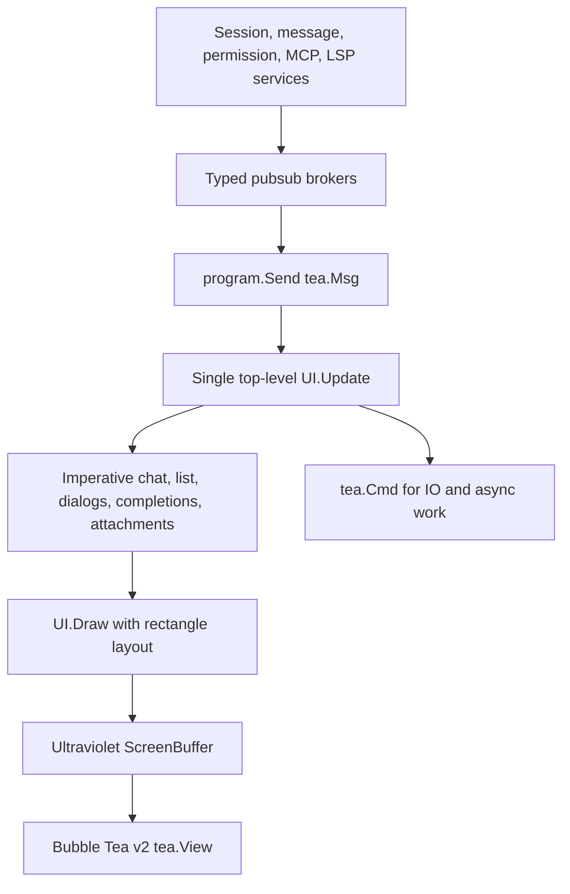

# Crush TUI Design Report

**Status:** reference-snapshot
**Research date:** 2026-07-10
**Local snapshot:** `.reference/crush` at `d20e29ae7500`
**Scope:** Bubble Tea application model, Ultraviolet rendering, lazy chat list,
composer, sessions, permissions, tool renderers, and Agent tool presentation

> **Ownership:** time-scoped Crush TUI evidence; current eino-agent behavior
> lives in [`architecture/tui/README.md`](../../../architecture/tui/README.md)

## Executive Summary

Crush is the most directly applicable implementation reference for
`eino-agent` because both are Go coding agents built around Bubble Tea. It shows
that a modern, efficient terminal UI does not require React or a remote app-
server. Its most valuable implementation choices are:

- one top-level Bubble Tea model with side effects returned as `tea.Cmd`;
- rectangle-based layout and a cell screen buffer;
- a lazy chat list with item/version/width render caching;
- freezing completed items and animating only visible items;
- semantic message/tool interfaces with dedicated tool renderers;
- incremental Markdown stable-prefix caching;
- service-owned persisted sessions and typed pub/sub events;
- responsive wide/compact layouts and a stacked dialog system.

Crush is weaker as a multi-agent product reference. Its Agent tool runs a
non-interactive child session and exposes nested tool calls inside the parent
tool item, but it does not make the child a user-navigable, independently
controllable conversation. That makes Crush the best **rendering and Bubble Tea
architecture** reference, while Codex and Claude Code remain better references
for Agent thread switching and follow-up.

The local `internal/ui` tree contains 97 production Go files and about 28.2K
production lines, plus 31 test files and about 7K test lines. The repository has
363 UI golden fixtures.

## Research Boundary

This report describes the local checkout, not an upstream latest-version
claim. `internal/ui/AGENTS.md` is useful architecture documentation, but every
important claim below was checked against the referenced production source.

## Architecture

The UI uses a hybrid renderer:

- the top level allocates an Ultraviolet `ScreenBuffer`;
- layout produces rectangles for header, main chat, editor, sidebar, pills,
  status, and compact details;
- components either draw cells into a rectangle or render a string that is
  decoded into the screen;
- `tea.View` carries the final content, cursor, alternate-screen flag, mouse
  mode, focus reporting, title, and optional progress bar.

## Primary Source Anchors

| Concern | Primary source |
|---|---|
| Architecture rules | `internal/ui/AGENTS.md` |
| Main model and layout | `internal/ui/model/ui.go` |
| Chat controller | `internal/ui/model/chat.go` |
| Lazy list/cache | `internal/ui/list/list.go`, `internal/ui/list/item.go` |
| Message interfaces | `internal/ui/chat/messages.go` |
| Tool factory/interfaces | `internal/ui/chat/tools.go` |
| Streaming Markdown | `internal/ui/chat/streaming_markdown.go` |
| Dialog stack | `internal/ui/dialog/dialog.go` |
| Permissions | `internal/ui/dialog/permissions.go` |
| Session picker | `internal/ui/dialog/sessions.go` |
| Composer/paste/layout | `internal/ui/model/ui.go` |
| Runtime pub/sub bridge | `internal/app/app.go` |
| Agent tool | `internal/agent/agent_tool.go`, `internal/agent/coordinator.go` |
| Child-agent UI projection | `internal/ui/model/ui.go`, `internal/ui/chat/agent.go` |

## State Ownership and Event Flow

`UI` is the sole Bubble Tea model. It owns dimensions, layout, focus, current
session, textarea, chat, dialog overlay, completion popup, attachments,
notifications, compact mode, prompt queue, pills, and service-facing state.

Children are stateful structs with imperative methods. `Chat` and `List` do not
implement independent Elm update loops. The parent calls methods such as
`AppendMessages`, `ScrollBy`, `SetMessages`, `Animate`, `HandleMouseDown`, and
`Draw`. Dialogs return typed actions to the parent.

This keeps message ownership obvious but makes `UI.Update` a large switch. The
project explicitly requires IO and expensive work to leave `Update` through
`tea.Cmd`, and commands return messages rather than mutating UI state from a
goroutine.

The application service layer fans typed pub/sub sources into a broker of
`tea.Msg`:

- sessions;
- messages;
- permissions and permission notifications;
- file history;
- Agent notifications and terminal completions;
- MCP, LSP, and skills.

The app subscriber sends broker events into Bubble Tea. Most event delivery is
best-effort; terminal run-completion uses a must-deliver path so a full buffer
cannot drop the only completion signal.

This distinction is worth adopting: high-frequency progress can be coalesced,
but permission and terminal state must be lossless.

## Responsive Layout

Crush uses two primary chat layouts:

- **wide:** main chat and editor alongside a fixed sidebar;
- **compact:** one-line header, full-width chat/editor, pills, and an optional
  session-details overlay.

Compact mode activates below 120 columns or 30 rows, or through a user setting.
The textarea has dynamic height from 3 to 15 rows. A two-pass layout handles
soft wrapping: setting the editor width can change its height, which triggers a
second layout calculation.

`Draw` clears the screen, draws base regions, then completions and dialogs last.
The cursor is returned only when the editor is focused and not covered by a
compact details overlay. This rectangle discipline prevents the repeated
manual string overlay arithmetic present in `eino-agent`.

## Lazy Chat Rendering and Caching

`list.List` uses item-relative scroll state:

- `offsetIdx`: first visible item;
- `offsetLine`: number of hidden lines within that item;
- selected item index;
- width and height;
- optional gap and reverse mode.

Each list item exposes `Render`, `Version`, and `Finished`. The cache key is
item pointer, width, and version. Completed items can be frozen permanently
until invalidated. Selection drag temporarily suppresses freezing for affected
items so a live highlight overlay can be rendered.

The list stores pre-split rendered lines. `Render` walks from the current item
and appends only the lines allowed by the viewport budget. Per-frame assembly is
therefore O(visible rows), even when a single hidden item contains many
thousands of lines.

`Chat` adds a bounded screen-level cache. If the final ANSI string and terminal
width method are unchanged, it reuses a previously decoded screen buffer and
avoids parsing ANSI on every frame. It also pauses animations for off-screen
items and restarts them when they become visible.

These mechanisms are a near-direct blueprint for `eino-agent`:

- use item/version/width as the cache key;
- freeze terminal items;
- keep offsets item-relative;
- assemble only visible rows;
- avoid animating invisible content;
- optionally cache ANSI decoding after measuring whether it is a bottleneck.

## Message and Tool Rendering

The message system is capability-based:

- `list.Item` is the rendering base;
- `MessageItem` adds raw rendering and identity;
- `ToolMessageItem` adds tool call, result, and status;
- optional interfaces add focus, highlight, expansion, animation, compact
  mode, nesting, and key handling.

`NewToolMessageItem` dispatches tool names to dedicated renderers for Bash,
file operations, search, fetch/web, Agent, diagnostics, references, LSP,
todos, MCP, and a generic fallback.

This is more maintainable and more informative than switching over tool names
inside one generic formatter. Each tool renderer can choose its own compact
summary, expanded output, status animation, raw copy form, and semantic style.

## Streaming Markdown

`streamingMarkdown` caches a rendered stable prefix and rerenders only the
trailing partial document. The safe-boundary detector is deliberately
conservative. It rejects boundaries that might split open fences, lists,
tables, quotes, setext headings, indented code, HTML blocks, or reference
definitions.

When safety cannot be proven, it falls back to a full render. Width changes or
non-prefix content changes reset the cache. This prioritizes correctness over a
fragile optimization.

Compared with Codex, Crush commits at safe block boundaries rather than owning
a stable line queue and mutable tail. Both approaches share the same principle:
finished Markdown should stop participating in full-document rendering.

## Composer and Attachments

Crush's editor supports:

- dynamic-height multiline input;
- direct shell mode with streaming output;
- prompt history;
- sending while busy through the Agent run queue;
- file and MCP resource completion after `@`;
- file and image attachments;
- clipboard image paste;
- external editor;
- command dialogs;
- focus transfer between editor and chat;
- mouse interaction and text selection.

Paste handling is structured:

- content over 10 lines or with a line over 1000 columns becomes a text
  attachment;
- attachments are bounded to 5 MiB;
- pasted image-file paths are detected and loaded asynchronously;
- pasted `!` input enters shell mode;
- large pasted text does not inflate the textarea.

One notable limitation is that external-editor launch is rejected while the
Agent is busy. Codex and Claude Code demonstrate a better target: the draft can
be edited independently while runtime work continues.

The completion UX is also simpler than Codex/Claude Code. Slash commands open a
dialog/palette, while file and resource completion is inline. There is no one
unified rich element model for pasted text, images, file mentions, and queued
input.

## Sessions

Sessions are service-owned and persisted in SQLite. They include parent
session, token/cost, todos, timing, and message data. The TUI session dialog
supports:

- filtering;
- selecting/switching;
- renaming;
- deletion with confirmation;
- current-session focus.

The picker is immediate and useful but less scalable than Codex's paginated
picker. It does not offer lazy transcript preview or a full transcript overlay.

Child Agent-tool sessions are intentionally not ordinary resume targets.
`resolveSession` rejects both encoded Agent-tool IDs and sessions with a parent
ID. This keeps the public session list clean but prevents subagent transcript
navigation and continuation.

## Permissions

Permission requests arrive through typed pub/sub and open a modal dialog. The
dialog offers allow once, allow for session, and deny. It supports:

- command/tool descriptions;
- edit/write diffs;
- split or unified diff mode;
- horizontal and vertical scrolling;
- fullscreen diff mode;
- narrow-terminal fullscreen fallback;
- mouse wheel;
- remote permission-resolution notification;
- focus-aware desktop notification when attention is needed.

The permission UI is strong for file edits but less tool-specialized than
Claude Code's component-per-tool hierarchy. Requests are shown as a global
front dialog; there is no per-Agent pending-approval inbox because child Agents
are non-interactive.

## Agent Tool and Child Sessions

The Agent tool is implemented with Fantasy's parallel Agent tool. For each call
it creates a deterministic child session derived from the parent assistant
message and tool-call IDs, records the parent session, runs a non-interactive
Agent, accumulates child cost into the parent, and returns final text as the
tool result.

The TUI reconstructs nested activity in two paths:

- when loading a session, it recursively reads child sessions and extracts
  nested tool items;
- while running, child-session message events update nested tool calls and
  results under the parent Agent item.

Only child messages containing tool calls or results are processed by
`handleChildSessionMessage`. Child assistant narrative is not projected into a
full transcript. The user cannot switch to the child, send follow-up input,
resume it, or resolve a child-specific permission. The child lifetime is
bounded by the parent tool call.

This design is excellent for a compact causal trace in the parent conversation
and insufficient for first-class asynchronous subagents. `eino-agent` should
keep the nested parent projection while adding a separate full Agent thread
projection.

## Notifications and Terminal Capability

Crush probes terminal capabilities and chooses native, OSC, bell, disabled, or
automatic notification backends. Notifications are suppressed when the window
is focused and focus reporting is available. SSH prefers terminal protocols.

The TUI enables alternate screen, cell-motion mouse mode, focus reporting,
window title, terminal images where supported, and terminal progress bars on
known terminals. It uses ANSI-aware string operations and configurable width
methods for Unicode correctness.

## Verification Strategy

Crush combines:

- state-transition unit tests;
- cache/version invalidation tests;
- layout and dialog tests;
- incremental Markdown tests;
- child-agent and session tests;
- `catwalk` visual tests;
- 363 golden fixtures.

The tests explicitly cover cache version bumps and rendering at stable widths,
which is important because cache correctness bugs can produce stale UI without
panics.

## Strengths

- Best directly reusable Bubble Tea architecture.
- Strong responsive rectangle layout and screen-buffer composition.
- Excellent visible-row rendering and finished-item caching.
- Clear semantic interfaces and dedicated tool renderers.
- Typed service pub/sub with lossless terminal event path.
- Good attachment, shell, permission, and notification workflows.
- Broad golden test coverage.

## Costs and Risks

- `UI.Update` and `model/ui.go` remain large coordination surfaces.
- State is split between services, the main UI, and mutable child structs.
- Alternate-screen-only UI gives up normal shell scrollback.
- Session picker lacks lazy preview/fork depth.
- External editor is blocked while work runs.
- Subagents are nested tool executions, not first-class conversations.
- A screen-buffer migration would be a larger change than `eino-agent` needs
  for its first Agent UX milestones.

## Applicable Decisions for Eino-Agent

Adopt directly or nearly directly:

- item/version/width render caching and terminal-item freezing;
- item-relative offsets and O(viewport) line budgets;
- visible-only animation;
- capability-based message/tool interfaces;
- dedicated tool renderers;
- typed service/runtime events sent into Bubble Tea;
- responsive wide/compact rectangle layout;
- dialog interface/stack;
- focus-aware notifications;
- large-paste attachment behavior;
- nested Agent tool trace under the parent call;
- golden fixtures across widths and states.

Adapt:

- preserve current Lip Gloss string rendering first; migrate only the layout
  model and item interfaces before considering a screen buffer;
- use engine-owned Agent thread state rather than child session IO inside TUI;
- allow drafts and external editor while background work runs.

Do not copy as the target Agent model:

- non-interactive child sessions as the only subagent representation;
- filtering child sessions out of every navigation path;
- tool-only child trace without assistant messages;
- global modal permissions with no inactive-Agent attention state.

## Related Reports

- [`claude-code-ripe.md`](claude-code-ripe.md)
- [`codex.md`](codex.md)
- [`eino-agent-2026-07-10.md`](eino-agent-2026-07-10.md)
- [`modern-coding-agent-synthesis.md`](modern-coding-agent-synthesis.md)
