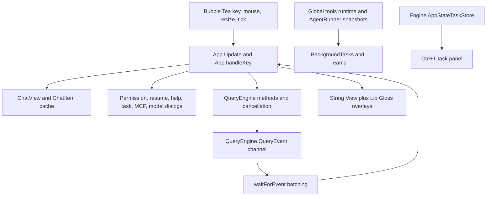

# eino-agent TUI Baseline Snapshot Report

**Status:** reference-snapshot
**Research date:** 2026-07-10
**Repository snapshot:** `630750541ea1`
**Scope:** `internal/tui`, engine/TUI event binding, sessions, permissions,
tasks, Agents, input, rendering, and tests

> **Ownership:** eino-agent TUI baseline at the named repository snapshot;
> current behavior lives in
> [`architecture/tui/README.md`](../../../architecture/tui/README.md)

> **Closeout follow-up (2026-07-14):** This report preserves the initial audit
> snapshot. The resulting M0-M7 program is complete; its delivery evidence is
> intentionally not repeated here. See
> [`architecture/tui/README.md`](../../../architecture/tui/README.md)
> for current architecture and [`migration/history/tui/README.md`](../../history/tui/README.md)
> for the completed M0-M7 record.
>
> **Ownership follow-up (2026-07-14):** P11 proved that the alternative
> packages under `internal/tui/collapse`, `components/*`, `input`, `rendering`,
> `state`, and `ui` never became live owners. P12 removed them with
> migration-ledger, PTY, golden, performance, release-closure, and binary
> proof. Treat their descriptions below as historical audit findings, not
> current architecture.

## Follow-Up Summary Recorded at M7 Closeout

- Engine snapshots now own stable session/thread/turn/Agent identity, bounded
  replay, progress, lineage, transcript, control, and unresolved attention.
- `/agent`, Ctrl+B, and `/team` provide switchable, retained Agent threads with
  per-thread view/editor state and compact parent trace projection.
- The semantic history contract and dedicated renderer families cover all 41
  default tools plus bounded unknown/plugin fallback.
- Assistant streaming combines a Goldmark top-level block boundary with the
  existing rendered-prefix cache. The last list/table/fence remains mutable;
  width changes reflow source; terminal output canonicalizes into one item.
- M4.3 verification passed the 12-stage golden, focused lifecycle/resize/
  reference tests, 3219-test suite, four builds, TUI race, lint, manifest, and
  diff checks. The complex stream benchmark improved by about 7.5x on the same
  machine while reducing allocation bytes by about 6.8x.
- M4.4 partitions the whole viewport into explicit header/chat/activity/hint/
  editor/sidebar/status/overlay rectangles and routes all 15 modal states through
  one focus-owning stack with covered-async restoration.
- M4.4 verification passed base/modal goldens, geometry/dialog lifecycle tests,
  3229-test suite, four builds, TUI race, lint, manifest, and diff checks.
  Measured string composition remains about 4.2 us/op and a 100-turn full view
  about 127-130 us/op, so a screen-buffer migration is deferred.
- M5.1 replaces the App-wide legacy `KeyMap` with one deterministic resolver for
  eight active contexts, multi-step chords, reachable-action filtering,
  defensive user overrides, null unbinding, and last-valid rollback.
- Visible Help/status/task hints and TUI `/keybindings` now project active
  bindings. Vim editing and terminal fallbacks retain precedence; Ctrl+C/Ctrl+D/
  Ctrl+M, terminal-reserved keys, context/action mismatch, and normalized
  conflicts are validated. Verification passed 3249 tests, four builds,
  TUI/keybinding race, lint, manifest, and diff checks.
- M5.2 promotes the per-thread composer element into a bounded rune-range
  contract for paste, image, file, skill, and MCP resource payloads. It adds
  async clipboard/path images, project/skill/MCP `@` completion, stale-result
  suppression, multimodal Eino user parts, and rich recent history/rewrite with
  text-only persistence. Verification passed 3268 tests, four builds, lint,
  focused race, manifest, and diff checks.
- M5.3 gives each QueryEngine a persistent bounded user queue. Busy leader Enter
  no longer cancels: completed tool rounds consume queued input as attachments,
  while terminal fallback atomically claims a fresh turn. Rich rows remain
  visible/editable/removable per thread, child input uses AgentRunner UUIDs, and
  Ctrl+C drains through terminal before handoff. Verification passed the same
  3287-test full gates plus focused engine/queue/TUI/Agent race scenarios.
- M5.4 gives the composer a dedicated reverse-search context, a real
  `$EDITOR` lifecycle through Bubble Tea's process handoff, and a bounded
  100-entry rich undo stack per thread. Rich drafts restore on search cancel,
  editor results are thread-targeted, and Bubbles-native word deletion remains
  undoable without claiming an unimplemented kill ring. Verification passed
  3298 tests, four builds, lint, focused TUI/keybinding race, manifest, and diff
  gates.
- M6.1 replaces eager fixed-limit picker loading with stat-first opaque-cursor
  pages and bounded head/tail enrichment. An atomic root catalog supports exact
  CWD, shared Git common-dir repository/worktree, and all registered projects;
  backend sort/filter, stale-generation rejection, moving-page merge, and
  stable-key selection are verified by the 3308-test full gates.
- M6.2 adds explicit selected-history resume/fork modes, a four-message bounded
  tail preview, on-demand full transcript/search with picker return, and rich
  available lineage/model/status/worktree metadata. Same-CWD sources are
  actionable, cross-CWD execution is deferred safely, and 3319 tests plus
  focused race and four builds pass.
- M6.3 adds execution metadata after every atomic transcript rewrite, selected-
  source cross-CWD/worktree restoration, live-callback request intersection,
  current-runner Agent live attach, durable/interrupted Agent replay, and a
  `0600` presentation-only sidecar. Queue/image/undo/request payloads are
  intentionally excluded. ACP prompt close now joins before engine close, and
  hook status is query-context scoped for concurrent sessions.
- M7.1 defines compact below 80 columns or 24 rows, standard at ordinary sizes,
  and wide at 150x24 with canonical work rows. Wide preserves at least 100 main
  columns and adds a bounded unframed Agent/task sidebar; compact hides only
  multi-row hints and keeps panel/command routes. The full 12-size matrix,
  bounds, golden, and focused race are covered.
- M7.2 introduces one startup capability snapshot and one atomic runtime focus
  signal. Theme/hyperlink detection, mouse/focus startup, `/terminal`, and
  external notification suppression consume it; unknown focus fails closed.
  Enhanced keys stay in explicit Bubble Tea v1 compatibility mode and image
  protocols remain diagnostic facts rather than claimed rendering.
- `/suspend` is reachable only while runtime work is idle and degrades
  explicitly on Windows/noninteractive terminals. Resume re-requests focus and
  redraws. Ctrl+D and intentional panic PTY scenarios prove paired alt-screen,
  paste, focus, mouse, cursor, and termios cleanup; the PTY path also exposed
  and closed an engine-optional goodbye-render nil dereference.
- M7.3 adds effective reduced-motion config/environment entrypoints and freezes
  decorative animation without stopping functional polling or deadlines.
  `ColorNone` strips complete frames, including local styles and OSC links.
  Ctrl+O conversation history toggles labeled expanded/raw projections, and
  active status remains textual.
- Unicode CWD truncation is display-width-safe; 40x20, 80x30, and 120x50 CJK,
  emoji/ZWJ, combining-mark, and long-unbroken-content frames remain valid
  UTF-8 and bounded. M7.4 adds reducer properties, transition/product goldens,
  a real interaction PTY workflow, p95 budgets, and deterministic Codex startup.
  Verification passes 3515 tests, focused race, four builds,
  lint, manifest, golden, and diff gates.

## Executive Summary

`eino-agent` already has a substantial TUI. It is not a minimal chat demo. The
current implementation includes streaming assistant/thinking output, tool
progress, diffs, permissions, resume, search, message selection, model and MCP
pickers, Agent creation, task/team panels, themes, Vim, mouse selection,
notifications, shell mode, command hints, reduced motion, and terminal recovery.

The main gap is architectural reachability and coherence:

- runtime state is split across `QueryEvent`, `App` fields, engine AppState,
  global task singletons, and AgentRunner snapshots;
- Agent state is shown in panels but is not a first-class switchable
  conversation;
- subagent progress/transcript primitives exist, but the real execution path
  does not continuously populate or project them;
- several implemented-looking packages are scaffolds with no product path;
- one 4.4K-line `App` owns most interaction routing;
- the event stream cannot route or replay multiple threads because events lack
  thread, turn, sequence, and causal identity;
- at the initial audit snapshot, input submitted while a leader query ran
  interrupted it instead of offering an explicit queue/steer choice.

The correct next step is not a visual rewrite. It is to establish one engine-
owned event/snapshot model and elevate Agents into thread-like runtime objects.
The existing Bubble Tea stack and much of the chat renderer can be retained.

## Measured Surface

The current local `internal/tui` tree contains:

| Metric | Value |
|---|---:|
| Production Go files | 100 |
| Production lines | 38,062 |
| Test Go files | 64 |
| Test lines | 12,071 |
| PTY parity scenarios | 6 |
| Parity projects | 4 (Codex startup only) |
| Main `app.go` lines | 4,764 |

The largest production files are `app.go`, `chat.go`, `markdown.go`,
`permission_prompt.go`, `background_tasks.go`, `teams.go`, and
`error_display.go`.

## Architecture

There are currently several parallel state planes:

1. **TUI coordinator state:** fields on `internal/tui.App`.
2. **Conversation display state:** `ChatView` and mutable `ChatItem`s.
3. **Leader query events:** `<-chan engine.QueryEvent`.
4. **Engine task snapshot:** `engine.AppStateTaskStore`.
5. **Global task/Agent state:** `tools.RuntimeTaskSnapshotCurrent()` and
   `DefaultAgentRunner`.
6. **Unused mirror store:** `internal/tui/state.AppState` and generic `Store`.

The system works for a single visible leader conversation, but no layer is yet
the canonical multi-thread runtime projection.

## Primary Source Anchors

| Concern | Primary source |
|---|---|
| Top-level model | `internal/tui/app.go` |
| Layout | `internal/tui/layout.go` |
| Chat viewport/cache | `internal/tui/chat.go` |
| Streaming integration | `internal/tui/chat_integration.go`, `streaming.go` |
| Markdown | `internal/tui/markdown.go`, `table_render.go` |
| Tool presentation | `internal/tui/tools.go` |
| Permission bridge | `internal/tui/app.go`, `permission_prompt.go`, `dialog.go` |
| Resume picker | `internal/tui/resume_dialog.go` |
| Task panels | `internal/tui/background_tasks.go`, `teams.go` |
| Engine task snapshot | `engine/app_state_tasks.go` |
| Engine events | `engine/events.go` |
| Agent execution/runtime | `engine/subagent.go`, `tools/agent_runner.go` |
| Agent lifecycle/steering | `tools/agent_lifecycle.go`, `agent_steering.go` |
| Input history | `internal/tui/history.go` |
| Attachments scaffold | `internal/tui/attachments/attachments.go` |
| Configurable key scaffold | `internal/tui/keybindings/` |
| Mirror AppState scaffold | `internal/tui/state/` |
| Terminal startup/recovery | `cmd/eino-agent/cmd/root.go`, `internal/tui/terminal.go` |

## Top-Level State and Interaction Routing

`AppState` in `app.go` enumerates welcome, chat, permission, resume, expand,
task, warning, help, search, bypass, MCP approval/settings, message selection,
model picker, background tasks, Agent wizard, teams, command palette, plan
approval, and user-question states.

`App` owns every major component and most product state: dimensions, input
mode, styles, engine, event channel, query cancellation, active tools/tasks,
history, spinner, notifications, selection, Vim, dialogs, and panel offsets.

`Update` routes window, key, mouse, engine, permission, approval, timer, task
tick, and shell result messages. `handleKey` has a long state-priority chain,
then `handleEditorKey` handles modes, hints, scrolling, history, selection, and
global shortcuts.

The advantage is deterministic ownership. The cost is that every new workflow
must modify the same coordinator. Several component systems exist beside this
path but are not authoritative, which is a warning sign that the main model is
absorbing features faster than they can be integrated cleanly.

## Engine Event Binding

`QueryEvent` is a typed string discriminator plus optional pointer fields for
assistant, stream, tool result, attachment, compaction, command lifecycle,
tool/task progress, permission, hooks, classifier, and terminal information.

Positive properties:

- event kinds are explicit;
- terminal and progress events are represented;
- event order follows the imperative query loop;
- `waitForEvent` batches bursts to bound Bubble Tea redraw frequency;
- query IDs protect against some stale events from replaced leader queries.

Missing for multi-thread TUI behavior:

- no `ThreadID` or `AgentID` envelope;
- no `SessionID`/`TurnID` on every event;
- no monotonic sequence number;
- no parent/causal event ID;
- no canonical event timestamp;
- no replay/retention policy;
- no reducer that can rebuild the visible state from the event history.

The TUI therefore handles events as immediate mutations to the one visible chat
and local maps. That is adequate for one leader query and insufficient for
inactive Agent threads that continue producing output.

## Chat Rendering and Performance

`ChatView` already implements several strong patterns:

- item-relative and line-relative scroll offsets;
- follow mode and bottom gravity;
- per-item render cache keyed by item identity/version/width;
- freezing of completed entries;
- stale-cache reuse for a running stream while the user is scrolled away;
- visible-window line assembly;
- readability width cap around 120 columns;
- grouped/collapsed Read, Grep, and Glob activity;
- mouse and keyboard selection;
- smooth scroll state.

`StreamingRenderer` tracks partial code fences and caches stable Markdown
prefixes. Engine events are batched before rendering. This is a good performance
foundation and should be preserved.

Compared with Crush and Codex, the renderer still lacks a common semantic item
interface for raw, compact, expanded, transcript, height, animation, and tool-
specific behavior. `tools.go` contains a generic category formatter rather
than a dedicated renderer per major tool family.

The current overlay model also repeatedly composes strings with centered
replacement logic. It works, but rectangle-based layout and a formal dialog
stack would reduce clipping and focus conflicts as more Agent views arrive.

## Input and Composer

The active composer is Bubbles `textarea.Model` plus logic in `app.go`. It
supports:

- normal, slash-command, and shell modes;
- multiline input;
- command and file hints;
- project-scoped persisted history;
- top/bottom-aware arrow history;
- leader query cancel/interrupt;
- search, message rewrite, model picker, task panels, and command palette;
- Vim state and configurable-keybinding data structures;
- pasted multiline input notification.

Important initial-audit behavior: submitting a normal prompt while `a.running` first
cancels the active leader query, appends an interruption marker, and starts a
new request. There is no explicit “queue next prompt” path in the composer.
This makes accidental Enter destructive during long-running work and cannot be
reused as per-Agent queued input.

At the initial audit snapshot, the following source existed without active
composer integration:

- `internal/tui/attachments` can resolve files, detect large paste, and read
  clipboard images, but has no production call site from `App`;
- actions for external editor, image paste, stash, kill Agents, and undo exist
  in the keybinding schema, but several have no `App` action handler;
- help advertises `ctrl+g` external editing, while the normal prompt editor
  does not launch it; only the plan dialog has a real editor process path.

**M5.1 follow-up:** the resolver is now the active Global/Chat/Autocomplete/
Scroll/Help/Transcript/Task/MessageSelector path, including chords, validation,
Vim precedence, and dynamic Help/status. Schema-only actions are no longer
defaults or visible promises.

**M5.2 follow-up:** large paste, clipboard/local images, and file/skill/MCP
mentions now use the active composer and real engine submission/history paths;
they are no longer scaffolds.

**M5.3 follow-up:** busy leader Enter now queues an immutable rich snapshot;
tool-round drain or terminal claim consumes it exactly once, `/queue` manages
pending rows, thread switches preserve queue/draft state, and explicit Ctrl+C
does not detach the event stream.

**M5.4 follow-up:** Ctrl+R now owns reverse incremental history search,
Ctrl+G suspends the terminal for a secure temporary-file editor round trip, and
Ctrl+Z restores bounded rich composer snapshots independently per thread.
Stash and shell-style kill-ring semantics remain intentionally deferred rather
than being represented as integrated behavior. Tracking continues to
distinguish source presence, runtime integration, and verified UX.

## Sessions and Transcript

The resume dialog loads up to 100 resumable sessions and supports:

- typed filtering over ID, summary, title, first prompt, branch, CWD, tag,
  branch name, and parent ID;
- current-git-branch filtering;
- parent/branch markers;
- age, creation time, CWD, tags, rough message estimate, and first-prompt
  preview;
- direct resume.

Other commands support export, tagging, fork/branch, message rewrite, and
conversation search.

Compared with Codex/Claude Code, the picker is eager and metadata-only. It has
no paginated source, lazy transcript preview, full transcript overlay, sort or
provider controls, or resume/fork action mode in the same view. Agent sidechain
transcripts are not selectable as conversations.

The existing transcript/session packages are useful foundations, but the TUI
does not have a per-thread replay model. Resuming replaces the leader context;
switching among concurrently active conversations is not represented.

**M6.1 follow-up:** discovery is no longer eager. The picker loads 25-row
cursor pages, scans a bounded candidate window, searches/sorts server-side,
cycles CWD/repository/all scopes, and merges moving rows by stable source path.
Lazy recent transcript preview, full overlay/search, resume/fork mode, and rich
restore semantics were staged as M6.2/M6.3 work.

**M6.2 follow-up:** the picker now distinguishes resume and immutable fork,
loads recent content only for the focused row, and opens the full transcript in
the existing searchable view only on request. It renders persisted branch,
parent, Agent, status, model, permission, and worktree fields without inventing
missing values.

**M6.3 follow-up:** resume now restores model/permission/CWD/worktree/scope,
replacement/file state, runtime identities, and only bounded safe TUI state.
Persisted requests remain non-actionable unless their callback still exists in
the current runtime. Running Agents owned by that runner reattach live; disk-
only or process-interrupted Agents expose replay-only transcripts.

## Permissions and User Questions

The TUI has rich dialogs for normal tool permission, MCP approval, plan
approval, and user questions. `PermissionPrompt` includes risk, command/input
details, session scope, feedback, and timeout behavior.

`MakeCanUseToolFn` bridges the engine's synchronous permission callback to the
TUI:

- a semaphore serializes concurrent prompts;
- a Tea message opens the dialog;
- the tool goroutine blocks on a response channel;
- context cancellation and timeout unblock the caller;
- session/always decisions update engine policy.

This is safe enough for the current single visible query, but permission state
is global to the active App state. A background Agent cannot own an unresolved
request while the user continues in another thread. The next model needs a
thread-scoped request inbox and an attention summary, with the existing dialog
reused when that thread becomes active.

## Tasks and Agents

The runtime already has more depth than the current UI exposes:

- `AgentRunner` tracks running Agents, pending messages, progress, retained and
  evicted metadata, transcript/output files, worktree fields, and resume;
- `engine/subagent.go` executes an isolated `QueryEngine` and returns final
  messages, tools used, and turn count;
- the main query loop drains Agent notifications and progress;
- `AgentLifecycle` and `AgentSteering` define transcript access, display state,
  pause/resume, priority, and stop primitives;
- `engine.AppStateTaskStore` reduces task lifecycle/progress into bounded rows.

The live product path is fragmented:

- `engine/subagent.go` does not continuously call AgentRunner progress updates
  while consuming subagent events;
- Ctrl+T uses engine AppState task rows;
- Ctrl+B and `/team` read `tools.RuntimeTaskSnapshotCurrent()` directly;
- the inline task tree uses App-local `activeTasks`/`activeTools` derived from
  current leader events;
- Agent detail shows summary, counters, last tool, and final output fallback,
  not the message transcript;
- Ctrl+B and `/team` can stop work but cannot send, resume, pause, or switch;
- no TUI state identifies which Agent transcript is active;
- no per-Agent composer draft or approval queue exists.

The result is three related task views with different state sources and no
single navigation model.

## Layout, Terminal, and Notifications

The TUI runs in alternate screen, optionally enables cell-motion mouse input,
supports reduced motion, detects minimum terminal size, saves/restores terminal
state, and has panic recovery. It provides a semantic theme system and a
notification stack plus engine notification adapter.

Current limitations relative to the references:

- no inline viewport/normal scrollback mode;
- no focus-event-driven notification suppression in the main TUI;
- no terminal capability probe comparable to Codex/Crush;
- explicit rectangles now prevent vertical band/overlay ownership drift, but the
  reserved sidebar remains width zero and there is no responsive wide Agent/task
  sidebar or compact-mode information hierarchy;
- alternate screen is requested both by the program options and `App.Init`,
  which is redundant even if Bubble Tea tolerates it.

These are polish and compatibility items after the runtime state model, not the
first blocker for Agent UX.

## Verification Strategy

The TUI has focused tests for input, dialogs, permissions, resume, streaming,
Markdown, tools, selection, scroll, Vim, welcome lifecycle, and rendering
helpers. Benchmarks exist for Markdown.

`internal/tui/parity` provides a build-tagged PTY/emulator harness for
`eino-agent`, Crush, Claude Code Ripe, and Codex. It has six general scenarios:
welcome, prompt input, multiline input, command hint, help, and resize. Codex is
restricted to deterministic logged-out startup: fresh `CODEX_HOME`, inherited
auth removed, startup update checks disabled, and two-run normalized equality.

M7.4 closes the prior broad verification gaps with reducer properties, Bubble
Tea transitions, product-state goldens, an interactive PTY workflow, p95
performance budgets, and the deterministic Codex startup boundary. Theme and
platform breadth remains distributed across focused capability/accessibility
tests rather than one combinatorial golden file.

## Capability Classification

### Integrated and useful now

- leader chat, streaming, tool results, thinking, interruption;
- chat caching, follow mode, selection, search, expand;
- command and shell modes;
- permission, plan, MCP, and user-question dialogs;
- resume metadata picker and session commands;
- model/MCP/Agent settings workflows;
- background/task/team summaries;
- themes, Vim, mouse, reduced motion, notifications.

### Implemented foundation, incomplete product path

- AgentRunner progress, transcript, retained resume;
- Agent lifecycle and steering;
- engine AppState task reducer;
- configurable keybinding resolver (product-integrated in M5.1);
- attachments and clipboard image helpers;
- alternative component/state packages under `internal/tui/components`,
  `internal/tui/ui`, and `internal/tui/state`.

### Missing first-class behavior

- canonical multi-thread event/snapshot model;
- Agent transcript switching and adjacent navigation;
- per-thread draft, queue, and unresolved-request state;
- continuous live subagent trace;
- nested parent projection plus full child transcript;
- queued prompt UX while the leader runs;
- rich composer elements and reliable large-paste/image flow;
- lazy transcript session preview;
- broad golden/PTY Agent workflows.

## Strengths

- Broad feature coverage in a native Go TUI.
- Strong imperative query-loop fidelity.
- Useful existing render caching and event batching.
- Rich permission and command workflows.
- Agent runtime primitives are already deeper than the UI projection.
- Existing session, transcript, and AppState task foundations reduce migration
  cost.

## Architectural Risks

- `App` is becoming a monolith and a second runtime state owner.
- State-source disagreement can produce stale or contradictory Agent rows.
- Source-level scaffolds can create false completion claims.
- Immediate chat mutation makes replay and multi-thread switching difficult.
- Global permission presentation cannot scale to asynchronous Agents.
- Generic tool rendering limits compact, readable trace presentation.
- Enter-to-interrupt is unsafe as the only busy-submit behavior.

## Snapshot Recommendation Implemented by M0-M7

1. Define a typed runtime event envelope with thread, turn, sequence, timestamp,
   and causal IDs.
2. Build an engine-owned reducer and bounded per-thread stores.
3. Make every TUI task/Agent view consume one snapshot adapter.
4. Stream real subagent events into the Agent thread store.
5. Add Agent transcript switching, retained closed-thread inspection, and
   per-thread composer state.
6. Reuse the parent chat for a compact nested trace and the selected chat for
   the full child transcript.
7. Decompose message/tool rendering behind semantic item interfaces.
8. Integrate the existing attachment and structured-element foundations through
   one composer state machine; contextual keybindings are already complete.
9. Expand golden, reducer, and PTY scenarios before broad visual polish.

The complete historical phased recommendation is in
[`modern-coding-agent-synthesis.md`](modern-coding-agent-synthesis.md). Current
work is owned by [`migration/PLAN.md`](../../PLAN.md).

## Related Reports

- [`claude-code-ripe.md`](claude-code-ripe.md)
- [`codex.md`](codex.md)
- [`crush.md`](crush.md)
- [`modern-coding-agent-synthesis.md`](modern-coding-agent-synthesis.md)
