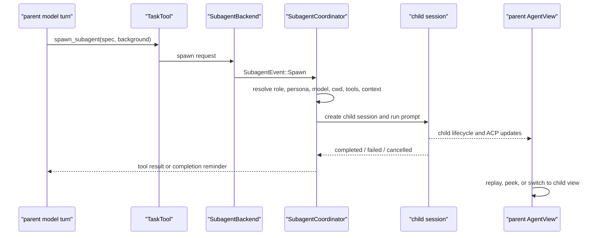

# Grok Build Agent Core and TUI Reference Report

**Status:** reference-snapshot
**Snapshot:** 2026-07-16; `.reference/grok-build` at `b189869b7755d2b482969acf6c92da3ecfeffd36`
**Last verified:** 2026-07-17

> **Ownership:** source-backed evidence about Grok Build's session actor, turn
> recovery, tool runtime, goal harness, subagent lifecycle, and Pager TUI; this
> report does not own Eino-Agent's current architecture or execution plan.

## Conclusion

Grok Build is the stronger of the two new references for asynchronous
subagents and multi-session TUI interaction. Its distinctive design is not
simply "Rust actors": one session actor owns turn mutation, child-agent work is
represented by a separate coordinator and child session, and the Pager builds
replayable per-child views that users can inspect or enter from a dashboard.

The most valuable contracts are:

1. one owner serializes session commands and terminal outcomes;
2. tools stream progress but must produce a terminal item;
3. foreground and background subagents have different parent-wait semantics;
4. child activity, permission requests, completion, replay, and view switching
   preserve parent/child identity;
5. terminal output is drained before raw mode and alternate-screen teardown.

Several attractive-sounding descriptions need qualification. Unbounded MPSC
senders avoid producer suspension but do not provide backpressure; they can
move overload into memory. Goal mode is not the default agent loop: it is an
opt-in harness gated by configuration, tool availability, and `/goal`
activation. The current source proves a writer-thread pipeline, but this audit
does not promote an unverified "only changed lines" algorithm to a contract.

For Eino-Agent the overall verdict is `combine`: adopt the observable
session/subagent/TUI semantics that close real UX gaps, while keeping the
current Go/Eino runtime, Bubble Tea projection, tool package, and permission
authority.

## Research Boundary

This report is a static source and test audit of the named local revision. It
does not claim upstream-latest behavior. No Cargo test suite or interactive PTY
run was executed. The workspace's exact crate count, storage engine internals,
and every transport entrypoint are outside the decision boundary.

The frozen question is:

> How does Grok Build own a turn, tool stream, goal continuation, and child
> agent from runtime through TUI, and which behavior should Eino-Agent adopt?

Claims below use these labels:

- **Verified:** reached from current source or covered by focused tests.
- **Inference:** supported by source shape but not exercised in this audit.
- **Recommendation:** a project decision, not a Grok Build implementation fact.
- **Excluded:** outside the inspected source boundary.

## Runtime Composition

```mermaid
sequenceDiagram
    participant Pager as "xai-grok-pager"
    participant ACP as "ACP/session bridge"
    participant Actor as "SessionActor"
    participant Turn as "turn and recovery"
    participant Sampler as "model sampler"
    participant Bridge as "ToolBridge / FinalizedToolset"
    participant Runtime as "xai-tool-runtime"

    Pager->>ACP: prompt, cancel, permission, session command
    ACP->>Actor: SessionCommand
    Actor->>Actor: queue and choose runnable task
    Actor->>Turn: handle_prompt
    Turn->>Sampler: process conversation turn
    Sampler->>Bridge: dispatch tool calls
    Bridge->>Runtime: call_streaming with Resources
    Runtime-->>Sampler: progress and required terminal item
    Sampler-->>Actor: completion outcome
    Actor-->>Pager: ordered session and chat-state updates
```

Primary source map:

| Boundary | Grok Build source | Evidence |
|---|---|---|
| Pager lifecycle | `crates/codegen/xai-grok-pager/src/app/mod.rs:376-389,624-680` | Creates terminal/writer, runs event loop, restores terminal. |
| Session construction | `crates/codegen/xai-grok-shell/src/session/acp_session_impl/spawn.rs:91-211,424,1035-1091` | Builds `SessionActor`, channels, goal state, and completion path. |
| Actor loop | `crates/codegen/xai-grok-shell/src/session/acp_session_impl/run_loop.rs:33-44,205-304` | Selects commands, completions, state updates, and runnable turns. |
| Prompt/turn owner | `crates/codegen/xai-grok-shell/src/session/acp_session_impl/turn.rs:210-255,760-786` | Establishes turn guards and executes normal/goal continuation. |
| Recovery | `crates/codegen/xai-grok-shell/src/session/acp_session_impl/turn.rs:1346-1425` | Applies agent-declared recovery requirements. |
| Sampler | `crates/codegen/xai-grok-shell/src/session/acp_session_impl/sampler_turn.rs:850-913` | Runs model sampling and requests compact/auth refresh when required. |
| Tool dispatch | `crates/codegen/xai-grok-shell/src/session/acp_session_impl/tool_dispatch.rs:13-58` | Injects session context and file-operation serialization. |
| Tool registry | `crates/codegen/xai-grok-tools/src/registry/types.rs:519-570,1439-1568` | Registers typed tools and dispatches streaming calls. |
| Tool contract | `crates/common/xai-tool-runtime/src/tool.rs:32-115` | Defines typed asynchronous tool execution and stream shape. |

## Session Actor And Turn Semantics

### Single mutation owner

`SessionActor::run_session` owns three primary unbounded receivers for session
commands, chat-state events, and session events, plus a completion receiver.
`SessionCommand::Prompt` is queued and `maybe_start_running_task` determines
when it can begin. `handle_prompt` establishes prompt state and lifecycle
guards before entering model/tool execution.

This is useful because concurrent producers do not mutate conversation state
directly. The actor defines ordering among user input, model completion,
cancellation, persistence notifications, and idle work.

It is not accurate to call this "backpressure-free":

- unbounded send does not await capacity;
- a stalled actor can accumulate memory;
- at least one pending-notification path separately caps its list and discards
  oldest entries at 50;
- terminal frame output uses a different queue and writer-drain contract.

The reusable rule is single ownership plus explicit overload policy, not an
unbounded-channel implementation choice.

### Turn and recovery

The normal turn path is:

```text
SessionCommand::Prompt
  -> maybe_start_running_task
  -> handle_prompt
  -> process_conversation_turn_with_recovery
  -> run_turn_via_sampler
  -> model and tool rounds
  -> completion_rx
  -> handle_completion / handle_turn_end
```

Recovery is capability-driven. The surrounding agent declares whether a
completion requires recovery; the sampler may request compaction or credential
refresh and retry. Authentication errors, cancellation, deterministic context
errors, and transient sampling failures therefore do not collapse into one
generic retry loop.

**Recommendation:** Eino-Agent should compare these outcome categories with
its existing `RecoveryManager` and terminal reasons. It should not migrate to
an actor solely to obtain typed recovery.

### Cancellation and channel closure

Cancellation is cooperative through tokens and explicit commands. Dispatcher
code can also drop a tool future. Closing the command channel causes actor
shutdown and cleanup rather than an implicit successful turn. Goal-role
cancellation does not retry.

The important contract is propagation and terminal classification across the
current model call, tool calls, child agents, background tasks, and session
teardown. Go contexts and current Eino-Agent runtime identities are sufficient
to implement that contract.

## Tool Runtime

### Streaming completeness

The shell dispatches through `WorkspaceOps`, `ToolBridge`, a finalized toolset,
and `xai-tool-runtime`. Tools are typed over arguments and output, while
`call_streaming` exposes progress plus a terminal item.

**Verified:** a tool stream is incomplete without a terminal item. This is a
stronger contract than treating channel closure as success and is directly
useful for TUI state: a progress row cannot remain permanently active merely
because a producer disappeared.

### Resources and registration

`Resources` is a type map populated for each dispatch with session-scoped
dependencies such as cwd, behavior version, dispatch handles, task/subagent
backends, and service clients. `ToolRegistryBuilder` supports typed built-ins,
tool packs, and dynamically registered MCP tools.

Behavior versions are injected per tool contract. They do not prove a global
compatibility guarantee. Likewise, Codex/OpenCode/Grok Build namespaces are
useful for hosting ports but impose prompt mapping, permission, aliasing, and
regression costs when elevated into a product architecture.

`ToolBridge` reads dynamic metadata and releases registry locks before invoking
the runtime handle. That avoids holding a registration lock across arbitrary
tool execution.

### File-operation ordering

Session dispatch extracts a lock key from conventional argument fields such as
`file_path`, `path`, or `target_file`; a separate file-operation lock manager
handles waiters and cancellation. The guarantee depends on tool argument
normalization and the call path. It is too broad to claim every same-file edit
is globally serialized by one mutex.

For Eino-Agent, per-resource serialization is worth considering only after the
resource key, lock scope, cancellation, and multi-file operation semantics are
defined.

## Goal Harness

Goal mode is a second orchestration layer, not the default ReAct loop.

`goal_enabled` may be configured, but `goal_harness_enabled` is initialized
false. Activation requires compatible configuration and tools plus an explicit
`/goal <objective>` flow. An active goal can then use independently gated
roles:

| Role | Responsibility | Main source |
|---|---|---|
| Planner | Produces or updates the executable plan. | `session/goal_planner.rs:198-460` |
| Strategist | Advises strategy and restores protected plan state. | `session/goal_strategist.rs:65-345` |
| Summarizer | Produces bounded progress/context summaries. | `session/goal_summarizer.rs:54-281` |
| Classifier and skeptics | Decide achieved, unfinished, blocked, or degraded outcomes. | `session/goal_classifier.rs:167-257,1939-1949` |

At round end, only an active goal can generate a continuation directive. The
directive is inserted as a subsequent user message, making continuation
visible to the same conversation loop rather than recursively invoking a
hidden loop.

This design supports long-running work, but it owns substantial complexity:

- extra model calls and per-role model policy;
- plan/goal persistence and restoration;
- token and wall-time budgets;
- role cancellation and failure fallback;
- completion classification and false-positive resistance;
- TUI state for the current role, progress, budget, and history.

Eino-Agent should `defer` this harness until goal ownership, budget, recovery,
and human-control semantics are accepted. A generic desire for longer tasks is
not enough to justify the mechanism.

## First-Class Subagents

Grok Build's subagent system is a full runtime and UI contract, not merely a
tool that runs another prompt.

### Spawn and child-session path



The `TaskTool` in
`crates/codegen/xai-grok-tools/src/implementations/grok_build/task/` depends on
an injected `SubagentBackendResource`. Its channel backend emits typed
`SubagentEvent` requests. The shell's `SubagentCoordinator` in
`crates/codegen/xai-grok-shell/src/agent/subagent/` owns live child records,
queries, cancellation, completion, and cleanup.

Before spawn, resolution combines:

- declared subagent role and optional persona;
- model and reasoning effort;
- capability-mode filtering of the child tool set;
- cwd validation;
- parent context normalization;
- depth and enable/disable policy.

The Task tool's `task_id` is also used as the subagent identifier and child
session identifier. The spawn request additionally records parent session and
parent prompt identity, which lets the coordinator distinguish "this child"
from "all children created by this turn" without asking the TUI to infer
lineage.

`xai-grok-subagent-resolution/src/context.rs:157-162` deliberately removes
parent-only orchestration reminders while giving the child its own system
context. This is more robust than copying the parent's message slice verbatim.

### Foreground, background, and completion

Foreground and background are observable modes. `run_in_background` defaults
to true:

- a foreground child waits in the Task tool, but abandoning the parent future
  or exhausting its await budget explicitly converts the wait to background;
  the child continues running;
- a background child returns control after dispatch and is polled or joined
  through task output/wait tools; a late detached-spawn error is logged rather
  than returned through the original tool call;
- completion reminders surface background results between turns;
- reminders track already reported IDs so a result read explicitly through a
  task-output tool is not injected again;
- cancellation APIs can target one child or all children belonging to a parent
  prompt; whether ordinary parent-turn cancellation also kills background
  children depends on the calling path and is not generalized here;
- child teardown scopes background-process cleanup to the child session.

The lifecycle requires at least `subagent_id`, `child_session_id`,
`parent_session_id` or parent prompt identity, run mode, owner session, status,
tool activity, output, and terminal reason. Collapsing these identities into a
display label would break cancellation, replay, and permission routing.

### TUI projection and switching

The Pager makes child execution visible at several levels:

1. `acp/tracker.rs` classifies the parent as waiting on a foreground subagent,
   task output, or task group. `_meta.subagentBackground` prevents a background
   spawn from showing a false blocking state.
2. `app/subagent.rs` stores `SubagentInfo` by child session and maintains a
   separate child `AgentView`.
3. Persisted child `updates.jsonl` records are replayed best-effort and only
   once when a child view is opened, so late attachment does not begin with an
   empty transcript or duplicate already projected events.
4. The dashboard can peek at child status/content or switch the full active
   view to the child session through `app/dispatch/dashboard.rs:301-326`.
5. Permission prompts carry a subagent label and route through the known child
   session. Child definitions resolve their effective capability mode, while
   the Pager presents approval/auto state as parent-owned and rejects plugin
   attempts to bypass the permission policy.
6. Goal detail and status views expose active role and token usage separately
   from normal child task rows.

This is a strong reference for Eino-Agent's TUI because it separates runtime
truth from projection: the child remains a session even when no child view is
materialized, and replay reconstructs the view later.

The hidden cost is equally important. The Pager must route every session event
to the correct root or child, preserve unloaded child history, deduplicate
completion signals, distinguish waiting from background activity, avoid
cross-session permission mistakes, and restore the previous active view.
Foreground-to-background conversion also means a parent turn can finish while
its child continues consuming tokens or mutating the workspace.

## Persistence, Fork, Rewind, And Compaction

The session persistence actor receives typed `PersistenceMsg` records and also
persists goal-mode state. Verified source paths implement session fork, rewind,
compaction, and reconstruction across a compaction boundary:

- `session/persistence.rs:306-350,1389-1634,2084-2155`;
- `session/fork.rs:17-65`;
- `session/acp_session_impl/rewind.rs:123-343`;
- `session/acp_session_impl/compaction.rs:601-811`;
- `session/acp_session_tests/rewind_cross_compaction_tests.rs`.

This audit did not trace the final storage format deeply enough to assert
"JSONL plus FTS" as the durable product contract. The important verified
behavior is that rewind and replay account for compaction boundaries and that
goal/subagent views depend on persisted session updates.

## Pager TUI

### Screen modes

`ScreenMode` in `xai-grok-pager/src/app/mod.rs:219-268` supports:

- `Fullscreen`: alternate screen;
- `Inline`: terminal scrollback-aware inline display;
- `Minimal`: an experimental mode whose specialized behavior is supplied by
  the sibling `xai-grok-pager-minimal` crate.

Mode selection changes terminal setup, view availability, and relaunch
behavior. Minimal is not merely a theme for Inline.

### Event and frame pipeline

The app event loop selects among terminal input, ACP updates, spawned task
results, animation ticks, and configuration I/O, then delegates state changes
to `AppView`.

At startup, `app::run` creates a frame channel and a dedicated writer thread.
Ratatui renders into its frame buffer; `TermWriter` sends bytes to the writer,
which performs blocking PTY writes outside the Tokio event loop.

This does not remove backpressure. It creates a boundary where queue capacity,
writer failure, drain timeout, and late-frame ordering can be controlled. A Go
Bubble Tea program may already serialize rendering adequately; Eino-Agent
should measure slow-terminal behavior before adding another writer owner.

### Teardown ordering

`restore_terminal` in `app/mod.rs:1165-1258` follows a strict order:

1. queue any final clear while the terminal backend still exists;
2. drop the terminal and drain/join the writer thread;
3. emit cursor and alternate-screen cleanup sequences;
4. disable raw mode.

The ordering prevents a queued frame from arriving after
`LeaveAlternateScreen` and corrupting the user's shell. Suspend and panic paths
also contain explicit restoration behavior. This is directly relevant to
Eino-Agent's terminal-lifecycle contract even if the writer-thread mechanism is
not adopted.

## Distinctive Strengths And Hidden Costs

| Design | User value | Hidden ownership and cost |
|---|---|---|
| Session actor | Deterministic ordering for prompts, completions, cancel, and state changes. | Unbounded queues need memory/overload policy; actor shutdown and reentrancy become lifecycle contracts. |
| Terminal tool streams | Reliable progress rows and explicit completion. | Every adapter and MCP bridge must normalize terminal/error/cancel behavior. |
| First-class child sessions | Inspectable, replayable, cancellable subagents with clear lineage. | Identity, routing, permission, replay, dedup, budgets, background conversion, and cleanup span runtime and TUI. |
| Goal harness | Sustains explicit long-horizon objectives. | Multiple model roles, persistence, policy, and failure matrices add large runtime cost. |
| Multi-mode Pager | Adapts to full-screen and scrollback-oriented workflows. | Modes multiply rendering, input, command, resize, and teardown tests. |
| Writer thread | Keeps blocking PTY writes out of async event processing. | Adds queue ownership, drain timeout, and late-frame failure modes. |
| Versioned tool ports | Hosts behavior-compatible tool families. | Namespace/alias/schema/permission combinations expand prompt and test surface. |

## Comparison With Eino-Agent

Eino-Agent's current owners are documented in
[`query-engine.md`](../../../architecture/runtime/query-engine.md),
[`tasks-and-agents.md`](../../../architecture/runtime/tasks-and-agents.md),
[`runtime-events.md`](../../../architecture/tui/contracts/runtime-events.md),
[`sessions.md`](../../../architecture/tui/contracts/sessions.md), and
[`terminal-lifecycle.md`](../../../architecture/tui/contracts/terminal-lifecycle.md).

| Concern | Grok Build snapshot | Eino-Agent current direction | Consequence |
|---|---|---|---|
| Runtime authority | One `SessionActor` serializes commands and completions. | One `QueryEngine` owns a conversation; `queryLoop` owns turn execution. | Adapt single-owner invariants without replacing Go call structure with an actor migration. |
| Cancellation | Typed command plus cooperative tokens across turns, tools, roles, and children. | Context chains, terminal reasons, and agent lifecycle events already exist. | Freeze descendant propagation and terminal ordering through focused traces. |
| Tool protocol | Typed streaming with a required terminal item and injected resources. | Flat `tools/` package and engine progress events. | Add completeness checks at the event boundary; preserve the flat registry. |
| Subagent identity | Coordinator plus independent child sessions and parent-prompt scope. | Agent ID, thread/session identity, progress, task/agent runtime, and TUI events have project owners. | Combine lineage/replay/view behavior with existing identities rather than introducing Grok-specific IDs. |
| Subagent TUI | Parent wait state, background state, child replay, dashboard peek, and full switch. | TUI is a projection over typed runtime state. | This is the strongest candidate reference for async child visibility and switching. |
| Goal mode | Opt-in multi-role harness with persisted state. | No accepted equivalent product contract. | Defer until user outcome, budget, recovery, and stop control are specified. |
| Tool namespaces | Several compatible families and versions. | Project-owned tool names and a flat package. | Reject namespace parity as a default objective; version only accepted observable contracts. |
| Terminal output | Dedicated writer with ordered drain and three screen modes. | Bubble Tea terminal lifecycle is project-owned. | Reuse teardown invariants; benchmark before adding a second writer pipeline. |

## Adoption Decisions

| Decision | Scope | Rationale and required proof |
|---|---|---|
| `preserve` | Runtime authority | Keep `engine/query.go:queryLoop` and `QueryEngine` as owners until an accepted slice proves replacement value. |
| `adapt` | Session command ownership | Specify concurrent prompt, cancel, channel-close, and terminal-outcome ordering independent of actor implementation. |
| `adapt` | Tool stream completeness | Require one terminal result or explicit cancellation/error for every visible tool execution; test missing terminal and MCP disconnect cases. |
| `combine` | Async subagent runtime and TUI | Combine Grok's foreground/background, explicit `backgrounded` transition, lineage, terminal replay, completion dedup, child replay, peek/switch, and permission labeling with Eino-Agent identities and reducer events. |
| `combine` | Terminal lifecycle | Add slow-PTY and late-frame teardown tests using Bubble Tea; adopt a writer thread only if measurement proves it necessary. |
| `defer` | Goal harness | First accept goal state, budget, role, recovery, persistence, and human-control contracts. |
| `reject` | Multi-namespace registry as product structure | Preserve the flat tool package and add behavior versions only for accepted compatibility requirements. |

**Overall verdict: `combine`.** Grok Build should guide one bounded subagent/TUI
contract audit and terminal-lifecycle verification, not a wholesale actor,
registry, goal-harness, or renderer migration. This report does not schedule
any PLAN item.

## Related Reports

- [`pi.md`](pi.md)
- [`claude-code-ripe.md`](claude-code-ripe.md)
- [`codex.md`](codex.md)
- [`crush.md`](crush.md)
- [`opencode.md`](opencode.md)
- [`eino-agent-2026-07-10.md`](eino-agent-2026-07-10.md)
- [`modern-coding-agent-synthesis.md`](modern-coding-agent-synthesis.md)
- [`subagent-runtime.md`](subagent-runtime.md)
