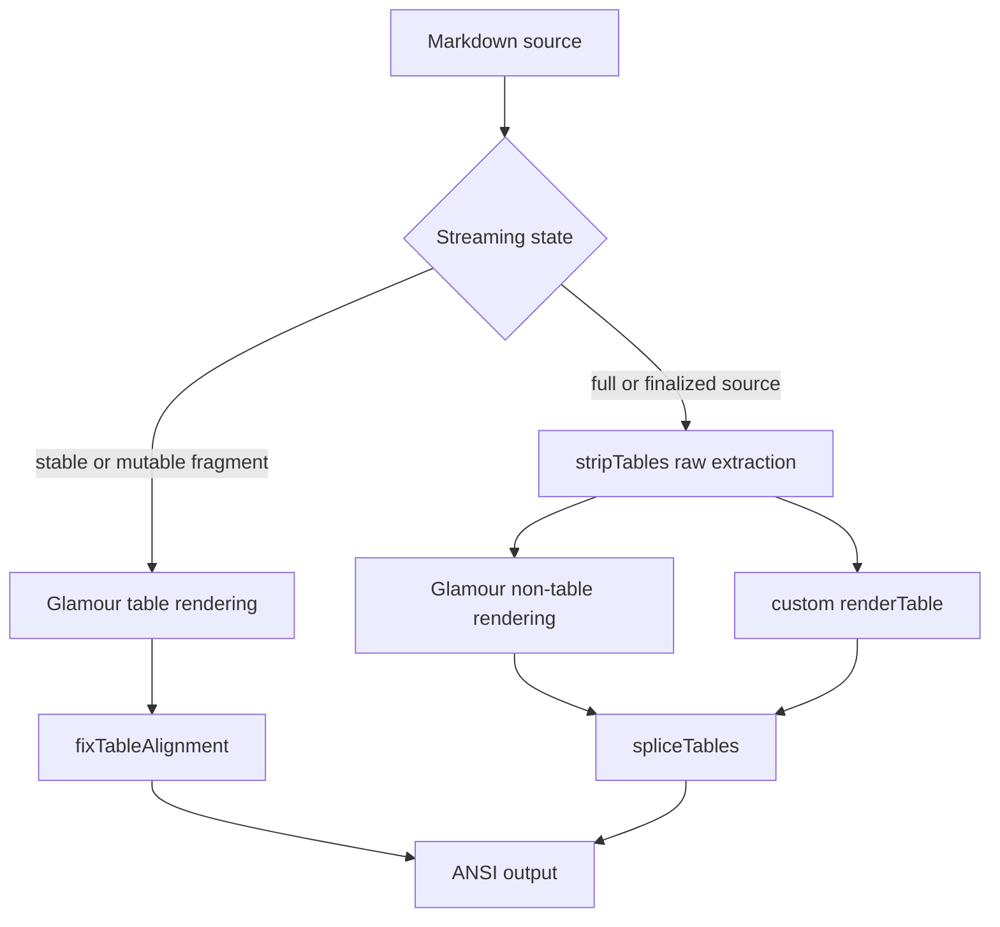

# Markdown Table Display-Cell Audit

**Status:** reference-snapshot
**Snapshot:** 2026-07-24
**Last revalidated:** 2026-07-25

> **Ownership:** current Eino-Agent Markdown-table misalignment evidence,
> relevant local-reference comparison, one adoption recommendation, and a
> staged implementation contract. This report does not schedule execution;
> accepted order belongs in [`migration/PLAN.md`](../../PLAN.md).

## Decision

Use a **`combine`** decision:

- preserve the project-owned proportional column allocation, narrow-width
  key/value fallback, semantic ANSI styling, and terminal safety margin;
- adapt Claude Code Ripe's single width owner and parsed table-token input;
- adapt Codex's structured styled-cell representation and semantic fallback;
- adapt Crush's rule that the active width method participates in final
  drawing and cache identity; and
- keep a project-native, immutable and versioned `WidthProfile` instead of
  copying any reference's JavaScript, Rust, or terminal-library internals.

The root fix is not a larger emoji range table. It is one parsed table owner,
one measured cell representation, and one display-cell model used by sizing,
wrapping, truncation, padding, border placement, overflow checks, cache keys,
and final drawing.

## Observable Question

How should Eino-Agent render a Markdown table so every border intersection
occupies the same terminal column for ASCII, CJK, combining marks, variation
selectors, emoji sequences, and ANSI-styled inline Markdown, during streaming
and after finalization?

Success is geometric:

1. every rendered line has the width implied by the border plan;
2. every vertical border has the same display-cell column in every row;
3. streaming and finalized output use the same table semantics;
4. wrapping never splits an ANSI sequence or extended grapheme cluster;
5. cache identity contains every layout input; and
6. unsupported terminal behavior selects an explicit profile or semantic
   fallback rather than destructive post-render trimming.

## First-Principles Model

A Go string exposes several different lengths:

| Quantity | Example for `❤️` | Suitable for table geometry |
|---|---:|---|
| bytes (`len`) | 6 | no |
| Unicode code points | 2 | no |
| extended grapheme clusters | 1 | necessary, not sufficient |
| terminal display cells | commonly 2 | yes |
| physical glyph pixels | font-dependent | unavailable to a cell TUI |

There is no context-free mapping from UTF-8 to the physical width shown by
every terminal. Unicode data, presentation selectors, ambiguous-width policy,
terminal emulator, font fallback, locale, tmux/SSH layers, and terminal mode
can affect the result.

The controllable contract is:

> Given one explicit width profile, every table layout and drawing operation
> consumes the same measured grapheme cells.

An extended grapheme cluster is the minimum atomic wrap/truncate unit, not a
width by itself. A cluster can occupy zero, one, two, or profile-dependent
cells. Representative failure classes include:

| Mechanism | Examples | Required treatment |
|---|---|---|
| canonical composition | `é` and `e` + `U+0301`; Hangul Jamo and precomposed Hangul | preserve source bytes but produce equivalent geometry |
| multiple marks | base plus multiple combining marks; Indic spacing marks | do not split the cluster |
| emoji composition | VS15/VS16, modifier, ZWJ family/profession, flags, keycaps | segment first, then measure the complete cluster |
| ambiguous/private use | `★`, Greek/Cyrillic symbols, private-use glyphs | resolve through the selected profile |
| contextual controls | tab, carriage return, backspace, bidi controls | expand, sanitize, isolate, or reject before measurement |
| terminal controls | SGR and OSC 8 | retain style/link state while assigning zero cells |

The selected Unicode segmentation and width-data version is part of the
profile. Current dependencies expose a version boundary:

- `charmbracelet/x/ansi v0.11.7` reaches
  `clipperhouse/uax29/v2 v2.7.0` and `displaywidth v0.11.0`;
- the repository also directly uses `rivo/uniseg v0.4.7` for editor visual
  line estimation.

The future table owner must choose one segmentation/measurement stack rather
than silently combine both.

## Current Rendering Flow

Current source still has two table owners:



The same source can therefore use Glamour plus a post-hoc repair in one frame
and the custom renderer in another.

### Root causes

1. **Lifecycle owner split.** `StreamingMarkdown.renderTrailing` and
   `renderMarkdownSource` do not share one table parser/renderer.
2. **Width-model split.** The custom renderer uses `x/ansi` for some sizing and
   wrapping, then `emojiAwareWidth` for padding; final layout clipping returns
   to `x/ansi`.
3. **Post-hoc mutation.** `fixTableAlignment` tries to repair already encoded
   rows without the original semantic cells. Total width cannot prove that
   every inner separator is aligned.
4. **Grammar reconstruction.** `parseTableRow` uses raw pipe splitting after
   Goldmark has already parsed Markdown. Escaped pipes and code spans can
   become false column boundaries.
5. **Incomplete cache identity.** Theme and width are inputs today, but there
   is no immutable width-profile generation shared by stable-prefix and full
   table caches.
6. **Circular tests.** Existing repair tests often validate output with the
   same heuristic used by production, rather than asserting independent border
   columns.

## Reference Evidence

| Reference | Local snapshot | Relevant mechanism | Transferable conclusion |
|---|---|---|---|
| Claude Code Ripe | `4b9d30f79532` | parsed table tokens; one `stringWidth` owner across sizing, padding, and overflow | keep one parser-owned table model and one width owner |
| Crush | `2af939d8e900` | one Markdown renderer across stream/final output; active ANSI width method participates in cache/drawing | width method is a rendering input |
| Codex | `66bd101fff6f` | parser events build rich table cells before layout; narrow tables become semantic records | preserve structured cells and explicit fallback |
| OpenCode | `411eff73f026` | one streaming Markdown component owns content and grid options | avoid application-side post-processing; hidden library behavior alone is not adoption proof |

No reference wins by identity. The useful shared property is consistent
ownership from parsed semantics through final cells.

## Target Contract

### One semantic owner

```mermaid
flowchart LR
    Source["canonical Markdown source"] --> AST["Goldmark AST"]
    AST --> Table["semantic table and inline nodes"]
    Table --> Runs["styled logical runs"]
    Runs --> Clusters["grapheme clusters"]
    Clusters --> Cells["WidthProfile measured cells"]
    Cells --> Layout["column allocation and wrap"]
    Layout --> Encode["ANSI/OSC encoding"]
    Encode --> Frame["final display-cell composition"]
```



Both stable streaming blocks and finalized documents must enter this pipeline.
An incomplete table may remain literal or defer formatting, but it cannot use a
second production table owner.

### One measured representation

The exact Go types remain an implementation decision, but the information flow
must be equivalent to:

```go
type WidthProfile struct {
    ID             string
    UnicodeVersion string
    AmbiguousWide  bool
}

type StyledRun struct {
    Text  string
    Style SemanticStyle
    Link  string
}

type MeasuredCluster struct {
    Source string
    Cells  int
    Style  SemanticStyle
    Link   string
}

type TableCell struct {
    Runs     []StyledRun
    Clusters []MeasuredCluster
}
```

No ANSI bytes are inserted inside one measured cluster. Measurement, wrapping,
truncation, padding, and final encoding consume the same cluster sequence.

### Geometry invariants

For column widths `c[i]`:

```text
outer row width = 1 + sum(c[i] + 3)
separator column i = 1 + sum(c[0:i] + 3)
cell visible width + left padding + right padding = c[i]
```

Tests must assert separator columns before ANSI encoding. A violation selects
the key/value fallback or returns a diagnostic in tests; it never deletes row
content or borders to conceal the mismatch.

### Cache identity

Every Markdown/table cache key must include:

```text
source identity
terminal content width
theme generation
color profile
width-profile ID or generation
streaming/final block completeness
```

A width-profile change invalidates stable-prefix, full-render, table-layout,
and any decoded-cell cache together.

## Staged Implementation Contract

### G9.A — failing geometry and grammar evidence

- Add an independent test `WidthProfile`.
- Assert exact separator columns for ASCII, CJK, NFC/NFD, Hangul Jamo, Indic
  clusters, VS15/VS16, modifiers, ZWJ, flags, keycaps, and ANSI/OSC styling.
- Cover escaped pipes, code pipes, empty/uneven cells, every append boundary,
  finalization, resize, and narrow fallback.
- Failure output identifies row, expected/actual columns, source clusters, and
  profile.

Promotion: tests fail on the current mixed-owner implementation for the
intended reason. This slice changes no runtime behavior.

### G9.B — immutable display-cell service

- Add one internal width-profile/cluster-measurement owner.
- Pin one segmentation implementation and Unicode data version.
- Route min/ideal sizing, wrapping, truncation, padding, and overflow through
  the service.
- Add property/fuzz tests for style preservation, cluster preservation, and
  `line width <= target`.

Promotion: table layout code no longer directly chooses among independent
width or segmentation functions.

### G9.C — Goldmark semantic tables

- Extract headers, alignment, rows, and inline nodes from the Goldmark AST.
- Build styled runs without reparsing raw cell strings.
- Remove `strings.Split(line, "|")` as a grammar owner.
- Preserve proportional allocation and vertical fallback.

Promotion: escaped/code pipes and rich inline cells use parser-owned
boundaries; only one production table parser remains.

### G9.D — stream/final convergence

- Route every complete table block through the structured renderer.
- Define incomplete-table behavior explicitly.
- Include block completeness in cache identity.
- Reflow from canonical source on resize, theme, or profile change.

Promotion: every append-boundary fixture converges to canonical final output
without switching table owners.

### G9.E — heuristic deletion and terminal evidence

- Delete `emojiAwareWidth`, `isEmojiWide`, `fixTableAlignment`,
  `trimTableRow`, and `padTableRow` from table ownership.
- Add debug/test geometry invariants and representative PTY/manual evidence.
- Document the deterministic default and terminal-variability boundary.

Promotion: no post-render table repair remains and all repository gates pass.
Rollback uses the structured semantic fallback, not the deleted repair.

## Acceptance Matrix

| Dimension | Required cases | Pass rule |
|---|---|---|
| presentation | `❤`, `❤︎`, `❤️`, `☀︎`, `☀️` | separator columns match the profile |
| canonical equivalence | NFC/NFD Latin and Hangul | source unchanged; geometry equivalent |
| grapheme composition | multiple marks, Indic, ZWJ, modifier | no cluster split or double count |
| regional/keycap | lone indicator, flag pair, `1️⃣`, `#️⃣` | deterministic preservation and cells |
| language | ASCII, CJK, mixed CJK/emoji | exact separator columns |
| ambiguous/private use | representative ambiguous and private-use glyphs | explicit cache-keyed profile choice |
| controls | tab, CR, backspace, bidi, invalid UTF-8 | explicit policy; no cursor mutation |
| styling | emphasis, code, ANSI-16/256/truecolor, OSC 8 | styled and visible geometry agree |
| grammar | escaped/code pipes, empty/uneven cells | Goldmark boundaries preserved |
| lifecycle | prefix append, stable tail, finalize, resize | one semantic table owner |
| widths | narrow, 40/80/120/180 | no overflow; fallback loses no field |
| cache | theme, color, width profile, terminal width | relevant generation invalidates |

## Rejected Shortcuts

- expanding `isEmojiWide` ranges;
- trimming every rendered row to one target width;
- injecting VS16 into user/model content;
- using byte or rune count as display width;
- treating one grapheme as always one or two cells;
- normalizing and mutating transcript source before rendering;
- using one terminal screenshot as the portable specification; and
- replacing the entire non-table Markdown stack before a table-specific owner
  proves the contract.

## Compatibility Consequences

- Column allocation and wrapping may change, but borders and content become
  internally consistent.
- Original source bytes remain unchanged while canonically equivalent text
  receives equivalent geometry under the selected profile.
- Escaped and code-span pipes become cell content instead of separators.
- Incomplete streaming tables may remain literal until complete.
- Terminals that intentionally differ from the default profile may still show
  a glyph/cell mismatch; a later override is valid only when final drawing and
  every cache consume it.

## Current Source Evidence

### 2026-07-25 G9.E Revalidation

G9.E closes the accepted deletion boundary. `renderMarkdownFragment` no longer
calls a post-render table repair; `fixTableAlignment`, `trimTableRow`, and
`padTableRow` are absent from production and tests. Complete table geometry is
measured only by `defaultWidthProfile`, and the 32/48/72-column PTY fixture
captures CJK, Indic, ZWJ emoji, bare-label, and flag rows with equal borders,
bounded lines, and balanced terminal control state.

The former broad emoji-range policy is retained only for non-table chat/status
overflow under the explicit `terminalLayoutSafetyWidth` name. It is not a
table allocator, renderer, or test oracle. The current owner map is:

| Boundary | Code reference | Evidence |
|---|---|---|
| streaming/cache branches | [`StreamingMarkdown.Render`](../../../../internal/tui/markdown.go) | stable-prefix, mutable-tail, full-cache, and Finalize selection |
| fragment owner | [`renderMarkdownFragment`](../../../../internal/tui/markdown.go) | completeness-aware semantic islands without a post-render table repair |
| non-table terminal variability guard | [`terminalLayoutSafetyWidth`](../../../../internal/tui/display_cell.go) | chat/status overflow only; no table call site |
| profile owner | [`defaultWidthProfile`](../../../../internal/tui/display_cell.go) | immutable table segmentation, width, wrap, truncate, and control policy |
| semantic layout | [`renderTable`](../../../../internal/tui/table_render.go) | proportional allocation, narrow fallback, padding, and borders |
| table grammar and projection | [`extractTableIslands`](../../../../internal/tui/table_render.go) and [`spliceTableIslands`](../../../../internal/tui/table_render.go) | Goldmark semantic islands and container projection |
| PTY geometry | [`markdown_table_pty_unix_test.go`](../../../../internal/tui/markdown_table_pty_unix_test.go) | 32/48/72-column finalized semantic captures |

### 2026-07-25 G9.B Revalidation

G9.B replaces the table-specific width split with one immutable production
profile. [`renderTable`](../../../../internal/tui/table_render.go) selects the
profile once and passes it through sizing, wrapping, padding, overflow, and
fallback. [`fixTableAlignment`](../../../../internal/tui/markdown.go) retains
its temporary post-render role but now measures and truncates through the same
profile. The independent G9 oracle reports exact border equality for all 15
cases, including the three original mismatches. Wrapped SGR and OSC 8 state is
closed before table borders and replayed on continuation lines.

This does not close G9. `parseTableRow` still owns raw pipe splitting; complete
tables still switch between custom and Glamour owners across the streaming
lifecycle; the cache does not yet carry width-profile identity; and the
post-render repair remains until G9.E.

### 2026-07-25 Revalidation

Before G9.B, current master still reached every mixed owner named below. The independent
G9.A oracle in
[`display_cell_g9_test.go`](../../../../internal/tui/display_cell_g9_test.go)
reproduces three distinct failure classes without changing production:

- Indic `क्ष` shifts later borders right under the explicit test profile,
  while VS15 `❤︎` and a lone regional indicator shift them left;
- escaped pipes and pipes inside code spans produce three raw cells where
  Goldmark semantics require two; and
- a table uses the custom renderer on initial/full/final render but Glamour
  after stable-prefix promotion.

The same fixture covers valid UTF-8 append boundaries, resize, narrow
key/value fallback, empty/uneven rows, ANSI/OSC cells, and the broader
presentation/normalization/emoji matrix. This verifies the `combine`
recommendation and promotes only G9.A; the first production change remains
G9.B.

| Boundary | Code reference | Evidence |
|---|---|---|
| streaming/cache branches | [`StreamingMarkdown.Render`](../../../../internal/tui/markdown.go) | stable-prefix, mutable-tail, and full-cache selection |
| fragment owner | [`renderMarkdownFragment`](../../../../internal/tui/markdown.go) | completeness-aware semantic islands |
| full owner | [`renderMarkdownFragment`](../../../../internal/tui/markdown.go) | Goldmark table extraction plus semantic splice |
| non-table width override at G9.A | `emojiAwareWidth` | later renamed and isolated by G9.E |
| post-hoc repair at G9.A | `fixTableAlignment` | deleted by G9.E |
| profile owner | [`defaultWidthProfile`](../../../../internal/tui/display_cell.go) | immutable ID, segmentation/width options, cluster policy, wrap, and truncation |
| custom layout | [`renderTable`](../../../../internal/tui/table_render.go#L46) | selects and passes one profile through proportional allocation, wrap, fallback, and overflow |
| profile padding | [`padAlignedCell`](../../../../internal/tui/table_render.go#L429) | padding consumes the passed profile |
| table grammar | [`extractTableIslands`](../../../../internal/tui/table_render.go#L422) | uses Goldmark GFM AST ranges for semantic table islands |
| final band composition | [`renderLayoutBands`](../../../../internal/tui/layout.go#L110) | final clipping uses `x/ansi` |
| final column composition | [`fitLayoutColumnLine`](../../../../internal/tui/layout.go#L298) | sidebar/main join uses `x/ansi` |
| separate editor estimator | [`countVisualLines`](../../../../internal/tui/layout.go#L315) | direct `uniseg` use is not a table contract |

## Evidence Limits

- Reference claims apply to the named local snapshots, not floating upstream
  heads.
- The audit defines a deterministic project profile, not every terminal/font.
- G9.A changed only evidence tests and evolution documents; G9.B was the first
  production slice. G9.E closes the accepted program without claiming that
  every terminal/font pair follows the deterministic project profile.
