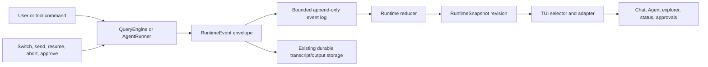
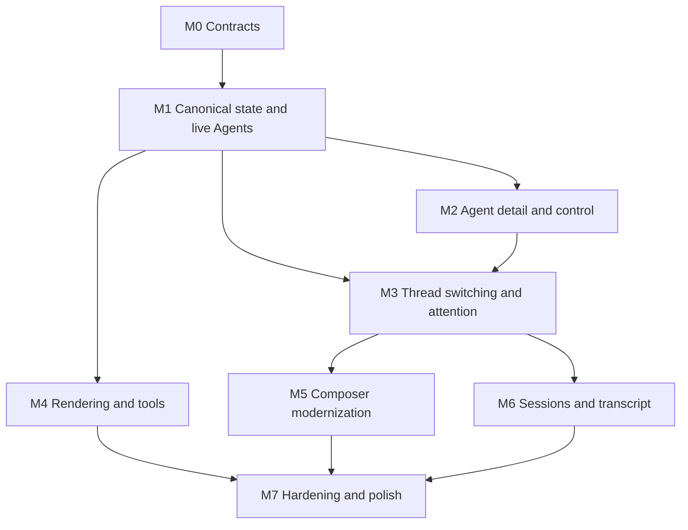

# Modern Coding-Agent TUI Synthesis

**Research baseline:** 2026-07-10
**Decision sync:** 2026-07-14 after M0-M7 and P10-P12
**Direction note:** 2026-07-16; future reference adoption is governed by
[`PROJECT_DIRECTION.md`](../../../../PROJECT_DIRECTION.md)
**Status:** reference-snapshot
**Result:** the accepted product path was implemented and disconnected scaffolds were removed
**Decision scope:** evolve `eino-agent` from broad Claude Code parity into a
coherent modern multi-Agent TUI while retaining the Go/Eino/Bubble Tea runtime

> **Ownership:** historical cross-reference synthesis and decision evidence;
> current behavior and active work live in
> [`architecture/tui/README.md`](../../../architecture/tui/README.md) and
> [`migration/PLAN.md`](../../PLAN.md)

## Decision

> **Historical decision boundary:** M0-M7 implemented this TUI direction. Its
> decision to retain the imperative `QueryEngine` predates and is superseded by
> P13's staged Eino ADK ownership-transfer target; current execution order lives
> in [`migration/PLAN.md`](../../PLAN.md).

Keep Bubble Tea and the imperative `QueryEngine`. M0-M7 implemented the
foundation described below without a renderer rewrite or full Codex-style
app-server split.

Preserve the current TUI generation around three contracts:

1. **Canonical runtime events and snapshots owned by the engine.**
2. **First-class conversation threads for leader and subagents.**
3. **A projection-oriented TUI with per-thread view state and bounded
   rendering.**

Use the references selectively:

- **Claude Code Ripe:** product workflows, retained Agent transcript, rich
  composer, permission specialization, long-transcript behavior.
- **Codex:** thread identity, event stores, replay, switching, inactive-thread
  approvals, semantic transcript items, session picker verification.
- **Crush:** Bubble Tea composition, rectangle layout, item caches, dedicated
  tool renderers, typed pub/sub, goldens, nested parent Agent trace.
- **OpenCode:** part-centric V1 message rendering, V2 event-sourced session
  direction, bounded ordered reactive store, extmark composer, wildcard
  permissions, structured questions, child-session navigation, and an
  experimental background-job registry.
- **Eino-agent:** retain the imperative query loop, existing AgentRunner,
  AppState task reducer, event batching, chat cache, session/transcript files,
  and current user workflows.

The user-facing goal is not “more panels.” It is:

> The user always knows which conversation is active, what every Agent is
> doing, where attention is required, how to switch or send input, and how to
> recover the same state after resume.

## Comparative Findings

| Capability | Claude Code Ripe | Codex | Crush | OpenCode | Eino-agent now |
|---|---|---|---|---|---|
| Runtime/UI truth boundary | Selector store plus task objects; REPL remains coupled | Strong app-server protocol boundary | Strong service/pubsub boundary | V1/TUI projection and V2 aggregate coexist | Engine-owned runtime store plus presentation-only TUI state |
| Long transcript | Virtualized measured list and off-screen freeze | Semantic cells plus terminal scrollback/reflow | O(viewport) item list and frozen cache | Sorted arrays with binary lookup and 100-message window | Bounded item cache plus disk-backed transcript/replay |
| Streaming | Mutable tail plus memoized rows | Stable committed region plus mutable tail/table holdback | Conservative stable Markdown prefix | V1 part deltas plus V2 durable/live event split | Batched events plus prefix cache |
| Tool presentation | Rich tool components | Rich semantic history cells | Dedicated tool renderers | Part-centric widgets per tool type | Semantic family renderers plus bounded generic fallback |
| Composer | Very rich: paste, image, queue, stash, history, editor, agent target | Richest state machine and paste handling | Good textarea, attachment, shell, queue | Extmark composer with file/agent/paste annotations | Structured paste/image/file/skill/MCP, queue, drafts, history search, editor |
| Session picker | Progressive resume/fork and state restoration | Paginated, preview, transcript, sort/filter, fork | Filter/switch/rename/delete | Top-level picker plus fork/undo/redo; child navigation is separate | Cursor pages, preview, transcript search, sort/filter, resume/fork |
| Permission UX | Tool-specific, worker-aware | Thread-scoped, replayable, cross-thread attention | Strong modal/diff UX | Wildcard rules with same-session approval/rejection cascading | Owner-scoped replayable attention across threads |
| Live subagent progress | First-class task state | Thread items/status feed | Nested child tool calls | Child sessions; background jobs are experimental | Canonical live progress, controls, and replay |
| Agent transcript switching | Yes, retained sidechain view | Yes, per-thread replay | No | Yes, parent/child/adjacent navigation | Yes, stable per-thread switching and replay |
| Agent follow-up/resume | Yes | Explicit thread operations | No | Yes, `task_id` resumes child session | Yes, running send and retained/evicted resume |
| Parent/child trace | Task and sidechain lineage | Protocol items and Agent paths | Excellent compact nested trace | Compact nested trace plus full child transcript | Canonical nested trace plus lineage |
| Visual regression testing | Tests absent from local snapshot | 525 snapshots | 363 goldens | Broad tests plus small TUI snapshot coverage | Product goldens, randomized replay, PTY, and parity scenarios |

## First Principles

### 1. The TUI Is a Projection

The engine owns facts such as thread status, transcript events, tool lifecycle,
pending approvals, Agent lineage, and terminal outcome. The TUI owns view state
such as cursor, scroll offset, selected tab, open dialog, and unsent draft.

No panel should be the only place where a task or Agent state exists.

### 2. Identity Precedes Presentation

Every conversation needs a stable `ThreadID`. Every Agent needs a stable
`AgentID`. Name, role, nickname, and Agent path are labels. Parent session,
parent thread, parent tool call, and spawn event form lineage.

Routing by display name creates ambiguity as soon as two Agents have the same
role or a resumed Agent is renamed.

### 3. Events Precede Replay

A switchable Agent cannot be implemented reliably by copying the current chat
slice. The runtime must emit events that identify the target thread and can be
reduced into a snapshot.

The event log can be bounded and simple. It does not need a new database in the
first release.

### 4. One Runtime, Multiple Projections

The same Agent activity should support:

- one-line live status in the footer/sidebar;
- a compact nested trace under the parent Agent tool call;
- an Agent explorer overview/detail;
- the full switchable Agent transcript;
- persisted session/debug trace.

These are projections of one event stream, not separate data models.

### 5. Attention Must Not Freeze Unrelated Work

A background Agent may need approval or user input. That request belongs to the
Agent thread. The visible leader conversation should show an attention badge
and allow the user to switch, rather than replacing global App state and
blocking all interaction.

### 6. Busy Runtime Does Not Mean Disabled Composer

The user must be able to compose, queue, edit externally, attach context, or
switch threads while a turn runs. Cancellation should be explicit. Pressing
Enter must not silently interrupt an unrelated running turn.

### 7. Work Per Frame Is Bounded

Rendering cost should follow visible rows and mutable cells, not total session
size. Completed content should be cached/frozen. High-frequency progress may be
coalesced; terminal and interactive events may not be dropped.

## Target Runtime Model

### Event Envelope

Extend the current event vocabulary with a common envelope. The concrete Go
shape can remain additive to `engine.QueryEvent` during migration.

```go
type RuntimeEvent struct {
    Seq            uint64
    At             time.Time
    SessionID      string
    ThreadID       string
    TurnID         string
    AgentID        string
    ParentThreadID string
    CausationID    string
    Type           RuntimeEventType
    Payload        RuntimeEventPayload
}
```

Required event families:

| Family | Events |
|---|---|
| Session/thread | `thread_started`, `thread_updated`, `thread_closed` |
| Turn/message | `turn_started`, `user_message`, `assistant_delta`, `assistant_completed`, `turn_completed`, `turn_interrupted` |
| Tool | `tool_started`, `tool_progress`, `tool_completed`, `tool_failed` |
| Agent | `agent_spawned`, `agent_progress`, `agent_message_queued`, `agent_message_delivered`, `agent_completed`, `agent_failed`, `agent_aborted` |
| Interactive | `approval_requested`, `approval_resolved`, `user_input_requested`, `user_input_resolved` |
| Plan/usage | `plan_updated`, `usage_updated`, `context_compacted` |
| Terminal | `thread_terminal` |

Payloads should be typed Go structs. Do not normalize everything into
`map[string]any`. Large tool output stays in existing transcript/output files;
events carry bounded previews and references.

### Engine Runtime Store

Add one reducer-backed store owned by `QueryEngine` or a shared engine runtime
object. It should expose immutable point-in-time copies:

```text
RuntimeSnapshot
  session
  active_thread_id
  threads[thread_id]
    identity and lineage
    status and active turn
    bounded transcript/event tail
    tool calls and progress
    usage and timestamps
    pending approvals/questions
    output/transcript/worktree references
```

Each thread store needs:

- canonical persisted turns/messages when available;
- a bounded live event ring;
- unresolved interactive request state;
- active turn ID;
- terminal reason;
- Agent identity and lineage;
- a monotonically increasing revision.

Persist normal session/transcript data through the existing packages. Persist
only the minimum Agent metadata and event references needed for resume. A
database can remain a later optimization.

### TUI View State

Keep view-only state in `internal/tui`:

```text
ThreadViewState
  draft text and structured elements
  queued input preview
  scroll/follow position
  selection and search state
  selected detail tab
```

This map is keyed by `ThreadID`. Switching captures the current view state,
selects another engine snapshot, rebuilds or updates the visible chat, and
restores the target view state.

Do not reuse `internal/tui/state.AppState` as a second unconnected truth store.
P11 proved that it and the sibling alternative component/input/rendering
packages were disconnected from the live adapter; P12 removed that cohort
after manifest and regression proof.

## Target Event Flow



Bubble Tea messages should notify the App that a snapshot revision changed.
They should not contain the only copy of the change.

## First-Class Agent Threads

Leader and Agent conversations should implement one bounded thread contract.
They may use different model/tool configurations, but the UI should be able to
ask the same questions:

- What is its identity and parent?
- Is it pending, running, waiting, completed, failed, aborted, or closed?
- What turn is active?
- What is the transcript?
- What tool is active?
- Does it need approval/input?
- Can it accept queued input, resume, pause, or abort?

### Agent Lifecycle

1. Parent invokes `Agent` with parent session/thread/tool-use identity.
2. AgentRunner allocates stable `AgentID` and child `ThreadID` before execution.
3. Metadata and transcript paths are persisted immediately.
4. Isolated QueryEngine emits enveloped events to the child thread.
5. AgentRunner derives bounded progress from the same events.
6. Parent receives compact progress and terminal notification projections.
7. User can switch to the child and send input through
   `SendOrResumeAgentMessage`.
8. Terminal threads remain inspectable; eviction removes heavy live state but
   not identity or transcript references.

### Dual Projection

Use both reference patterns:

- **Parent projection, from Crush:** nested compact Agent activity under the
  parent `Agent` tool call.
- **Full child projection, from Codex/Claude:** switch to the child transcript
  with the ordinary chat and composer.

The compact projection should show at most a bounded activity tail, for example
last tool, 3 recent operations, elapsed time, usage, and attention/terminal
state. The full transcript is the source for detailed inspection.

## Navigation and Agent Explorer

Unify Ctrl+B, `/team`, and Ctrl+T task views behind one selector. A recommended
Agent/task explorer has:

- **Agents:** main plus child threads, stable spawn order, role/path, status,
  attention, elapsed time, last activity;
- **Tasks:** local task-list items;
- **Approvals:** unresolved requests across threads;
- **Detail:** overview, activity, transcript, output, lineage.

Commands and keys:

- `/agent`: open searchable thread picker/explorer;
- `Alt+Left` / `Alt+Right`: previous/next known thread;
- `Enter`: inspect or switch;
- `s`: send/follow up from detail;
- `r`: resume terminal Agent;
- `p`: pause/resume when supported;
- `x`: abort running Agent or dismiss terminal row;
- `Esc`: return to previous thread/view.

Shortcut choice must go through the integrated keybinding resolver and respect
terminal enhancement support. The currently advertised but unreachable actions
must be removed or wired.

**M5.1 implementation decision (2026-07-10):** Eino-Agent now combines Claude
Code's action/context/chord model, Codex's strict ambiguous/reserved-binding
rejection, and Crush's active-keymap-driven Help. Eight product contexts resolve
through one deterministic path with specific-context precedence and Global
fallback. Ctrl+C remains a non-rebindable safety boundary; Vim editing precedes
plain-character actions; Ctrl+J/Shift+Enter, Windows mode-cycle, and Alt Agent
navigation fallbacks remain. Only actions with real handlers are defaults;
M5.2 activates image paste and autocomplete dismissal while editor/history/
stash/undo actions remain schema-only. This avoids a
configuration that parses successfully while doing nothing.

## Composer Contract

Replace scattered textarea-adjacent state with one composer state machine:

```text
ComposerState
  text and cursor
  mode: prompt, command, shell
  structured elements: paste, image, file, skill, MCP resource
  local and persistent history
  reverse-search state
  queued submissions
  undo/kill buffer
  external-editor state
  active popup
```

Recommended submit semantics:

- idle thread + Enter: start a turn;
- running thread + Enter: queue/steer the active thread and show the queued row;
- Ctrl+C: explicit interrupt/cancel;
- an explicit “interrupt and replace” action can be added, but must never be
  the implicit Enter behavior;
- drafts and external editor remain available while any thread runs;
- switching preserves each thread's draft and structured elements.

Integrate the existing attachment and keybinding packages instead of creating a
third implementation. Add:

- large-paste placeholders;
- clipboard/local image rows with deletion and model-capability feedback;
- `@` file/skill/MCP suggestions;
- `Ctrl+R` history search;
- queued-input editing;
- external editor for ordinary prompts;
- visible target label when composing to an Agent.

**M5.2 implementation decision (2026-07-10):** Eino-Agent uses Codex's range-
validity model as the core, Claude Code's compact ref/payload and text-only
persistence boundary, and Crush's asynchronous attachment/source loading.
Bubble Tea does not expose Codex's atomic textarea elements, so one contiguous
rune diff rebases disjoint elements and conservatively invalidates every
overlapping edit. Async file/image/MCP results rejoin by stable element ID;
valid leader images become Eino multimodal user parts, while file, skill, and
MCP content becomes encoded prompt context. This is one bounded contract, not
separate stores for each source.

**M5.3 implementation decision (2026-07-10):** runtime ownership follows Claude
Code's priority queue and command lifecycle, while the TUI uses Codex-like
optimistic identity reconciliation and Crush-like visible pending rows. One
persistent QueryEngine queue supports same-query tool-round steering and a
terminal-triggered fresh-turn fallback. Child input stays on the AgentRunner
mailbox path. Ctrl+C cancels only active work and the TUI drains to terminal;
there is no implicit replace and no additional destructive shortcut without
evidence that it is needed.

**M5.4 implementation decision (2026-07-11):** reverse history is a transient,
focus-owning composer context rather than another global dialog; external
editing uses Bubble Tea's process handoff and targets the originating thread;
undo stores bounded rich snapshots per thread. Native textarea word deletion
participates in undo, while a shell kill ring remains explicitly out of scope
until a concrete product need justifies replacing Bubbles editing semantics.

## Transcript and Tool Rendering

Introduce a semantic item interface inspired by Codex and Crush:

```go
type HistoryItem interface {
    ID() string
    Version() uint64
    Finished() bool
    Render(RenderContext) string
    Raw(RenderContext) string
    Height(RenderContext) int
}
```

Optional interfaces can cover expansion, animation, selection, compact
projection, transcript projection, and nested children.

Create dedicated renderers for high-value families:

- Bash and background shell;
- Read/search groups;
- Edit/write/diff;
- Agent and nested activity;
- MCP;
- task/todo/plan;
- web fetch/search;
- generic fallback.

Preserve current item/version/width caching and visible-window assembly. Add
Codex-style stable stream commit for newline-complete regions and table
holdback only after correctness tests exist. A wholesale screen-buffer
migration is not required for the first releases.

**Implementation status (2026-07-10):** M4.1-M4.4 now implement the semantic
item contract, every listed renderer family, and source-backed stable streaming.
The streaming boundary is parser-derived like Claude Code, retains Crush's
rendered-prefix cache, holds Codex-style mutable table/list/fence tails, and
canonicalizes the final source into one assistant item. Explicit contiguous
rectangles and a top-focused formal dialog stack now close the layout boundary.
Measured string composition remains small enough that a screen buffer is not
currently justified; compact/wide responsive layouts were implemented in M7.1.

## Sessions, Resume, and Trace

The session picker should eventually support:

- resume and fork mode;
- paginated/lazy metadata loading;
- current CWD/repository versus all sessions;
- sort and filter controls;
- lazy recent-message preview;
- full transcript overlay;
- branch/parent/Agent lineage;
- restoration of model, permission mode, worktree, safe presentation state,
  and only still-live unresolved interaction references.

**M6.1 implementation decision (2026-07-11):** preserve project-local JSONL,
but make roots discoverable through a metadata-only atomic catalog. Queries
sort stat-only candidates first, continue with an opaque anchor, and perform a
bounded number of head/tail reads. The TUI owns stable-key page merge and query
generation, while exact filtered totals are omitted because they would force
an eager scan. This adapts Claude's progressive enrichment and Codex's cursor/
scan-cap semantics without adding a rollout database.

**M6.2 implementation decision (2026-07-11):** preview is a separate bounded
tail read keyed by the selected source, not a second eager list field. Full
transcript parsing occurs only after Ctrl+T and reuses the searchable expanded
view. Resume/fork is an explicit picker mode; fork copies the selected complete
history. M6.3 subsequently removes the temporary cross-CWD block only after it
can restore runtime context safely.

**M6.3 implementation decision (2026-07-11):** JSONL owns conversation plus a
payload-free execution checkpoint; a separate versioned `0600` sidecar owns
only bounded plain draft/cursor/scroll/follow/input-mode/detail-tab state.
Persisted request IDs are intersected with live callbacks and never recreate a
permission or question. Current-runner Agents attach live; durable-only and
process-interrupted Agents become non-actionable replay projections. Queue,
structured/image payloads, undo, selection, and dialogs are deliberately not
restored.

Agent trace summary should be deterministic and reducer-derived:

- live status uses structured activity, not an LLM call;
- parent nested trace uses the bounded recent event tail;
- terminal summary uses final response/error plus usage and output reference;
- optional LLM summarization may enrich a completed long trace, but it must not
  be required for correctness or navigation.

## Permission and Attention Model

Store interactive requests by thread. The active thread can display the current
specialized permission dialog. Inactive requests appear in an attention area:

```text
! Approval needed in agent/explorer
? Input needed in agent/reviewer
/agent to switch
```

The request remains pending until resolved or the runtime cancels it. Replay
must filter resolved requests. Agent completion with unresolved requests must
produce a clear terminal/cancellation reason, not silently disappear.

Reuse the existing rich permission dialog and progressively split tool-specific
renderers for Bash, edit/write, network/MCP, plan, and generic tools.

## Responsive Interaction Design

The main surface should remain a work-focused conversation, not a dashboard of
cards.

### Compact mode

- one-line thread breadcrumb/status;
- chat;
- attention/task summary line;
- composer;
- Agent explorer as an overlay.

### Wide mode

- chat and composer remain primary;
- optional 28-36 column Agent/task sidebar when multiple active threads exist;
- sidebar can collapse without changing the transcript width unexpectedly;
- detail transcript replaces the main chat instead of appearing inside another
  framed card.

Widths and heights must be tested at 40, 80, 120, and 180 columns and at 20,
30, and 50 rows. No control should disappear solely because the terminal is
narrow; it should move into an overlay or command path.

## Historical M0-M7 Delivery Plan

This section preserves the plan that produced the current implementation. It
is completion context, not the active queue; current work is owned by
[`migration/PLAN.md`](../../PLAN.md).

### Milestone 0: Baseline and Contracts

Status: complete.

- freeze current event/render/session baselines with tests;
- define event envelope, identity, terminal states, and retention rules;
- classify scaffolded versus integrated TUI features;
- add architecture decision tests before UI changes.

### Milestone 1: Canonical State and Observable Agents

- add thread/turn/sequence/causal identity to runtime events;
- add bounded runtime reducer/store;
- adapt current leader `QueryEvent` flow into the store;
- continuously publish subagent events and progress;
- migrate Ctrl+T, Ctrl+B, `/team`, and inline Agent status to one selector;
- remove direct global snapshot reads from TUI after adapter stabilization.

User outcome: background Agents show correct live status and activity everywhere.

### Milestone 2: Agent Detail and Control

- add overview/activity/transcript/output/lineage detail;
- wire send, resume, abort, and later pause/resume through existing runtime
  paths;
- persist running metadata at launch;
- add parent nested Agent trace;
- keep terminal Agents inspectable.

User outcome: an Agent is observable and controllable, not only summarized.

### Milestone 3: Thread Switching and Attention

- add per-thread event buffers and replay snapshots;
- add per-thread draft/view state;
- implement `/agent` picker and adjacent navigation;
- replay only unresolved approvals/questions;
- show inactive-thread attention summary;
- fail over to leader if an active child closes unexpectedly.

User outcome: the user can move among live conversations without losing state.

### Milestone 4: Rendering and Tool Presentation

- introduce semantic `HistoryItem` capabilities;
- split dedicated tool renderers;
- preserve O(viewport) cache/freeze behavior;
- add stable stream region and table holdback where benchmarks justify it;
- unify rectangle layout and formal dialog routing.

User outcome: dense traces remain readable and responsive in long sessions.

**Implementation status (2026-07-10): complete.** Semantic items, every default
tool family plus generic fallback, parser-derived stable streaming, explicit
rectangles, and formal modal routing are implemented and verified. The retained
string renderer is an evidence-based adaptation rather than an unfinished Crush
port.

### Milestone 5: Composer Modernization

- integrate keybinding resolver and remove raw-key drift;
- integrate paste/image/file attachment state;
- add queue semantics, queued-input editing, reverse history search, external
  editor, and per-thread drafts;
- make submit behavior non-destructive while busy.

User outcome: composing remains reliable while multiple threads run.

**Implementation status (2026-07-11): complete.** Contextual key actions,
structured paste/image/file/skill/MCP elements, and safe busy submission are
implemented and verified. The engine queue retains rich payloads, drains during
tool rounds or claims after terminal, and projects bounded per-thread rows with
list/edit/remove behavior. Ctrl+C is explicit and does not strand the stream.
Reverse incremental search, `$EDITOR` process handoff, and bounded rich undo
are integrated per thread. M6 session scale and recovery is now complete.

### Milestone 6: Session and Transcript Experience

- add lazy preview, pagination, sort/filter, resume/fork mode;
- restore thread and Agent lineage;
- add transcript overlay/search and replay recovery;
- expose retained/evicted Agent transcripts after restart.

User outcome: long-running work is discoverable and recoverable.

**Implementation status (2026-07-11): complete through M6.3.** Bounded cursor pages,
CWD/repository/all root scopes, backend sort/filter, moving-page deduplication,
stable selection, stale query rejection, explicit resume/fork, bounded recent
preview, full searchable transcript/return, and rich available metadata are
implemented. Execution checkpoints, cross-CWD/worktree restore, safe view
sidecars, live request intersection, and live/replay Agent recovery complete
the milestone. M7 terminal hardening follows.

### Milestone 7: Terminal Hardening and Product Polish

- focus-aware notifications and terminal capability probing;
- responsive compact/wide layouts;
- reduced-motion and no-color validation;
- raw/copy-friendly transcript mode;
- PTY tests for resize, paste, mouse, suspend, switch, approval, and shutdown;
- performance budgets and leak/race tests.

User outcome: the experience is dependable across terminals and long sessions.

**Implementation status (2026-07-11): M0-M7 complete.** Deterministic compact,
standard, and wide geometry is implemented. Wide mode consumes the canonical
Agent/task selector in a 32-42 column unframed sidebar while preserving at
least 100 main columns; compact mode prioritizes overlay/chat/editor/status and
retains every command route. One terminal/focus capability source now drives
theme/hyperlink/mouse/focus decisions and focus-aware external notifications;
platform degradation, idle-only suspend, Ctrl+D, panic cleanup, and real Unix
PTY restoration are verified. Enhanced keys remain safely detected but
disabled under Bubble Tea v1, and image protocol identity is not claimed as
rendering. Reduced motion now freezes decoration while retaining functional
polling, no-color frames are escape-free, raw history is user-reachable, state
meaning is textual, and Unicode width/integrity has a representative matrix.
M7.4 is complete: reducer/replay randomized properties, Bubble Tea thread/modal
transitions, product-state goldens, and a real PTY workflow covering every
listed interaction/restoration scenario are complete. The performance baseline
and p95 gates are also complete. Deterministic isolated Codex startup is now in
the multi-project parity harness.

## Historical Post-M0-M7 Decisions

At the 2026-07-12 decision boundary, current source and the OpenCode audit
supported the following next phase. P9-P10 are now complete; closeout evidence
lives in [`migration/history/runtime/post-parity.md`](../../history/runtime/post-parity.md).

1. **Completed P9.1:** the engine-owned repeated-identical-tool circuit breaker
   runs before hooks, permissions, or execution and projects its one-shot
   decision through existing owner-thread attention without raw input.
2. **Completed P9.2:** permission ownership, exactly-once settlement, and
   exact-scope positive coalescing are unified in the engine. Candidate requests
   retain their own rule evaluation and terminal claim; blanket rejection
   cascading remains rejected. The implemented contract is in
   [`permission-coalescing.md`](../parity/permission-coalescing.md).
3. **Completed P10:** realistic multi-Agent PTY/restart scenarios found no
   evidence requiring a broad trace/session contract rewrite.

SQLite event sourcing, an app-server split, renderer replacement, terminal
images, and extra panels remain deferred until a measured ownership, recovery,
performance, or workflow gap exists.

## Dependency Graph



## Acceptance Metrics

### Correctness

- reducer replay from the same event sequence produces an identical snapshot;
- no duplicate tool/Agent terminal rows after resume or switch;
- queued user input is never lost across switch, Agent resume, or leader turn
  completion;
- resolved approvals never reappear after replay;
- every Agent row can resolve parent session/thread/tool-use lineage;
- all terminal states have a reason and timestamp.

### Responsiveness

- event-to-visible-progress latency is at most 500 ms under normal load;
- in-memory thread switch paints within 100 ms at p95;
- disk-backed transcript switch paints an initial usable view within 500 ms;
- ordinary key-to-frame latency remains below 50 ms at p95;
- high-frequency stream redraw is capped at 30 fps without delaying terminal
  events.

### Scale

- render work remains O(visible rows) for a 10K-message transcript;
- per-thread live event memory is bounded and old detail is recoverable from
  transcript storage;
- 20 concurrent Agent threads do not make input or navigation progressively
  slower due to full-list rerendering;
- widths 40/80/120/180 and heights 20/30/50 have no overlapping controls or
  inaccessible commands.

### Verification

- pure reducer tests for every event family and replay filter;
- Agent lifecycle/integration tests for spawn, progress, queue, resume, abort,
  terminal, and eviction;
- Bubble Tea transition tests for switch, draft restore, attention, and modal
  ownership;
- golden output for major tools, Agent states, permissions, and responsive
  widths;
- PTY scenarios for paste, resize, mouse selection, thread switching,
  background approval, cancellation, and terminal restore;
- benchmarks for long transcript, streaming, switching, and snapshot copying.

## Historical Sequencing and Effort Estimate

For one experienced engineer, the full target is a multi-release effort rather
than a 6-10 day panel enhancement. A reasonable directional estimate is:

| Slice | Estimate |
|---|---:|
| M0-M1 canonical state and live progress | 1.5-2.5 weeks |
| M2 Agent detail/control | 1-2 weeks |
| M3 switching/attention | 2-3 weeks |
| M4 rendering/tool decomposition | 1.5-2.5 weeks |
| M5 composer integration | 1.5-2.5 weeks |
| M6 sessions/transcript | 1.5-2.5 weeks |
| M7 hardening/polish | ongoing, initial 1-2 weeks |

The first shippable release is M1 plus the read-only portion of M2. It provides
visible progress and transcript inspection without waiting for the complete
navigation/composer redesign.

## Historical Non-Goals for the First Releases

- no full Codex app-server or rollout database;
- no React/Ink or wholesale Ultraviolet renderer migration;
- no replacement of the imperative Eino query loop;
- no unbounded in-memory transcript/event history;
- no LLM-generated live summary as the source of Agent state;
- no fourth task panel with another state model;
- no visual redesign before state/replay contracts are testable.

## Risks and Mitigations

| Risk | Mitigation |
|---|---|
| Event schema expansion destabilizes parity | Add envelope fields and adapters; preserve existing payload/order during M1 |
| Runtime store duplicates AgentRunner | Make AgentRunner emit events and use the reducer as read model; retire duplicate snapshots incrementally |
| App monolith grows during migration | Add thread navigation, runtime adapter, and composer as bounded modules before adding UI states |
| Replay consumes too much memory | Bounded event rings plus existing transcript paths and lazy disk bootstrap |
| Busy-submit semantics surprise existing users | Show queued state explicitly; keep Ctrl+C as clear cancellation; document shortcuts in active footer |
| Tool renderer refactor regresses output | Golden current output first, then migrate one tool family at a time |
| Reference behavior conflicts | Preserve explicitly accepted compatibility; otherwise compare only the references relevant to the project-owned user outcome |

## Source Reports

- [`claude-code-ripe.md`](claude-code-ripe.md)
- [`codex.md`](codex.md)
- [`crush.md`](crush.md)
- [`opencode.md`](opencode.md)
- [`eino-agent-2026-07-10.md`](eino-agent-2026-07-10.md)

## Execution Trackers

The current actionable queue is [`migration/PLAN.md`](../../PLAN.md). The completed M0-M7
checklist remains in [`migration/history/tui/m0-m7-refinement-plan.md`](../../history/tui/m0-m7-refinement-plan.md),
and current TUI architecture is documented in
[`architecture/tui/README.md`](../../../architecture/tui/README.md).
