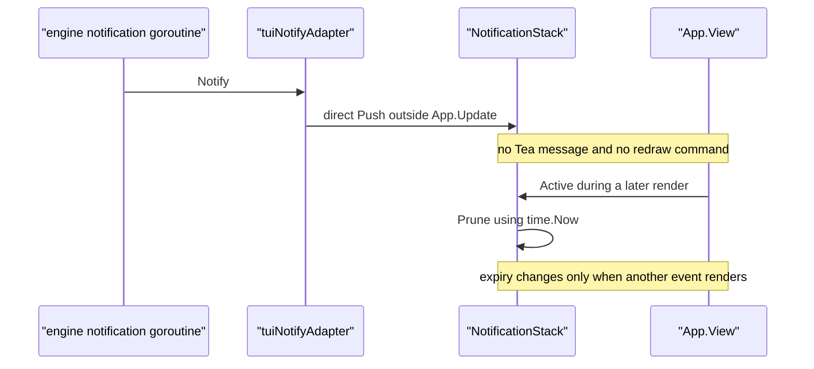
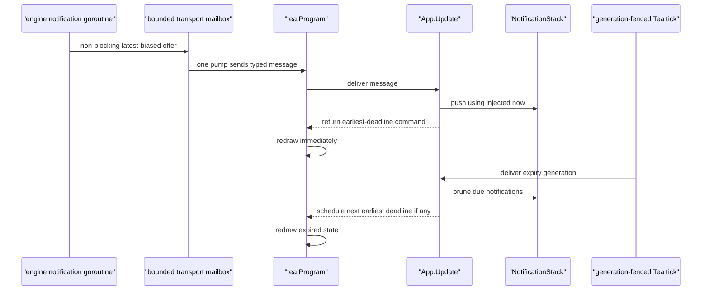

# TUI Notification Lifecycle Audit

**Status:** reference-snapshot
**Snapshot:** 2026-07-31; Eino-Agent
`4506fdbc54e8bcd9a0fee8785d796a5e23b9bd8a`, Claude Code Ripe
`4b9d30f79532`, OpenCode `411eff73f026`, Codex `66bd101fff6f`, Crush
`2af939d8e900`, and Bubble Tea v2.0.8

> **Ownership:** source-backed evidence for choosing the delivery, redraw, and
> TTL-expiry owner for G8 TUI notifications. Current TUI behavior belongs in
> [`architecture/tui/README.md`](../../../architecture/tui/README.md), the
> unresolved mismatch belongs in [`REMAINING.md`](../../REMAINING.md), and the
> accepted implementation contract belongs in
> [`p35-tui-notification-lifecycle.md`](../../plans/p35-tui-notification-lifecycle.md).

## Decision

Use `combine`: preserve Eino-Agent's status-line placement, severity styling,
five-second default TTL, and newest-three stack semantics, while combining the
references' explicit expiry wake-up with the project's existing Bubble
Tea-owned callback boundary.

P35.1 must offer every production notification to one bounded, non-blocking
transport mailbox whose sole pump sends a typed Tea message. `App.Update`
mutates the stack and schedules the earliest active deadline with an
injectable clock and generation-fenced tick. Rendering becomes a pure read.
This is not an overlay redesign and does not adopt Claude's priority queue or
OpenCode's single-toast replacement policy.

## Observable Question

Which component must own external notification delivery and TTL expiry so a
notification appears promptly, expires on time while the TUI is otherwise
idle, and no presentation state is mutated outside Bubble Tea `Update`?

The question covers the production TUI and its engine-notification callback.
It excludes desktop notification policy, notification persistence, replay,
layout placement, queue priority/folding, and non-TUI entrypoints.

## Current Production Flow

The composition root registers `tuiNotifyAdapter` after constructing the
QueryEngine. Its `Notify` method calls `App.ShowNotification`, which directly
appends to `NotificationStack`. `NotificationManager.Send` may invoke that
handler from engine work outside the Bubble Tea event loop.

The stack owns wall-clock calls inside `Push`, `PushWithDuration`, and `Prune`.
`Active`, `HasActive`, `Count`, and both render paths call `Prune`, so reads and
rendering mutate presentation state. No notification-specific message or
expiry command exists in `App.Update`.

The only focused auto-dismiss test sleeps, then calls `Count`; it proves
query-triggered pruning, not idle expiry or redraw. The production path
therefore has three deterministic mismatches:

1. external delivery does not itself wake Bubble Tea for a prompt redraw;
2. an idle terminal can keep the already-rendered notification past its TTL;
3. callback mutation can race with `View` or another notification read.

## Existing Project-Native Owner Pattern

The project already routes permission, question, repeated-tool, and
cancellation callbacks through `tea.Program.Send`. Their typed messages are
handled by `App.Update`; the callback does not mutate widgets directly.

Bubble Tea v2.0.8 documents `Program.Send` as injection into the main update
function. It is an unbuffered send: it blocks before the program starts and
while `Update` is unavailable, then becomes a no-op after termination.
`NotificationManager.Send` invokes handlers synchronously, so the production
adapter cannot call `Program.Send` on that callback stack. Doing so would add
engine backpressure and can deadlock if an App update synchronously triggers
an engine notification.

P35.1 therefore needs one composition-owned transport mailbox. `Notify`
performs a bounded, non-blocking offer; one pump removes a message before
calling `Program.Send`. The mailbox retains the latest three pending messages
in FIFO order, drops the oldest pending message on overflow, and permits at
most one additional in-flight send. It owns no creation time, TTL, styling, or
visible state. App update time becomes notification creation time, so callback
backpressure cannot consume the visible five-second TTL.

The TUI also has a generation-fenced tick precedent. Mascot idle ticks cannot
be cancelled, so one App-owned generation rejects superseded messages.
Notification expiry needs the same stale-message rule, but it remains active
under reduced motion because TTL is state settlement rather than animation.

## Evidence Matrix

| Source | Verified mechanism | Useful consequence | Boundary |
|---|---|---|---|
| Eino-Agent callback path | `tuiNotifyAdapter.Notify` directly mutates `NotificationStack`; no redraw or expiry message is scheduled | G8 is reproduced on the supported TUI entrypoint | Direct mutation must be removed, not mutex-protected |
| Eino-Agent permission path | Background callbacks use typed `Program.Send` messages and `App.Update` owns presentation mutation | Reuse the existing cross-goroutine ownership boundary | A notification cannot inherit permission's intentional synchronous wait semantics |
| Eino-Agent stack | Up to three notifications remain visible concurrently, each with severity and TTL | Preserve current user-visible stacking and styling | Render-triggered pruning and legacy toast fields are not compatibility requirements |
| Bubble Tea v2.0.8 | `Program.Send` injects into `Update` but blocks until receive; `tea.Tick` returns a future message and cannot be cancelled | Delivery and expiry can both wake the event loop | The callback needs a bounded non-blocking mailbox; stale ticks need generation fencing |
| Claude Code Ripe | Notification state is updated through one App-state setter; explicit timeouts clear matching keys and are reset or invalidated when current state changes | Expiry needs an active wake-up and stale identity check | Its global module timeout, priority queue, folding, and eight-second default are not copied |
| OpenCode | One store owns the current toast; `show` replaces the timeout and expiry clears the store after five seconds | Confirms explicit expiry instead of render-time pruning | Its single current toast would regress Eino-Agent's three-item stack |
| Codex and Crush | Named snapshots expose runtime/desktop notification paths but no matching in-app transient TTL owner was found | They do not add a better mechanism for this question | Absence is snapshot-scoped, not an upstream-current claim |

## Accepted Ownership and Ordering

The accepted sequence is:

The mailbox is a transport boundary, not a presentation owner. Its producer
path never waits for `Program.Send`; its pump removes a message before the
blocking call and holds no mailbox lock across that call. Pre-run offers return
promptly. The production run boundary terminates the program before closing
the adapter: termination first releases an in-flight send, then close discards
pending transport messages, joins the pump, and makes later offers no-ops.

`App.Update` is the sole mutation owner. Existing internal helpers may still
request a toast while processing an update, but one post-update reconciliation
must schedule the deadline for every return path. The stack may calculate
deadlines and return immutable views; it may not read wall time or prune during
render.

At most one current expiry generation is authoritative. A superseded tick
cannot delete a newer notification. A still-earlier tick may wake after its
notification was evicted, observe that nothing is due, and schedule the new
earliest deadline; avoiding eager rescheduling to later deadlines prevents a
burst of default-TTL notifications from accumulating replacement timers.

## Compatibility and Exclusions

P35.1 preserves:

- five-second default TTL and newest-three eviction;
- Info, Success, Warning, and Error rendering;
- current status-line placement and `(+N)` single-line suffix;
- in-process notification visibility regardless of focus;
- external desktop-notification focus policy; and
- all non-TUI notification handlers and entrypoints.

It deliberately does not add an overlay, presentation queue priority,
deduplication, folding, persistence, replay, user dismissal, configurable
duration, or a polling ticker. The bounded latest-three transport mailbox is
the only new queue and is deliberately lossy under overload so engine work
never waits for presentation. The unused `TUINotificationHandler`
direct-stack bridge and legacy toast fallback are not production contracts and
should not survive as alternate mutation owners.

## Evidence Limits

- No terminal/font pixel observation is claimed. Placement does not change, so
  PTY geometry evidence is not required for promotion.
- The current race follows from unsynchronized callback and render ownership;
  this audit does not claim a particular scheduler interleaving was observed.
  P35.1 requires repeated `-race` proof at the adapter/App boundary.
- Bubble Tea dependency behavior is verified at the pinned v2.0.8 source
  snapshot. A dependency upgrade requires revalidation of send, tick, and
  termination semantics.
- Under sustained producer overload, an intermediate pending notification may
  never become visible. This differs from synchronously blocking the producer
  until every message enters App, but preserves the existing newest-three
  product bias without allowing presentation to stall engine correctness.

## Source Index

| Boundary | Direct source and focused evidence |
|---|---|
| Production composition and bounded adapter | [`runTUI`](../../../../cmd/yhc/cmd/root.go#L235), [`tuiNotifyAdapter.Notify`](../../../../cmd/yhc/cmd/root.go#L1405) |
| Synchronous notification handlers | [`NotificationManager.Send`](../../../../engine/notify/notify.go#L223) |
| Current typed Update owner | [`App.MakePermissionPromptFn`](../../../../internal/tui/app.go#L569), [`App.Update`](../../../../internal/tui/app.go#L844) |
| Current App mutation and pure status read | [`App.showNotification`](../../../../internal/tui/app.go#L6115), [`App.activeToast`](../../../../internal/tui/app.go#L6120) |
| Current explicit stack time and pure rendering | [`NotificationStack.PushAt`](../../../../internal/tui/notifications.go#L59), [`NotificationStack.PruneAt`](../../../../internal/tui/notifications.go#L83), [`NotificationStack.Active`](../../../../internal/tui/notifications.go#L117), [`NotificationStack.RenderSingleLineWithEnvironment`](../../../../internal/tui/notifications.go#L166) |
| Deterministic replacement proof | [`TestNotificationStackAutoDismiss`](../../../../internal/tui/parity_test.go#L150), [`P35.1 verification`](../../verification/p35-1-tui-notification-lifecycle.md) |
| Bubble Tea dependency | [`go.mod`](../../../../go.mod#L12); `charm.land/bubbletea/v2@v2.0.8/tea.go:1176-1187` |
| Claude Code Ripe | `.reference/claude-code-ripe/src/context/notifications.tsx:34-213` |
| OpenCode | `.reference/opencode/packages/tui/src/ui/toast.tsx:53-84` |
