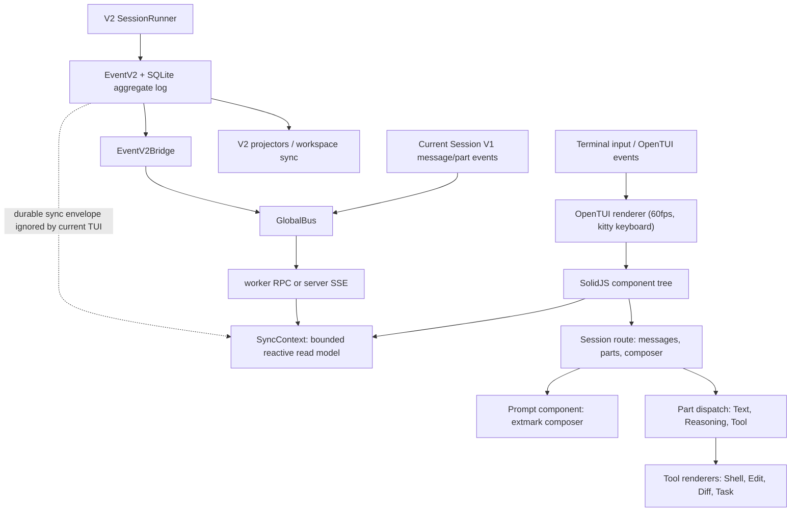

# OpenCode TUI Design Report

**Status:** reference-snapshot
**Research date:** 2026-07-11
**Local snapshot:** `.reference/opencode` at `9976269ab`
**Audit status:** corrected against source on 2026-07-12
**Scope:** Effect-TS runtime, event-sourced session system, SolidJS/OpenTUI
rendering, part-centric messages, extmark composer, permission/question
interaction, and subagent architecture

> **Ownership:** time-scoped OpenCode TUI evidence; current eino-agent behavior
> lives in [`architecture/tui/README.md`](../../../architecture/tui/README.md)

## Executive Summary

OpenCode is a strong reference for a **terminal-native IDE experience**.
Where the other three projects optimize chat-centric interaction, OpenCode
borrows from editor UX: inline annotations (extmarks), a command palette,
domain-specific tool widgets, part-level message decomposition, and an
extensible plugin architecture. Its V2 core also has an explicit
**event-sourced session aggregate** backed by SQLite and per-aggregate sequence
numbers. That is more explicit than the other references, but it is not the
only durable replay design in the comparison: Codex also persists and rebuilds
threads from rollout items.

Its most valuable ideas for `eino-agent` are:

1. **Part-centric message decomposition** — the current V1/TUI message path
stores assistant output as an array of typed parts (text, reasoning, tool,
patch) rather than one markdown string.
This enables per-type streaming, collapsible reasoning blocks, and rich tool
widgets without reparsing.
2. **V2 event-sourced session direction** — durable lifecycle boundaries use
SQLite aggregate events with optimistic sequence checks, while text/reasoning/
tool-input deltas remain live-only. This path supports replay and experimental
workspace synchronization, but it is not yet the sole state path feeding the
current TUI.
3. **Bounded reactive store with binary-search lookup** — sessions, messages,
and parts are kept in sorted arrays nested under ID-keyed records. Lookup is
`O(log n)`; insertion/removal still uses array `splice`/`shift` and is `O(n)`.
A 100-message per-session window bounds the practical cost.
4. **Extmark-based composer** — the prompt input overlays virtual text spans
for file attachments, agent mentions, and paste placeholders inline. Each span
maps to a typed `Part` that survives editing.
5. **Structured permission and question system** — wildcard rule-based
permissions with cascading approval/rejection, deferred-promise blocking via
Effect, and a dedicated `question` tool for structured multi-part user input.
6. **Child-session navigation and experimental background jobs** — subagents
run as child sessions. The TUI can open, cycle, and return from child
transcripts; optional background execution uses a process-local
`BackgroundJob` registry with `extend`/`promote`/`wait` semantics behind
`OPENCODE_EXPERIMENTAL_BACKGROUND_SUBAGENTS`.

OpenCode is weaker as a direct Bubble Tea reference because it uses SolidJS
reactive primitives and a custom OpenTUI renderer rather than Go channels
and Lip Gloss string composition. Its value is architectural and product-level,
not implementation-portable line-by-line.

The local `packages/tui/src` tree contains 152 TS/TSX files and roughly 27K
lines. The `packages/opencode/src` core contains 361 TS/TSX files and roughly
80K lines.

## Research Boundary

This report describes the local checkout, not an upstream latest-version
claim. The codebase is a large Effect-TS monorepo with multiple packages
(`core`, `opencode`, `tui`, `ui`, `llm`, `schema`, etc.) and a V1-to-V2
migration in progress. The report distinguishes the current V1/TUI
message-part path from the V2 event-sourced direction; combining them into one
already-converged runtime would overstate the snapshot.

## Architecture



The major layers are:

- **Terminal runtime:** OpenTUI provides a flexbox-like layout engine,
  scrollboxes, textareas, mouse/keyboard handling, and a 60fps renderer with
  kitty keyboard protocol support.
- **Reactive UI:** SolidJS `createSignal`/`createStore`/`createMemo` drive
  fine-grained reactivity. Context providers (`SyncContext`, `LocalContext`,
  `RouteContext`, `ThemeContext`) pass data without prop drilling.
- **Reactive store:** `SyncContext` holds ID-keyed records whose values are
  sorted arrays. Binary search finds update positions and a 100-message window
  bounds each hydrated session.
- **V2 event sourcing:** `EventV2` implements typed publish/subscribe, durable
  SQLite persistence, aggregate replay, projectors, and optimistic sequence
  checks. Live-only events cannot use durable commit hooks.
- **V2 agent loop:** `SessionRunner` loads projected history, streams LLM
  output, publishes durable boundaries/live deltas, settles local tools through
  `FiberSet`, and loops after settlement.
- **Current TUI transport:** local TUI mode receives `GlobalBus` events through
  a worker RPC; server mode uses SSE. `SyncContext` consumes the legacy
  `message.*`, `permission.*`, and `question.*` projection and explicitly drops
  the V2 `sync` replication envelope; it also has no chat reducer cases for
  direct `session.next.*` V2 events.

## Primary Source Anchors

| Concern | Primary source |
|---|---|
| TUI entry and runtime | `packages/tui/src/app.tsx`, `packages/tui/src/runtime.tsx` |
| Central reactive store | `packages/tui/src/context/sync.tsx` |
| TUI event transport | `packages/tui/src/context/event.ts`, `packages/tui/src/context/sdk.tsx` |
| Session/chat route | `packages/tui/src/routes/session/index.tsx` |
| Child-session navigation | `packages/tui/src/routes/session/subagent-footer.tsx` |
| Prompt composer | `packages/tui/src/component/prompt/index.tsx` |
| Prompt history/stash | `packages/tui/src/prompt/history.tsx`, `packages/tui/src/prompt/stash.tsx` |
| Keymap and commands | `packages/tui/src/keymap.tsx` |
| Permission prompt UI | `packages/tui/src/routes/session/permission.tsx` |
| Question prompt UI | `packages/tui/src/routes/session/question.tsx` |
| Attention/notifications | `packages/tui/src/attention.ts` |
| Core event bus | `packages/core/src/event.ts` |
| Session service (V2) | `packages/core/src/session.ts` |
| Session runner / agent loop | `packages/core/src/session/runner/llm.ts`, `packages/core/src/session/runner/index.ts` |
| Session processor (V1) | `packages/opencode/src/session/processor.ts` |
| Session prompt orchestrator | `packages/opencode/src/session/prompt.ts` |
| Session run state | `packages/opencode/src/session/run-state.ts` |
| Background jobs | `packages/core/src/background-job.ts` |
| V1 background-job adapter | `packages/opencode/src/background/job.ts` |
| Permission service | `packages/opencode/src/permission/index.ts` |
| Question service | `packages/opencode/src/question/index.ts` |
| Task tool (subagent spawn) | `packages/opencode/src/tool/task.ts` |
| Subagent permissions | `packages/opencode/src/agent/subagent-permissions.ts` |
| Control plane / workspace sync | `packages/opencode/src/control-plane/workspace.ts` |
| Event V2 bridge | `packages/opencode/src/event-v2-bridge.ts` |

## State Ownership and Event Flow

OpenCode currently separates two runtime generations plus client state:

1. **Current V1/TUI truth:** session/message/part services persist current chat
   rows and publish legacy events consumed by the shipping TUI.
2. **V2 direction:** the core `EventV2` aggregate, projectors, and
   `SessionRunner` own the newer replayable session path. The bridge exposes its
   events, but the current `SyncContext` does not project the durable `sync`
   envelope into chat state.
3. **Client projection and view state:** `SyncContext` maintains the bounded
   reactive read model, while `LocalContext` holds client-only state (agent,
   model selection, pinned sessions) persisted to small JSON files.

The local TUI event flow crosses one worker boundary; remote/server mode uses
SSE instead:

```
Session/Event publisher
  → GlobalBus (Node.js EventEmitter)
    → CLI worker RPC or server SSE
      → TUI event subscription
        → SyncContext ordered-array update
```

This is heavier than an in-process Go runtime needs, but the underlying
principles are transferable: typed events, bounded projections, and explicit
read-model projections.

## V2 Session and Event-Sourcing Model

In the V2 core, a session is an event-sourced aggregate identified by
`sessionID`. Its history is an ordered sequence of durable events stored in
SQLite with optimistic sequence checks (`seq` per aggregate). This is verified
V2 behavior, not a claim that all V1 session mutations and current TUI reads
have already converged on the aggregate.

The schema distinguishes **durable** from **live-only** events:

| Type | Examples | Persisted |
|---|---|---|
| Durable | `Text.Started/Ended`, `Reasoning.Started/Ended`, `Tool.Called/Progress/Success/Failed` | Yes |
| Live-only | `Text.Delta`, `Reasoning.Delta`, `Tool.Input.Delta` | No |

This keeps the event log compact while still allowing real-time updates. Live
deltas are published to subscribers and can travel over worker RPC or SSE;
durable boundaries are replayable.

The `SessionRunner` (`core/src/session/runner/llm.ts`) implements the agent
loop:

1. Load projected history from the event store.
2. Resolve model and tool set.
3. Stream one LLM turn.
4. Publish live deltas and durable lifecycle/value boundaries.
5. Execute tools concurrently via `FiberSet`.
6. Wait for tool settlement.
7. Loop if more tool calls exist.

The V2 `SessionRunCoordinator` serializes execution per session and coalesces
wakeups. The V1 `SessionRunState` also keeps one runner per session. A V1 shell
run occupies that runner; a normal run can be queued as `ShellThenRun` and
starts only after the shell exits. The latch coordinates shell readiness and
cancellation, not concurrent execution with the main loop.

## Subagent/Agent Architecture

Agents in OpenCode are **statically-defined configurations** (permission
rulesets, mode, prompt, model) rather than runtime objects. The default agent
is `build`; `general` and `explore` are built-in subagents. `plan` is a visible
primary agent, while `compaction`, `title`, and `summary` are hidden primary
agents. Custom agents with mode `subagent` or `all` can also be advertised to
the `task` tool when permission allows.

Subagent spawn flow:

1. Parent session calls the `task` tool with an agent type and prompt.
2. `task.ts` creates a **child session** with a derived permission ruleset
   (`subagent-permissions.ts`). Parent `deny` and `external_directory`
   restrictions propagate down.
3. The child session runs through the same current V1 `SessionPrompt` loop as
   the parent; this task path is not yet the V2 `SessionRunner` path.
4. If the experimental background-subagent flag is enabled and
   `background=true`, the job enters the `BackgroundJob` registry
   (`core/src/background-job.ts`) and the parent `wait`/`extend`/`promote`
   primitives control its lifecycle.
5. Child session history is persisted independently; parent and child can be
   resumed or forked separately.

The `BackgroundJob` registry is process-local (not durable across restarts).
Jobs use `SynchronizedRef`, `Deferred`, and `Scope` for safe concurrency and
resource cleanup. A running job can be **extended** (chain more work) or
**promoted** (marked as background so waiters return immediately).

The TUI renders subagent activity as `Task` tool parts with a compact nested
trace under the parent invocation. It also provides first-class child-session
navigation: the task row opens the child transcript, commands select/cycle
children, and `SubagentFooter` returns to the parent or adjacent child. The
top-level session picker intentionally filters child sessions; child access is
through lineage navigation. Passing `task_id` resumes the same child session.

## TUI Rendering Architecture

OpenCode's TUI uses **OpenTUI**, a custom terminal rendering framework with a
flexbox-like layout engine, scrollboxes, textareas, and mouse/keyboard
handling. The renderer runs at 60fps with kitty keyboard protocol support.

SolidJS reactive primitives drive the component tree:

- `createSignal` for simple reactive values.
- `createStore` for nested reactive state (the sync store).
- `createMemo` for computed derived state.
- `Dynamic` for runtime component dispatch (part-type rendering).

The session route (`routes/session/index.tsx`, ~2700 lines) contains:

- message list rendering with `UserMessage` and `AssistantMessage`;
- part-type dispatch via `PART_MAPPING` registry;
- scrollbox management with `stickyScroll` anchored to bottom;
- permission and question prompt overlays;
- sidebar layout;
- ~15 tool-specific renderers (Shell, Read, Write, Edit, Task, etc.).

The `UI.Update`-equivalent in OpenCode is SolidJS reactive recomputation
rather than a single large switch. Fine-grained signals limit rerender scope
so that streaming a text delta only invalidates the affected part, not the
entire message list.

## Message and Part Model

OpenCode's most distinctive rendering decision is **part-centric decomposition**.
An assistant message is not a monolithic markdown string; it is an array of
typed `Part`s:

- `text` — streaming prose rendered as markdown.
- `reasoning` — thinking blocks with show/hide toggle.
- `tool` — tool calls and results with inline spinner → inline result → block
  view transitions.
- `patch` — file mutation snapshots retained in the broader V1 part schema.
- `step-start`/`step-finish` — lifecycle markers.
- user-side `file`, `agent`, `subtask`, and `compaction` parts.

The current `AssistantMessage` `PART_MAPPING` directly dispatches `text`,
`tool`, and `reasoning`; user messages separately render text/files and
compaction markers. The typed storage model still avoids reparsing markdown to
recover tool calls or reasoning blocks.

Each tool part has a typed pending/running/completed/error state. The UI chooses
between compact inline and richer block renderers by tool family; this is not a
universal three-stage expand-on-click state machine for every tool.

1. **Inline spinner** — while the tool runs.
2. **Inline result** — brief success/failure summary.
3. **Block view** — expanded diff, code block, or diagnostic output on
   interaction.

Tool renderers exist for Shell, Read, Write, Edit, Task, Diagnostics,
References, LSP, and a generic fallback. This is comparable to Crush's
dedicated tool renderers but expressed as SolidJS components rather than Go
interfaces.

## Prompt Composer

The prompt component (`component/prompt/index.tsx`, ~1700 lines) is a rich
composer built on OpenTUI's `TextareaRenderable`:

- **Extmark-based virtual text** — file attachments, agent mentions, and paste
  summaries overlay inline as virtual text spans. Each span maps to a typed
  `Part` in the prompt store.
- **Shell mode** — `!` prefix switches to direct shell execution.
- **Autocomplete** — file and agent suggestions after `@`.
- **History navigation** — `↑`/`↓` cycles through previous prompts.
- **Draft stash/pop/list** — bound to keys for saving and restoring drafts.
- **External editor integration** — `prompt.editor` edits the prompt in
  `$EDITOR`; a separate editor-context channel injects opened-file or selected
  range context from supported editor integrations.
- **Paste handling** — automatic image/file detection and placeholder expansion.
- **IME-aware submit guarding** — double-deferred `setTimeout` ensures composed
  characters flush before reading state.

On submit, text parts expand inline while file/agent parts are preserved as
structured payloads sent to the session API.

The command palette (`keymap.tsx`) exposes nearly every feature as a
namespaced command (`session.share`, `session.undo`, `prompt.editor`, etc.).
Slash commands (`/share`, `/rename`, `/compact`) derive from the same command
definitions, unifying keyboard shortcuts and typed commands.

## Streaming Model

Two streaming paths coexist:

- The current V1 `SessionProcessor` consumes raw LLM stream events, persists
  assistant message/part mutations, and emits `message.part.delta` updates used
  by `SyncContext`.
- The V2 `SessionRunner` publishes live-only text/reasoning/tool-input deltas
  plus durable started/ended/tool settlement events. That aggregate stream is
  available for replay/workspace sync but is not yet the current TUI's sole
  chat projection.

The TUI scrollbox uses `stickyScroll={true} stickyStart="bottom"` so new
streaming content auto-scrolls, but manual scroll detaches. A `toBottom()`
helper re-engages stickiness after user actions.

The processor also implements **doom-loop detection**: if the last three tool
calls are identical (same tool + input), it injects a `doom_loop` permission
request before allowing continuation.

## Permission and Attention Model

OpenCode's permission system is the most elaborate among the four projects.

**Permission service** (`opencode/src/permission/index.ts`):

- Evaluates wildcard rules (`ask`/`allow`/`deny` with wildcards) against a
  ruleset.
- Creates an Effect `Deferred` and blocks tool execution until the user replies.
- Publishes a `permission.asked` event; the TUI renders the prompt.
- Supports cascading approval: when a user replies `"always"`, new rules are
  pushed to an in-memory `approved` array, and pending requests that now match
  are auto-resolved.
- Supports cascading rejection: a reject resolves all other pending permissions
  in the same session.

**Question service** (`opencode/src/question/index.ts`):

- Structured multi-part user input via the `question` tool.
- Supports single/multi-select, numbered shortcuts, custom text answers, and
  tab navigation.
- Uses the same deferred-promise pattern as permissions.

**Attention/notifications** (`tui/src/attention.ts`):

- Tracks focus/blur state.
- Plays configurable sound packs.
- Triggers OS notifications based on config rules.
- Suppresses OS notifications for background subagents (identified by
  `session.parentID`), but still plays sounds.

**Tool context injection** (`opencode/src/session/tools.ts`):

- Every built-in and MCP tool receives a uniform `Tool.Context` with a
  standardized `ask()` function.
- MCP tools participate in the same permission model without individual
  modification.

The permission prompt UI (`tui/src/routes/session/permission.tsx`) renders
type-specific previews: diffs for edits, command text for bash, etc. The
question prompt UI (`tui/src/routes/session/question.tsx`) uses a multi-tab
layout for multi-part questions.

## Terminal Runtime

OpenTUI provides:

- flexbox-like layout engine;
- scrollboxes with sticky anchoring;
- textareas with extmark virtual text;
- mouse and kitty keyboard protocol;
- 60fps rendering;
- alternate-screen mode;
- terminal title management;
- copy-on-select mouse handling;
- configurable border character sets.

The app entry (`tui/src/app.tsx`) sets up the Effect-scoped runtime, mounts
the SolidJS tree inside a deeply nested provider stack, and wires global
commands for session switching, model cycling, and theme toggling.

## Verification Strategy

The codebase contains:

- Effect-TS property-based and integration tests for core services;
- permission cascading approval/rejection tests;
- background job lifecycle tests;
- session runner interruption and retry tests.

The repeated-tool guard is directly visible in `session/processor.ts`, but no
focused processor test for the three-call threshold was found in this snapshot.

The TUI package has broad unit/integration coverage and a small snapshot file
for narrow inline-tool wrapping, but not a broad visual regression suite
comparable to Codex's `insta` snapshots or Crush's `catwalk` goldens.

## Strengths

- Explicit event-sourced session model with durable replay and
  optimistic concurrency.
- Fine-grained message decomposition (parts) enabling per-type streaming and
  rich tool widgets.
- Rich prompt composer with extmarks, draft stash, external editor
  integration, and IME-aware guarding.
- Comprehensive permission system with wildcard rules, cascading
  approval/rejection, and structured questions.
- Binary-search lookup plus a 100-message bound avoids full unbounded-session
  scans; array insertion/removal remains linear.
- Background job registry with extend/promote/wait primitives.
- Command palette unifies keyboard shortcuts and slash commands.
- Effect-TS provides structured concurrency, cancellation, and error handling.

## Costs and Risks

- Effect-TS adds significant structural and cognitive overhead compared to Go
  channels or simple async/await.
- The monorepo is large (~1.5K TS/TSX files total) and has a V1-to-V2
  migration in progress, creating transitional complexity.
- OpenTUI is a custom renderer; it solves real problems but is not portable
  to Bubble Tea.
- Background subagents and workspace synchronization are experimental surfaces,
  so their lifecycle should not be treated as a stable default contract.
- V1 message/part mutation and V2 aggregate paths coexist, making ownership and
  migration status easy to overstate.
- The bridge/GlobalBus/worker-or-SSE transport is heavier than an in-process Go
  runtime needs.
- No broad dedicated TUI visual regression suite comparable to Codex or Crush.

## Applicable Decisions for Eino-Agent

The 2026-07-12 audit compared these ideas with current Go source rather than
the pre-M0-M7 baseline:

| OpenCode idea | Current eino-agent state | Decision | Class / status |
|---|---|---|---|
| Typed message/tool parts and dedicated renderers | `HistoryItem` plus semantic tool-family renderers and generic fallback are complete | Reuse current Go contract; do not replace it with OpenCode's schema | Verified / satisfied |
| Per-thread drafts, rich paste/files, command palette, external editor | M5 composer/keybinding work is complete | No new slice | Verified / satisfied |
| Structured question flow | `AskUserQuestion` and owner-scoped question dialogs exist | No new tool | Verified / satisfied |
| Child transcript navigation and follow-up | Stable thread IDs, Agent switching, send/resume, lineage, and nested trace exist | Treat OpenCode as corroborating evidence | Verified / satisfied |
| Focus-aware notifications | Terminal focus policy and inactive-thread attention exist | Keep current stricter unknown-focus behavior | Verified / satisfied |
| Three identical tool calls trigger confirmation | P9.1 now provides a query-local guard over canonical tool name plus coerced input, deterministic streaming/batch order, one-shot override, and fail-closed headless behavior | Preserve the completed contract; keep result-aware rolling detection separate | Completed P9.1 |
| Cascading permission resolution | P9.2 now provides one project-scoped settlement owner, structured decisions, lineage-bound session grants, serialized durable commits, and per-candidate exact-scope positive re-evaluation | Preserve the completed contract; do not reject every pending request in a multi-thread session | Completed P9.2 |
| SQLite aggregate log and workspace replication | Existing runtime reducer plus transcript/checkpoint persistence already meets current replay contracts | Defer until a measured multi-process ownership/recovery gap exists | Recommendation / deferred |
| Binary-search ordered arrays | Current performance gates pass and insertion remains linear in OpenCode too | Profile before changing stores | Recommendation / rejected for now |
| Effect/OpenTUI runtime | Bubble Tea/Go ownership is established | Do not copy | Recommendation / rejected |

The two improvements are recorded as non-parity product work in
[`migration/PLAN.md`](../../PLAN.md) and [`migration/REMAINING.md`](../../REMAINING.md). P9.1 and
both P9.2 slices are complete, with the source comparison and implemented
contract in
[`permission-coalescing.md`](../parity/permission-coalescing.md).
Neither reopens the completed TUI M0-M7 or P1-P8 tracks.

## Audit Corrections

**Status (2026-07-12): complete for snapshot `9976269ab`.** The audit corrected
the V1/V2 ownership boundary, event durability claims, ordered-array complexity,
agent modes, shell serialization, experimental background status, child-session
navigation, editor-context wording, and TUI snapshot coverage. No unresolved
source question remains for this report; implementation priority is owned by
the current migration plan rather than this reference report.

## Related Reports

- [`claude-code-ripe.md`](claude-code-ripe.md)
- [`codex.md`](codex.md)
- [`crush.md`](crush.md)
- [`eino-agent-2026-07-10.md`](eino-agent-2026-07-10.md)
- [`modern-coding-agent-synthesis.md`](modern-coding-agent-synthesis.md)
