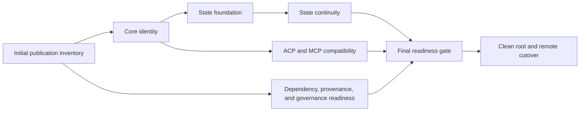

# YHC Public Release Program Implementation Plan

> **For agentic workers:** REQUIRED SUB-SKILL: Use
> `$iteration-workflow` to execute and close this plan task-by-task. Preserve
> every approval boundary and evidence requirement. Steps use
> checkbox (`- [ ]`) syntax for tracking.

**Goal:** Release YHC — Yet Hooked on Coding from a cleared fresh Git root at
`<public-repository>`, retain the complete old history in the private
`<private-archive>`, and preserve current runtime
behavior except for the approved identity and compatibility changes.

**Architecture:** All implementation happens on one short-lived private release
staging branch whose commits are review units, not public history. The leaf
plans below characterize and change identity, state, protocols, dependencies,
provenance, and governance. Only an allowlisted, verified tree is materialized
without `.git` and committed as the single public bootstrap root. Remote rename,
visibility promotion, and canonical cutover are separate stop points.

**Tech Stack:** Go 1.26.5, Eino, Cobra, Bubble Tea, ACP and MCP Go SDKs, Git,
GitHub CLI/API, Makefile iteration gates, `govulncheck`, secret and license
scanners, CycloneDX SBOM, and repository-owned publication tooling.

**Status:** active-plan
**Created:** 2026-08-09
**Plan state:** Approved design; execution pending

> **Ownership:** execution order, integration boundaries, and terminal
> acceptance for the approved
> [YHC Public Release And Identity Migration Design](../specs/2026-08-09-yhc-public-release-design.md).
> Each leaf plan owns its named implementation surface.

## Global Constraints

- Record the approved design baseline and the release-staging start/final HEADs
  in private `build/publication` evidence. Each materialization explicitly
  supplies the clean current HEAD; do not silently combine another branch.
- The existing multi-worktree clone remains attached to the private archive.
  Never repoint its shared `origin` to the public repository. New public work
  uses a separate clone after promotion.
- Create a dedicated clean release-staging worktree for implementation. The
  main checkout remains on its current branch with all user-owned untracked
  files untouched; no leaf command runs in that checkout.
- The release staging branch may contain multiple atomic review commits because
  the public root deliberately discards private Git history. Do not merge those
  commits into the fresh public graph and do not copy tags, refs, PR metadata,
  Actions data, reflogs, or author history. Cleared unchanged file content may
  naturally produce the same content-addressed blob ID; that is not copied
  history and is not a zero-blob-intersection requirement.
- Preserve model/tool ordering, permissions, sandboxing, cancellation,
  persistence, recovery, provider behavior, and supported CLI, TUI, ACP, and
  MCP workflows. Every clean-room rewrite starts with a behavior
  characterization test.
- Preserve accurate source mappings, migration manifests, and cleared
  reference research. Exclude `.reference/` snapshots, symlink targets, copied
  source bodies, machine paths, private identities, credentials, transcripts,
  local state, and unresolved material.
- Canonical identity is `YHC — Yet Hooked on Coding`, module and repository
  `<public-repository>`, command `yhc`, state roots `.yhc` and
  `~/.yhc`, environment prefix `YHC_`, ACP identity `yhc`, and MCP
  implementation name `yhc`.
- Legacy `EINO_AGENT_*` runtime variables remain aliases with canonical-first
  precedence. Legacy `.eino-agent` state is immutable. There is no public
  `eino-agent` command shim or old Go-module alias.
- No automatic import may recurse through a legacy state root, merge into a
  non-empty canonical artifact, copy credentials, mutate legacy bytes, or move
  a live worktree.
- All required local and publication gates run against the exact materialized
  tree. Scanner logs with sensitive findings stay outside the public tree.
- Remote mutation begins only in the cutover plan after the pre-remote readback.
  Public visibility is a second explicit stop point because exposure cannot be
  rolled back by later making the repository private.
- The initial public root push is the sole direct-`master` bootstrap exception.
  Every later change uses a short-lived branch, pull request, squash merge, and
  `CI / Required gates`.
- Preserve unrelated dirty or untracked files. The known main-checkout
  `PROJECT_GUIDE.md`, `artifacts/`, and `scripts/e2e/` entries are user-owned
  and outside this program.

---

## Locked Plan Graph



| Order | Leaf plan | Required input | Terminal evidence |
|---|---|---|---|
| 1 | [Publication readiness](2026-08-09-yhc-publication-readiness.md), Tasks 1-2 | Frozen release staging HEAD | Complete path inventory and publication checker red/green tests |
| 2 | [Core identity](2026-08-09-yhc-core-identity.md) | Inventory rules and approved identity | New module/command/product identity and canonical-first env aliases |
| 3 | [State foundation](2026-08-09-yhc-state-foundation.md) | Identity constants and env resolver | Safe exact-artifact importer plus plain owner compatibility |
| 4 | [State continuity](2026-08-09-yhc-state-continuity.md) | State foundation | Recoverable session import, cron refusal/import boundary, legacy-worktree inspection |
| 5 | [Protocol compatibility](2026-08-09-yhc-protocol-compatibility.md) | Core identity | ACP namespace matrix and MCP declaration-only rename |
| 6 | [Publication readiness](2026-08-09-yhc-publication-readiness.md), Tasks 3-8 | Final candidate source tree | No unresolved provenance, reachable vulnerability, secret, privacy, or license blocker |
| 7 | [Clean-root cutover](2026-08-09-yhc-clean-root-cutover.md) | Exact approved tree and all prior evidence | Fresh root, private archive, public YHC, green public required check |

State continuity and protocol compatibility may be implemented in either order
after their prerequisites. Do not run their write steps concurrently in one
checkout.

## Review And Commit Boundaries

The private release staging branch retains these independently reviewable
boundaries even though the public repository starts with one root:

1. publication inventory and deterministic materializer;
2. module/command/current-copy identity;
3. runtime environment aliases;
4. generic state-import safety foundation;
5. each plain state owner;
6. session bundle transaction;
7. cron and worktree compatibility;
8. ACP namespace compatibility;
9. MCP declaration identity;
10. dependency and reachable-vulnerability remediation;
11. provenance clearance or clean-room rewrite;
12. governance, workflow, and SBOM;
13. root materialization and remote operations.

Each commit runs the leaf plan's focused test. Before another commit depends on
it, run:

```bash
env GOCACHE="<task-cache>" make change-plan
env GOCACHE="<task-cache>" make verify-focused
git diff --check
```

## Task 1: Freeze The Release Staging Input

**Files:**

- Modify: `quality/publication.yaml` after Publication Readiness Task 1 creates
  it
- Evidence only: `build/publication/private-source.json`

**Interfaces:**

- `quality/publication.yaml.source.baseline_commit` freezes the accepted
  private-source ancestor.
- `build/publication/private-source.json` records the remote name, visibility,
  default branch, staging start/final commits, and clean-status result without
  secrets.

- [ ] **Step 1: Create a dedicated clean release worktree**

```bash
git merge-base --is-ancestor "<approved-source-baseline>" HEAD
release_parent=$(mktemp -d "<temporary-directory>/release-stage.XXXXXX")
release_stage="$release_parent/worktree"
git worktree add -b codex/chore/yhc-public-release "$release_stage" HEAD
git -C "$release_stage" status --short
```

Expected: the ancestry check succeeds; the new worktree status is empty and
its branch is based on the plan-bearing commit. The caller checkout's branch,
tracked changes, and untracked files are unchanged. Every remaining command in
this program and its leaf plans runs with workdir `release_stage`.

- [ ] **Step 2: Record the baseline and staging start**

Run Publication Readiness Task 1, set `source.baseline_commit` to the approved
source baseline, and record the output of
`git rev-parse HEAD` as the staging start in private evidence. The publication
checker rejects a dirty tree, a source commit that is not current HEAD, or a
source commit that is not a descendant of the frozen baseline.

- [ ] **Step 3: Commit the frozen input**

```bash
git add quality/publication.yaml scripts/publication
git commit -m "chore(publication): freeze YHC release input"
```

## Task 2: Establish The Initial Publication Sieve

Execute Tasks 1-2 of
[Publication readiness](2026-08-09-yhc-publication-readiness.md). Stop if any
tracked path is unresolved or any ignored/untracked path enters the candidate
tree.

- [ ] Initial inventory is complete for every tracked path.
- [ ] `.reference/`, `.git`, local state, credentials, build/evaluation output,
  and user-owned untracked files are negative fixtures.
- [ ] Materialization from a dirty or mismatched source commit fails closed.

## Task 3: Implement Identity And Compatibility

Execute, in dependency order:

1. [Core identity](2026-08-09-yhc-core-identity.md);
2. [State foundation](2026-08-09-yhc-state-foundation.md);
3. [State continuity](2026-08-09-yhc-state-continuity.md); and
4. [Protocol compatibility](2026-08-09-yhc-protocol-compatibility.md).

- [ ] Every leaf focused test is green before its commit.
- [ ] Characterization tests prove the approved runtime invariants did not
  change.
- [ ] No legacy state sample is deleted, chmodded, rewritten, or merged.
- [ ] Historical and compatibility references to the old identity remain only
  where the publication identity checker explicitly permits them.

## Task 4: Close Publication Readiness

Execute Tasks 3-8 of
[Publication readiness](2026-08-09-yhc-publication-readiness.md).

- [ ] The path and source-mapping inventories contain no `unresolved` decision.
- [ ] Every reference-informed implementation is cleared or replaced behind
  pre-existing behavior tests.
- [ ] `govulncheck ./...` reports no reachable known vulnerability.
- [ ] Dependency licenses and required notices are complete.
- [ ] Secret and privacy scanners pass on the source tree, materialized tree,
  fresh object database, workflow files, and release artifacts.
- [ ] Apache-2.0, NOTICE, security, contribution, conduct, dependency update,
  SBOM, and public CI governance files are present.

## Task 5: Run The Private Candidate Acceptance

**Files:**

- Generated outside Git: `build/publication/acceptance.json`
- Generated public artifact: `sbom.cdx.json`

- [ ] **Step 1: Run repository gates**

```bash
make fmt
make lint
make test
make build
make docs-check
git diff --check
```

Expected: all commands exit 0.

- [ ] **Step 2: Run deep compatibility and publication gates**

```bash
make test-race
make test-contract
make test-e2e
make verify-publication
```

Expected: all commands exit 0; skipped physical-terminal or platform evidence
is reported separately and is not mislabeled as passed.

- [ ] **Step 3: Commit the final private candidate**

```bash
git add --pathspec-from-file=build/publication/candidate-stage-paths.txt --pathspec-file-nul
git diff --cached --check
git commit -m "chore: prepare cleared YHC public root"
```

`candidate-stage-paths.txt` is generated from the reviewed publication
inventory and current planned diff. It excludes unrelated and ignored paths.
Inspect `git status --short` and the staged diff before committing.

- [ ] **Step 4: Persist merge evidence**

```bash
env GOCACHE="<task-cache>" make verify-merge
env GOCACHE="<task-cache>" make change-evidence
```

Expected: `change-evidence` reports `evidence_ready` for the final candidate
commit.

## Task 6: Execute The Irreversible Cutover With Stop Points

Follow [Clean-root cutover](2026-08-09-yhc-clean-root-cutover.md) exactly.

- [ ] Pre-remote readback confirms the exact source commit, candidate tree hash,
  archive target, public target, author identity, and all gate results.
- [ ] After explicit approval, rename the old remote, keep it private, and
  bootstrap the new private staging repository.
- [ ] Re-clone and re-run all publication gates on GitHub's exact root object.
- [ ] Immediately before visibility promotion, refresh remote and scanner facts
  and obtain the publication approval.
- [ ] After approval, expose only `<public-repository>`, run the public workflow, and
  keep YHC non-canonical until `CI / Required gates` succeeds on the root.

## Task 7: Close The Program

**Files:**

- Modify: `docs/superpowers/plans/2026-08-09-yhc-public-release-program.md`
- Modify: `docs/superpowers/plans/README.md`
- Modify: `README.md` only if final public URLs or badges differ from the
  already-reviewed candidate

- [ ] Record the public root SHA, private archive visibility verification,
  public workflow run ID, and separate-clone path without recording tokens,
  private email, removed paths, or scanner findings.
- [ ] Change every leaf plan state from `Approved design; execution pending` to
  its evidence-backed terminal state.
- [ ] Run `make docs-check` and `git diff --check`.
- [ ] Open the first normal YHC pull request for closeout documentation; do not
  use the bootstrap exception again.

The program is complete only when the public required check is green and the
separate YHC clone is the canonical development home. A public visibility field
alone is not completion.
