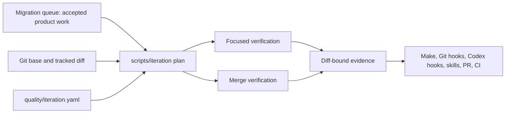
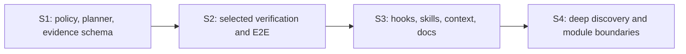

# Iteration Quality Kernel Design

**Status:** active-plan
**Accepted:** 2026-08-08
**Last verified:** 2026-08-09
**Source snapshot:** `origin/master` at
`0a45e462145615f40c289d667c53c82c8d40ed8e`

> **Ownership:** approved design for risk-selected local verification,
> iteration evidence, agent-context lifecycle, defect discovery, and
> incremental module-boundary enforcement; current testing policy remains
> owned by [`testing-strategy.md`](../../contributing/testing-strategy.md),
> product execution order by [`queue.yaml`](../../migration/queue.yaml), and
> current implementation by [`architecture/`](../../architecture/README.md)

## Outcome

Eino-Agent will gain one project-owned iteration quality kernel that derives a
change plan from the actual Git diff, selects the applicable focused and risk
checks, executes two levels of local verification, and emits evidence bound to
that exact diff. Make targets, Git hooks, Codex hooks, project skills, and
best-effort CI will consume this kernel instead of restating their own change
classification and closeout rules.

The accepted quality promise is deliberately narrower than “zero defects”:

- `master` carries no known regression at merge time;
- every confirmed defect gains a durable regression at the lowest stable seam;
- every merge has local evidence matched to the changed risk;
- blocked and not-applicable checks remain visible; and
- a new change invalidates evidence produced for an older diff.

Remote CI remains useful independent evidence, but the accepted infrastructure
constraint does not make its availability a prerequisite for this design.
Local hooks are defense in depth and remain bypassable. The system therefore
optimizes for deterministic detection, explicit evidence, and cheap recovery,
not an unachievable absolute guarantee.

This is a `project-native` governance decision. It does not change runtime
behavior, promote a product migration slice, or make a reference agent the
owner of Eino-Agent's development process.

## Current Baseline And Verified Gap

The repository already has most execution primitives. The missing capability
is the closed loop that selects and records them.

| Current capability | Current owner | Verified gap |
|---|---|---|
| Formatting, lint, full tests, and cross-builds | [`Makefile`](../../../Makefile) | No diff-bound plan or durable local evidence state |
| Contract, race, PTY, fuzz smoke, and opt-in repository evaluation | [`Makefile`](../../../Makefile) and [`testing-strategy.md`](../../contributing/testing-strategy.md) | Risk packs are selected manually; required CI runs none of them |
| JUnit and atomic coverage artifacts | `make test` and [CI](../../../.github/workflows/ci.yml) | No changed-package diagnostic, trend, or explicit first-failure model |
| Documentation-only classification and aggregate required job | [CI workflow](../../../.github/workflows/ci.yml) | Classification is only `docs_only`; there is no module-to-risk selection |
| Validated migration DAG and generated Mermaid projection | [`scripts/migration_queue`](../../../scripts/migration_queue/main.go) | Product topology is not linked to a per-change quality plan |
| Root instruction freshness guard | [`scripts/docs_check`](../../../scripts/docs_check/main.go) | Most architecture and workflow prose remains semantically unchecked |
| Protected-master pre-push hook | [`.githooks/pre-push`](../../../.githooks/pre-push) | It does not require fresh verification evidence |
| Privacy-aware skill telemetry | [`skill-runtime`](../../../.agents/skills/skill-runtime/SKILL.md) | Lifecycle calls remain repetitive and there is no per-diff phase owner |
| Defect workflow and sanitized S1-S10 E2E catalog | [`defect-investigation`](../../../.agents/skills/defect-investigation/SKILL.md) | The scenarios are guidance, not an executable discovery and regression matrix |
| Current architecture and code map | [`architecture/`](../../architecture/README.md) | No checker prevents new forbidden project import edges |

`make verify` currently means `fmt-check`, full lint, full tests, and builds. It
does not include documentation checks or risk packs. This design preserves that
meaning and adds explicit composition targets rather than silently redefining
an established command.

## Decision And Alternatives

Three approaches were considered:

1. Keep extending AGENTS, skills, Make, hooks, and CI independently. This is
   cheap per edit but preserves duplicated policy and future drift.
2. Add one machine-readable policy and one iteration tool, then keep every
   other surface thin. This is the accepted design.
3. Build a hosted quality service with persistent history and remote
   scheduling. This is rejected for now because its infrastructure and
   operating cost exceed the accepted local-first requirement.

The kernel is a deep module: a small plan/verify/evidence interface hides path
classification, risk union, platform applicability, state invalidation, and
evidence formatting. Hooks and skills must not reimplement those details.

## Architecture



The migration queue and quality policy remain separate:

- [`queue.yaml`](../../migration/queue.yaml) answers which accepted product
  slice can execute and already owns topological ordering, cycles, promotion
  gates, and the one-Ready limit.
- `quality/iteration.yaml` answers which modules and risks a concrete diff
  touches and which evidence that change requires.

An optional `slice_id` links the two. A quality change does not create a second
product queue, and an open Gap does not become executable merely because files
were changed.

## Versioned Quality Contract

Create `quality/iteration.yaml` as the single machine-readable policy owner.
Its schema contains four sections:

```yaml
version: 1

modules:
  engine-runtime:
    priority: 10
    production_paths:
      - include: "engine/**/*.go"
        exclude: ["engine/**/*_test.go"]
    test_paths: ["engine/**/*_test.go"]
    packages: ["github.com/yuhaichuan/eino-agent/engine/..."]
    owner_docs: ["docs/architecture/runtime/query-engine.md"]
    risks: [contract, concurrency, recovery]
    focused_packages: ["./engine/..."]

risk_packs:
  contract:
    target: test-contract
    platforms: [all]
  terminal:
    target: test-pty
    platforms: [unix]

change_classes:
  documentation:
    priority: 20
    paths: ["**/*.md", "docs/**"]
  governance:
    priority: 30
    paths: ["quality/**", "scripts/iteration/**", ".codex/**",
            ".githooks/**", ".github/workflows/**", "Makefile"]

boundaries:
  forbidden_production_edges: []
```

The final schema may add fields only when the first implementation needs them.
It must obey these semantics:

1. Multiple changed modules produce the union of risks and owner documents.
2. Production and test matchers are explicit. A test path must resolve to
   exactly one module; the tool does not guess ownership from an import or test
   name.
3. Matchers are evaluated by descending priority. An equal-priority overlap
   across different modules or classes is an invalid policy; overlaps inside
   the same owner are harmless.
4. A new path that matches no module or explicit ignored class fails closed.
5. `quality/**`, iteration tooling, hooks, Make, and workflow changes use the
   `governance` class and require self-verification plus the ordinary code
   gates.
6. Documentation-only changes never inherit code risk merely because their
   owner describes code.
7. Platform-specific checks report `not_applicable` only when the policy names
   the platform boundary.
8. The parser rejects unknown fields, duplicate module ownership, invalid
   targets, missing owner documents, and ambiguous path precedence.

The contract stores stable commands and categories, not historical durations,
coverage percentages, or generated results.

## Iteration Tool And Stable Commands

Create a tested Go command under `scripts/iteration`. It owns:

| Command | Responsibility | Side effects |
|---|---|---|
| `plan` | Resolve base/head, classify files, union risks, list owner docs and checks | Read-only plan output |
| `verify --level focused` | Run affected package checks and the smallest immediately relevant contract check | Local test artifacts |
| `verify --level merge` | Run final repository gates plus selected risk packs | Local test/build artifacts and evidence |
| `evidence` | Render the current plan and gate statuses as JSON or Markdown | No gate execution |
| `boundaries` | Compare changed production/test import edges with policy | Read-only diagnostics |
| `deep` | Run explicitly opted-in discovery packs | Bounded test-owned artifacts |

Expose these stable Make wrappers:

```text
make change-plan
make verify-focused
make verify-merge
make change-evidence
make verify-deep
```

The wrappers are the public contributor interface. Hooks and skills call them
or the underlying structured command; they do not parse Git diffs themselves.

### Focused level

`verify-focused` targets rapid development feedback:

- affected package tests;
- directly selected contract checks;
- bounded parser or Unicode fuzz smoke only when applicable; and
- the policy and tool's own tests for governance changes.

Initial runtime budgets are measured before enforcement. A timeout increase is
not accepted as a fix for missing synchronization.

### Merge level

For code changes, `verify-merge`:

1. requires an isolated or explicitly scoped worktree so unrelated tracked
   changes are not formatted or attributed to the task;
2. runs `make fmt` and recomputes the diff digest after formatting;
3. runs `make lint`, `make test`, and `make build`;
4. runs the union of applicable contract, race, PTY, fuzz, and deterministic
   E2E packs; and
5. runs documentation, manifest, queue, and whitespace checks applicable to
   the changed owners.

For documentation-only changes, it runs `git diff --check` and the portable
documentation checks. Full reference-manifest validation runs when its
reference input exists; otherwise the reference-dependent result is
`not_applicable`, not `pass` or a failure of unrelated documentation checks.

CI continues to use non-mutating formatting checks and `lint-new`. Local
`verify-merge`, required workflow jobs, risk packs, live-provider checks, PTY,
and physical desktop acceptance remain separate evidence classes.

## Plan, State, And Evidence

Generated state lives under the ignored `build/iteration/` tree, never in a
second committed ledger. A plan is keyed by:

- repository identity and policy version;
- base and head identity;
- tracked diff digest;
- relevant toolchain and platform identity; and
- selected module/risk set.

The derived lifecycle is:

```text
planned -> changed -> focused_verified -> merge_verified -> evidence_ready
```

The state is not advanced by a free-form agent declaration. A tracked content,
base, policy, classification, or relevant toolchain change invalidates all
later states. The sole identity transition is the first commit of an otherwise
identical candidate: committed-tree merge verification may explicitly carry
only complete successful focused gates when every plan field except `head` is
identical. It never carries failed, blocked, or merge evidence, and ordinary
evidence reads never rebind a plan. Unrelated pre-existing untracked files are
recorded as outside scope and are never deleted or absorbed.

Each gate has exactly one status:

- `pass`: the current invocation completed successfully;
- `fail`: the first invocation failed;
- `blocked`: it did not execute or complete because a required environment,
  input, or prerequisite was unavailable; a required pack in this state
  prevents `evidence_ready`; or
- `not_applicable`: the policy proves that the boundary does not apply.

Remote cancellation or infrastructure unavailability maps to `blocked` in its
own evidence class. There is no additional `skipped` or `unavailable` gate
state.

Evidence records the selected modules, risks, commands by stable target name,
exit status, duration, failure-log path, and first failing seed when applicable.
It does not record prompts, source text, transcript content, credentials,
environment dumps, or full command output. A diagnostic retry never replaces
the first `fail` with `pass`.

## Testing Model

Tests are organized around six agreed observable seams:

1. query input to ordered events and terminal result;
2. tool input to permission, result, and side effects;
3. persisted session to unique recovery result;
4. provider candidate to failover, cancellation, and disposition;
5. shared runtime semantics projected through CLI, TUI, and ACP, plus the
   standalone MCP tool-server lifecycle where applicable; and
6. process and terminal behavior observed through a real PTY.

| Layer | Primary purpose | Required oracle |
|---|---|---|
| Unit/table | Pure validation, parsing, reducers, and state transitions | Independent explicit input/output |
| Property/fuzz | Malformed input, Unicode, serialization, and algebraic invariants | Invariant or second decoder plus retained corpus |
| Package integration | Collaboration across a small real boundary | Public result, side-effect journal, or typed terminal state |
| Contract/replay/race | Ordering, permission, cancellation, persistence, recovery | Ordered trace, fresh-process state, deterministic barrier |
| PTY/hermetic E2E | Real binary, process lifecycle, terminal bytes, repository outcome | Exit status, structured events, exact file delta, cleanup |
| Live/Computer Use | Provider canary or UI-only desktop claim | Redacted supplementary observation |

Use Go's standard `testing` package first. New concurrent tests should use
[`testing/synctest`](https://pkg.go.dev/testing/synctest) when virtual time and
goroutine quiescence match the boundary. Use
[native Go fuzzing](https://go.dev/doc/security/fuzz/) for coverage-guided
input discovery. Add `testscript` for a growing CLI script suite or `goleak`
for selected lifecycle owners only if a focused pilot proves that the missing
execution or leak oracle justifies the dependency. Do not migrate the existing
suite to an assertion, BDD, mocking, or snapshot framework for syntax alone.

Coverage remains a changed-package and diff diagnostic. It is not a universal
percentage gate and cannot replace permission, recovery, cancellation, or
exactly-once scenarios.

### Deterministic E2E

Keep the existing `eval-baseline` opt-in and outside `verify`, required CI, and
release builds. It is a product evaluation with a scripted provider, not the
default correctness oracle.

Add a separate `test-e2e` correctness pack that reuses the existing real-binary
and disposable-repository mechanisms without inheriting evaluation-report or
live-provider claims. Its first scenarios cover:

- read, edit, run a focused test, and report the exact result;
- rejected permission with no unauthorized or late write;
- cancellation during streaming or tool execution with one terminal result;
- fresh-process resume with no replay dispatch or duplicate write;
- failover with full request admission and observable candidate disposition;
- the same core query semantics through supported entrypoints;
- malformed tool input without panic or validation bypass; and
- concurrent permission settlement with exactly one winner.

Later scenarios extend compaction, child-agent lifecycle, ACP identity,
terminal resize/modes, and provider interruption. The sanitized
[S1-S10 catalog](../../../.agents/skills/defect-investigation/references/e2e-scenarios.md)
remains the scenario-selection reference; executable oracles live with tests.

Computer Use is permitted only after structured state, process, and PTY tests
have reduced the remaining claim to font fallback, pixel clipping, OS
clipboard permission, focus, or window integration. It is supplementary and
environment-specific, never the sole regression oracle.

## Context, Hooks, And Skills

### Root instructions

Root `AGENTS.md` should retain only stable information every contributor needs:

- product direction and current architecture owner links;
- safety and protected-master constraints;
- module invariants such as the flat `tools` package;
- public iteration and final-gate commands; and
- routing to project-owned skills.

Detailed Terra accounting moves to `skill-runtime`, risk selection to the
quality contract, test taxonomy to the testing strategy, reference policy to
`PROJECT_DIRECTION.md`, and documentation lifecycle to the documentation
policy. Personal conversation preferences remain user-level instructions and
must not be copied into the repository.

Mandatory project behavior must be tracked. Ignored local Eino, Matt, or
Superpowers skills may help a developer, but they cannot be the sole owner of a
merge or closeout requirement.

### Codex hooks

Add one project-local `.codex/hooks.json` plus small versioned adapters after
the kernel exists. The hooks use the
[documented Codex lifecycle](https://learn.chatgpt.com/docs/hooks.md) but remain
trust-gated and bypassable:

Adapters may retain only stable session/turn/child identifiers, agent type,
event name, repository-relative owner paths, branch/base identity, diff digest,
gate status, duration, and bounded counts. They must discard raw tool input and
response data after deriving the allowed structural result.

| Event | Allowed responsibility |
|---|---|
| `SessionStart` | Inject at most 2,048 UTF-8 bytes covering current slice, branch/base drift, plan state, and pending checks |
| `PostToolUse` | Detect a net new tracked diff and invalidate old evidence without model-visible output |
| `SubagentStart` / `SubagentStop` | Record mechanical child lifecycle identifiers and terminal status |
| `Stop` | Continue once when this session created a tracked change with stale evidence |
| `SessionEnd` | Close a still-open session-level record as incomplete |

Do not use `UserPromptSubmit`, parse transcript content, emit source or command
output as context, or run the full repository gates from a lifecycle hook.
Session-start context has a strict small output budget and returns nothing when
there is no actionable dynamic state.

Hooks can automate mutation detection, evidence invalidation, child start/stop,
and session cleanup. They cannot determine skill admission, parent adoption,
or a verified per-skill `finally`. Those judgment-bearing operations remain in
the concise `skill-runtime` protocol. The hook design therefore reduces
repeated phase and logging declarations without pretending to replace every
explicit terminal decision.

### Git hooks

Extend the existing pre-push hook only after `verify-merge` produces stable
evidence. It keeps the protected-master rule and verifies that the pushed HEAD
has matching `evidence_ready` state. It does not rerun all gates inside the
hook. `--no-verify` and the documented recovery override remain possible and
must be reported as bypassed evidence rather than hidden.

### Project skill shape

Introduce one tracked `iteration-workflow` skill as the human/agent reasoning
owner for:

```text
plan -> one vertical test-first slice -> focused verification
     -> merge verification -> evidence handoff
```

Then narrow existing skills:

- `migration-slice` adds accepted product-slice semantics and calls the shared
  workflow;
- `iteration-closeout` becomes a temporary compatibility wrapper and is
  removed after callers migrate;
- `runtime-depth-change` and `tui-runtime-change` keep only their domain
  invariants;
- `write-docs` keeps documentation judgment, not repository gate mechanics;
- `defect-investigation` keeps causal diagnosis and delegates final evidence
  to the workflow; and
- `skill-runtime` keeps privacy, admission, terminal logging, and parent
  disposition.

Do not package this as a cross-repository plugin until project use proves a
stable reusable contract.

## Documentation Governance

The quality policy maps modules to their current owner documents; no second
ownership table is introduced. Documentation rules change as follows:

1. Current architecture uses `symbol + repository-relative file + role`.
   Volatile line anchors are restricted to time-scoped evidence and reference
   snapshots.
2. Critical architecture prose gains narrow executable invariants only when a
   stable contract can be checked. A docs checker must not claim that token
   presence proves runtime wiring.
3. Portable documentation checks run without local reference repositories.
   Reference-dependent validation reports its own applicability.
4. Derived topology and test views are generated on demand instead of copied
   into several documents.
5. Routine small and medium changes keep design, implementation, tests, and
   owner updates in one PR. A separate design decision PR is reserved for an
   external consumer or a genuinely prior approval boundary.

The existing migration queue renderer already validates missing dependencies,
cycles, topological priority, promotion state, and the one-Ready limit. S1
reuses it and adds only the optional link from a change plan to an accepted
slice.

## Defect Discovery And Regression

Keep the existing investigation sequence:

```text
freeze symptom -> reproduce with one oracle -> falsify hypotheses
-> identify one owner -> add lowest stable red test -> repair
-> run risk-matched checks -> preserve regression
```

Add a deterministic, privacy-bounded session-shape aggregation script under the
defect skill only when the next audit would otherwise rewrite the same logic.
It may count entrypoints, tool/event kinds, terminal reasons, and lifecycle
transitions from restricted administration metadata. It must never export or
commit prompts, responses, titles, credentials, environment data, or raw
transcripts.

`verify-deep` is opt-in and may run longer fuzzing, deterministic fault
injection, hermetic E2E, and PTY matrices. It stops at the first reproducible
divergence and creates an investigation intake; it does not mix broad
exploration with speculative repair. The first failure remains a failure even
if a diagnostic retry passes.

Forward-test the revised defect skill on sanitized historical defect artifacts
without giving subagents the known cause or expected repair. Successful child
completion is not parent acceptance or repository proof.

## Incremental Module Boundaries

The first boundary step prevents further erosion; it does not reorganize the
repository.

The policy distinguishes production imports from `_test.go` imports and checks
new cross-module edges introduced by the diff. Initial stable rules include:

- engine and tools production code must not depend on `cmd/eino-agent`,
  `internal/tui`, `server/acp`, or `server/mcp`;
- entrypoint adapters may depend on engine and tools, never the reverse;
- command composition roots may assemble supported entrypoints;
- the `tools` package remains flat; and
- a new exception requires an explicit policy review rather than a baseline
  update that hides the edge.

The first implementation captures current edges for diagnostics and fails only
new forbidden production edges. Test-only imports are evaluated separately so
an integration fixture is not mistaken for production coupling.

When a product slice touches a broad composition root or parameter object:

1. confirm the public seam and primary owner;
2. move cohesive state and behavior behind a deeper existing or accepted
   module boundary;
3. group configuration by real lifecycle rather than field count;
4. remove shallow forwarding layers that hide no complexity;
5. test through the public seam; and
6. preserve observable behavior and compatibility.

File length, package count, and interface count are diagnostics, not targets.
S4 succeeds when new boundary violations are blocked and one real touched slice
demonstrates deepening; it does not require a full-repository refactor.

## Delivery Topology



### S1: Quality contract and read-only planning

Deliver:

- strict `quality/iteration.yaml` schema and fixtures;
- `scripts/iteration plan`, evidence schema, and Markdown/JSON rendering;
- unknown-path and ambiguous-owner failure behavior;
- reuse of migration queue topology with optional `slice_id`; and
- portable docs/source freshness checks.

Acceptance requires deterministic plan fixtures for documentation, production
and test ownership, one module, multiple modules, governance files, unknown
paths, unsupported platforms, equal-priority overlap, and other policy errors.
S1 executes no production change and can roll back by removing the new
policy/tool and wrappers.

### S2: Selected verification and regression packs

Deliver:

- focused and merge-level runners;
- risk-to-existing-Make-target selection;
- a separate deterministic `test-e2e` correctness pack;
- retained fuzz corpus, deterministic concurrency tests, PTY selection, and
  first-failure evidence; and
- advisory changed-package/diff coverage.

Acceptance proves that representative diffs select every applicable pack,
multi-module risk is a union, a required pack that did not execute is
`blocked` and cannot become green, and `eval-baseline` remains opt-in.

### S3: Context and workflow consolidation

Deliver:

- shorter root AGENTS and updated documentation policy;
- tracked `iteration-workflow` and thin specialized skills;
- Codex lifecycle hooks with strict privacy and output budgets;
- pre-push evidence freshness checking; and
- removal of duplicated phase/gate prose after every caller migrates.

Acceptance proves evidence invalidation after a new diff, no hook action on
pre-existing unrelated changes, one-shot Stop continuation, terminal logging,
and correct behavior with project hooks disabled. Isolated hook fixtures feed
synthetic prompt, source, argv, tool-argument, credential, and command-output
markers into every supported event and prove that none reaches stdout,
additional context, or persistent logs. They also enforce the 2,048-byte
`SessionStart` limit.

### S4: Defect discovery and boundary enforcement

Deliver:

- revised defect workflow and optional sanitized shape aggregator;
- bounded `verify-deep` discovery;
- PTY plus supplementary Computer Use acceptance recipes;
- production/test import-edge classification and no-new-forbidden-edge checks;
  and
- one touched-slice module-deepening example.

Acceptance forward-tests the skill on sanitized cases, proves cleanup after
process and PTY failure, rejects a seeded forbidden production edge, permits a
declared test-only fixture edge, and keeps current runtime behavior unchanged.

Each stage may use several independently reviewable PRs. A PR owns one
observable governance behavior and one rollback boundary; the stage labels are
dependency groups, not permission for a large batch change.

## Failure, Privacy, And Rollback Rules

- Invalid policy, unknown paths, stale evidence, missing mandatory gates, and
  ambiguous ownership fail closed.
- Optional reference absence and platform-inapplicable checks remain explicit
  `not_applicable` results.
- Remote CI cancellation or unavailability is `blocked`, never local `pass`.
- Hooks never log prompt, source, transcript, terminal output, credentials, or
  arbitrary tool arguments.
- Test fixtures use isolated temporary repositories, config roots, session
  stores, PTYs, processes, and fresh report paths.
- Every spawned process, reader, PTY, server, and goroutine receives a bounded
  cleanup path even after assertion failure.
- Policy and evidence formats are versioned. A format change requires a reader
  compatibility or explicit invalidation plan.
- Each delivery slice can roll back its wrapper, hook, test pack, or boundary
  rule without rolling back unrelated runtime behavior.

## Non-Goals

- Claiming mathematical zero-defect delivery.
- Paying for or depending on new remote CI infrastructure.
- Making live providers, physical terminals, or Computer Use required merge
  oracles.
- Running full-repository race, unbounded fuzzing, evaluation, or benchmarks on
  every change.
- Replacing standard Go testing with a framework migration.
- Automatically proving arbitrary documentation semantics from prose tokens.
- Creating a second product queue, status ledger, or documentation ownership
  table.
- Splitting the flat tools package or performing a full-repository module
  refactor.
- Generalizing the workflow into a plugin before local use stabilizes it.

## Overall Acceptance

The program is complete when a new contributor or agent can start from current
`origin/master`, run one command to see the affected modules, risks, owner
documents, and required checks, develop with focused feedback, and produce
merge evidence that becomes stale as soon as the diff changes. A defect found
through tests, PTY, session replay, or Computer Use must enter one causal
workflow and leave behind a deterministic regression whenever the claim is
automatable.

Completion also requires:

- no new forbidden production dependency edge;
- no mandatory rule owned only by an ignored local skill;
- no duplicated queue or evidence ledger;
- explicit distinction among local gates, remote CI, PTY, live-provider, and
  physical desktop evidence; and
- green current-tree repository gates for every code-bearing implementation
  slice.

This approved design freezes the boundaries above. Exact initial module rows,
measured time budgets, hook adapter language, and the first touched module are
implementation-plan decisions constrained by current source and these
acceptance rules.
