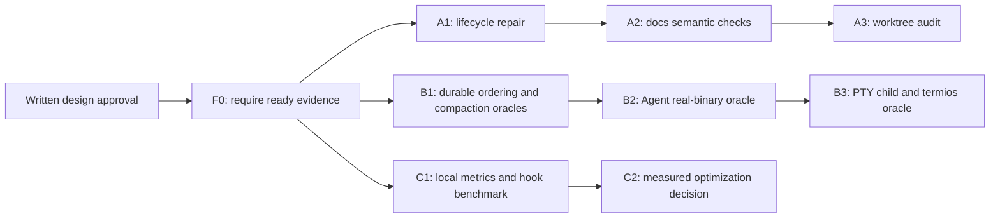

# Iteration Quality S5 Completion Design

**Status:** active-plan
**Accepted:** 2026-08-10
**Review state:** approved for implementation
**Last verified:** 2026-08-10
**Source snapshot:** `origin/master` at
`6500a09be6ec641c31348a4322a085eeaa029241`

> **Ownership:** accepted contract for closing the remaining local iteration-
> quality gaps after S1-S4 without claiming remote CI, product-module
> deepening, or complete defect prevention

## Reader outcome

A maintainer reading this design can decide which S5 slice is safe to execute,
which observable result proves it, and which requested improvement remains
conditional. Update this design when the plan lifecycle schema, worktree audit
contract, E2E entrypoints, or iteration evidence schema changes.

## Decision

S5 will first add one fail-closed evidence assertion, then close four concrete
local gaps through three independently reviewable programs:

1. make plan lifecycle and skill routing machine-checkable, then add a report-
   only worktree audit;
2. add four missing durability, ordering, child-process, and terminal oracles
   at their lowest stable seams; and
3. report local gate latency from existing evidence and benchmark hook startup
   explicitly, outside the normal hook path.

This is a `project-native` governance and test decision. It does not change the
product roadmap, promote a migration slice, add a hosted quality service, or
promise that all defects are preventable.

## What remains after S1-S4

S1-S4 already provide the diff-bound quality policy, focused and merge
evidence, optional Codex hooks, a shared iteration skill, boundary checks, deep
diagnostics, and a hermetic real-binary pack. Current source remains the owner
of those capabilities: [`scripts/iteration/main.go`](../../../scripts/iteration/main.go),
[`quality/iteration.yaml`](../../../quality/iteration.yaml),
[`scripts/e2e/harness_test.go`](../../../scripts/e2e/harness_test.go), and
[`iteration-workflow`](../../../.agents/skills/iteration-workflow/SKILL.md).

The residual gaps are narrower:

| Verified current fact | Residual gap | Consequence |
|---|---|---|
| The [plan index](../plans/README.md) marks S1-S4 executed. | Their headers still say active, Ready, or dependency-queued and reference retired `superpowers:*` skills. | Humans and agents can restart completed work or follow a missing owner. |
| Git can enumerate every registered worktree. | The repository has no read-only classification command; old cleanup code can force-remove worktrees. | Cleanup remains manual and easy to over-authorize. |
| Unit and component tests cover child delivery, queued input, compaction, process groups, and terminal cleanup separately. | No independent oracle joins the durable or real-process boundaries listed below. | A refactor can preserve helpers while regressing the supported entrypoint. |
| Gate evidence already stores target status and duration. | There is no bounded aggregate report or full hook-startup comparison. | Performance changes are discussed without a repeatable baseline. |
| Required CI is best effort under the accepted infrastructure constraint. | Billing, branch protection, and external scanner availability are not locally controllable facts. | They must remain visible conditions, not false green gates. |

The [documentation policy](../../contributing/documentation-policy.md) remains
the lifecycle owner, the [testing strategy](../../contributing/testing-strategy.md)
remains the test-layer owner, and the migration queue remains the only product-
order SSOT.

## Program topology

The three programs may progress independently after this design is approved
and the evidence assertion is merged. Within each program, arrows are hard
dependencies, not a second product queue.



[`S5A`](../plans/2026-08-09-iteration-quality-s5a-context-workspace.md),
[`S5B`](../plans/2026-08-09-iteration-quality-s5b-regression-oracles.md), and
[`S5C`](../plans/2026-08-09-iteration-quality-s5c-measurement-readiness.md)
own the exact TDD steps and PR boundaries.

## S5A: plan truth and workspace hygiene

### Fail-closed completion assertion

Add `make change-evidence-ready` as the public wrapper for
`iteration --base <base> --head HEAD evidence --require-ready`. Keep
`make change-evidence` as the read-only status renderer. Update AGENTS, the
shared iteration skill, and contributor verification so a closeout command
cannot succeed for `planned`, `changed`, stale, failed, or blocked evidence.
This foundation merges before S5A, S5B, or S5C implementation.

### Lifecycle contract

Every task-level plan listed in `docs/superpowers/plans/README.md` has one
machine-readable lifecycle:

- an index state beginning with `Executed` or `Historical` requires
  `**Status:** historical` in the linked plan;
- an index state beginning with `Draft`, `Ready`, `Queued`, or `Accepted`
  requires `**Status:** active-plan`;
- every focused plan file appears exactly once in the index; and
- a historical plan has no live `REQUIRED SUB-SKILL` instruction.

An active plan may name only a repository-local skill present at
`.agents/skills/<name>/SKILL.md`. The checker reads only the explicit top
instruction block; it does not infer runtime wiring or scan historical prose,
fenced examples, and shell commands for semantic meaning.

S1-S4 become historical execution records. The Iteration Quality Kernel design
remains active only for the separately intake-gated product-module deepening
acceptance. Its index entry must say that the governance implementation is
executed instead of claiming that all implementation plans are pending.

### Worktree audit interface

Create a standalone developer command under `scripts/worktree_audit`. It is
not part of `engine/worktree`, the flat tool registry, ACP, MCP, or the model-
visible interface.

```text
go run ./scripts/worktree_audit --base origin/master --format json
go run ./scripts/worktree_audit --base origin/master --format text
```

The command performs only read operations. It may invoke `git worktree list
--porcelain`, `git status --porcelain=v1 -z`, `git rev-parse`, `git
symbolic-ref`, `git for-each-ref`, `git rev-list`, and `git merge-base
--is-ancestor`. It must never fetch, prune, repair, remove, delete a branch,
checkout, rebase, reset, clean, or infer that another process has stopped using
a path.

The JSON interface is versioned and exposes facts separately from review
hints:

```json
{
  "schema_version": 1,
  "base": "<resolved commit>",
  "worktrees": [
    {
      "path": "<absolute path>",
      "head": "<commit>",
      "branch": "<ref or empty>",
      "detached": false,
      "locked": false,
      "prunable": false,
      "status": "clean",
      "untracked_count": 0,
      "upstream_state": "gone",
      "ahead": 0,
      "behind": 0,
      "base_reachable": true,
      "review_hints": ["review_clean_base_reachable"],
      "diagnostics": []
    }
  ]
}
```

`review_hints` are not deletion authorization. Dirty, locked, unreadable,
diverged, or prunable registrations receive explicit preserve/inspect hints.
Even `review_clean_base_reachable` still requires the user to confirm that the
worktree is no longer occupied and to name the exact removal target. S5 adds no
`--apply` or cleanup mode.

## S5B: missing independent regression oracles

Each new test observes durable or user-visible state, not only a helper call,
runtime log, internal flag, or mock result.

| Scenario | Lowest stable seam | Required independent oracle | Risk pack |
|---|---|---|---|
| Queued follow-up ordering | `QueryEngine` durable queue and transcript | Prior terminal assistant result persists before one follow-up; the next model input consumes that follow-up once. | `test-contract` |
| Compaction across restart | transcript reload into a fresh engine | Summary and newest tail survive; pre-compaction sentinel text is not re-injected directly. | `test-contract` |
| Agent completion across restart | real binary, scripted provider, parent transcript | One foreground child dispatch, one parent-visible tool result, and one `AgentCompletionReceipt` are durable. Each resumed input may retain exactly one historical result; no-redelivery means no additional durable receipt/message, duplicate item in one input, or child redispatch. | `test-e2e` |
| Terminal shutdown with owned child | real binary in a Unix PTY | Child PID is alive before shutdown and absent afterward; PTY termios flags equal the entry snapshot. | `test-pty` and `test-e2e` |

The Agent scenario may extend the hermetic E2E script schema with strict v2
request lanes. The provider derives the lane only from an exact, non-ambiguous
tool-set match: parent requests expose `Agent`, `Bash`, `Glob`, `Grep`, and
`Read`, while an `Explore` child exposes the same set minus `Agent`. Each
lane has its own ordered steps. Test-owned barriers control cross-lane
concurrency without inspecting prompts.

Resumed parent requests return to the parent lane and may contain one historical
completion result per call ID. The provider rejects duplicate call IDs within a
single request. Existing v1 fixtures retain their global tool-set contract. The
journal stores only the sanitized lane, request index, model, tool names, and
expected prior call IDs. This is test
harness capability, not a new production tool or public runtime seam.

The PTY scenario must traverse the real `ShellManager` and process group; it
must not expose `killProcessGroup` or another test-only production API.

If a new oracle passes against unchanged production code, it is a coverage
addition and no repair is invented. If it fails, the implementation follows
[`defect-investigation`](../../../.agents/skills/defect-investigation/SKILL.md):
preserve the first failure, localize one owner, make the smallest repair, and
keep the failing test as the regression.

## S5C: measure before optimizing hooks and tests

### Gate metrics

Add `scripts/iteration metrics` and `make iteration-metrics`. The command reads
at most the newest 256 local `build/iteration/*/evidence.json` files and emits
only aggregate target-level facts:

- target and verification level;
- outcome counts;
- count of executed duration samples; and
- nearest-rank p50 and p95 milliseconds when at least five samples exist.

Blocked and not-applicable entries do not contribute a duration. The report
contains no branch, path, base/head/diff identity, session ID, prompt, source,
transcript, argv, environment, log path, or command output. It is advisory,
read-only, and cannot change `evidence_ready`.

Every scanned artifact must pass the same stored-plan identity and expected-
target validation used by the evidence store. A gate target must be both a safe
target atom and an expected target for that exact plan/level. Invalid files are
rejected with a bounded diagnostic that never echoes the target or artifact
content; generic JSON decoding alone is not an admission check.

### Hook benchmark

Add an opt-in `scripts/iteration hook-benchmark` command and
`make iteration-hook-benchmark`. It creates and removes a temporary committed
fixture and sends only synthetic allowlisted hook fields. Both measured modes
start the same shell adapter, execute the same `git rev-parse`, and differ only
in the final iteration-process command: current `go run` versus a once-built
local binary. A test-owned candidate wrapper makes that single substitution;
the production wrapper gains no benchmark switch.

The command prints sample count and p50/p95 for each mode and stores no raw
event or timing file. It never runs from `.codex/hooks.json` or CI.

S5 does not select a permanent prebuilt-binary cache. A later change may do so
only from measured evidence and must define freshness, failure fallback, and
cross-platform installation. Without that evidence, changing hook execution
would trade visible startup cost for stale-binary risk.

### Security boundary

S5 preserves current local checks: boundary enforcement, diff whitespace,
ordinary Go vetting through test execution, and the focused hook privacy,
permission, symlink, and concurrency regressions. It does not label these as a
vulnerability scan.

`govulncheck`, `gosec`, `gitleaks`, CodeQL, dependency review, SBOM, license,
container, and hosted secret scanning remain deferred until their binary,
database, network, billing, and policy owners are admitted. Missing tooling is
`blocked` or not run, never `pass`. Remote branch protection and CI availability
must be reported separately from local evidence.

## Failure and rollback boundaries

- A docs lifecycle parse error fails `docs-check-ci`; it does not rewrite a
  plan or infer execution state.
- A worktree audit read or parse failure returns non-zero and performs no
  mutation. A review hint never grants cleanup authority.
- A regression oracle that cannot reach its real seam remains blocked; it is
  not replaced with a weaker log assertion.
- A metrics or benchmark failure cannot fail a runtime hook, change gate
  evidence, or persist sensitive data.
- Each implementation PR can be reverted independently. Reverting a test pack
  addition does not require reverting unrelated governance or metrics work.

## Non-goals

- Automatically deleting worktrees or branches.
- Replacing the migration queue or generating a complete product-module DAG.
- Treating the intake-gated S4 product-module acceptance as complete.
- Running live providers, Computer Use, or physical-terminal checks as local
  merge proof.
- Adding a new assertion, BDD, snapshot, mocking, or property framework.
- Paying for, weakening, or falsifying remote CI and security evidence.
- Optimizing hooks before an explicit local comparison exists.

## Acceptance

S5 is complete only when every admitted plan is historical, its exact tests and
Make targets pass on the committed diff, `make change-evidence-ready` succeeds
for current `HEAD`, and remaining remote/provider/physical conditions are named
separately. Ordinary `make change-evidence` remains diagnostic and cannot close
an iteration. Written approval of this design admits the plans; it does not
itself claim any implementation result.
