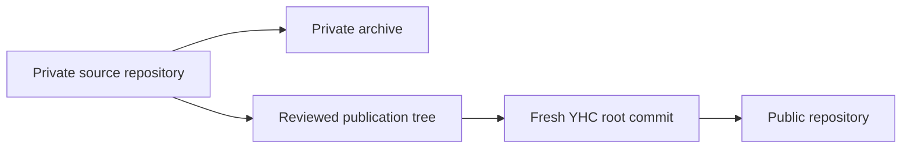

# YHC Public Release And Identity Migration Design

**Status:** active-plan
**Review:** approved 2026-08-09
**Accepted direction:** 2026-08-09
**Source snapshot:** approved private-source baseline (recorded in private
publication evidence)
**Adoption:** `project-native`, with `preserve` for observable runtime behavior
and source-mapping evidence

> **Ownership:** approved publication boundary, repository topology, identity
> contract, compatibility rules, and promotion gates for releasing the current
> private Eino-Agent project as the public YHC project; current runtime behavior
> remains owned by [`docs/architecture/`](../../architecture/README.md), and
> task-level execution will be owned by the implementation plan written after
> this design is reviewed

## Decision

Release the project as **YHC — Yet Hooked on Coding** in a new public
`<public-repository>`. The existing repository is renamed to
`<private-archive>` and remains private as the complete historical archive.

The public repository starts from a reviewed fresh root commit. It does not
inherit the old commit graph, pull requests, Actions logs, artifacts, deleted
files, or private reference snapshots. The release keeps source-mapping metadata
that supports study and maintenance, but a mapping never licenses the mapped
source or permits proprietary text to be published.

The public release is an identity and distribution migration, not a runtime
redesign. Tool ordering, permissions, cancellation, persistence, recovery,
provider behavior, and supported CLI, TUI, ACP, and MCP workflows must retain
their current observable contracts except for the explicitly listed identity
and compatibility changes.

## Reader Task And Freshness

A maintainer reading this specification must be able to decide:

- which repository and files may become public;
- which old and new names are canonical at each boundary;
- how existing local state, environment variables, and protocol clients remain
  usable;
- which evidence blocks publication; and
- when the public repository may become the canonical development home.

Update this specification before implementation continues if the repository
owner, target name, license choice, state schema, protocol namespace, source
provenance rule, GitHub visibility model, or promotion gates change. Refresh all
dated security and remote-state observations immediately before publication.

## Problem And Success Conditions

The private repository's hosted CI currently cannot start required jobs because
of an account billing or spending-limit condition. That makes a correct pull
request appear unmergeable even when local gates pass. Moving an eligible
open-source repository to public GitHub-hosted runners removes this specific
private-repository billing dependency, but it also makes every pushed object and
workflow log available to untrusted readers.

The migration succeeds only when all of these conditions hold:

1. `<public-repository>` is public, uses `master` as its default branch, and identifies
   the product as `YHC — Yet Hooked on Coding`.
2. Its public Git graph begins at a reviewed clean root and contains no object
   copied from the private history merely for continuity.
3. `<private-archive>` remains private and retains the old history,
   review records, Actions logs, and artifacts.
4. The public tree contains only cleared project-owned or license-compatible
   third-party material, with Apache-2.0 and NOTICE coverage that does not make
   false ownership claims.
5. Source mappings, the migration manifest, and cleared reference research stay
   usable without publishing `.reference` snapshots or reconstructable
   proprietary content.
6. The full local gates, security gates, provenance gates, and public `Required
   gates` workflow pass on the exact promoted commit.
7. Existing users can recover their sessions and configuration through the
   compatibility rules below; no migration deletes or mutates legacy state.
8. Active private worktrees continue their current iterations until each change
   is either completed in the archive or deliberately forward-ported through
   the public-content gate.

## Verified Starting Gaps

The 2026-08-09 audit of the source snapshot established the following blockers.
They are evidence for this design, not claims that remain current indefinitely.

- The remote is private; the module path, command,
  build outputs, local state, environment variables, and protocol identifiers
  still use the old identity.
- The root does not yet contain `LICENSE`, `NOTICE`, `SECURITY.md`,
  `CONTRIBUTING.md`, or `CODE_OF_CONDUCT.md`.
- The ignored `.reference/` boundary may resolve to local source snapshots that
  are not licensed for redistribution. Git ignore rules alone do not clear
  tracked code, prompts, fixtures, tests, or reports that were derived from
  those snapshots.
- A tracked test contains a machine-specific macOS home path. The publication
  scan must remove it and prove that no comparable personal path remains.
- The source tree contains substantial source-mapping metadata. That metadata
  is intentionally retained, while the mapped implementation still requires a
  file-by-file provenance decision.
- The dependency snapshot has reachable findings reported by `govulncheck` for
  gRPC, AWS eventstream, Goldmark, and `golang.org/x/net`. The implementation
  plan must refresh the scan and update to non-vulnerable compatible versions;
  an unresolved reachable finding blocks publication.

The old repository also contains private review and Actions state that cannot
be made safe by editing only the current checkout. This is why changing the
existing repository's visibility is rejected.

## Frozen Invariants

### Runtime behavior stays project-owned

The migration may change names, packaging, compatibility adapters, repository
metadata, dependencies, and noncompliant expression. It must not change the
accepted outcomes or ordering for:

- model and tool traversal;
- permission decisions and sandbox boundaries;
- cancellation and terminal event delivery;
- transcript, session, task, and WorkBoard durability;
- replay, resume, compaction, retry, and recovery;
- provider selection and fallback; or
- supported TUI, plain CLI, ACP, and MCP workflows.

When a provenance review requires a clean-room rewrite, focused characterization
tests freeze the observable contract before the old expression is replaced.
The replacement may preserve behavior; it may not use compatibility as a reason
to retain unlicensed expression.

### Publication is append-only from an exposure perspective

Making a repository private again does not retract clones, forks, caches, or
screenshots. The visibility flip is therefore the publication point, not a
reversible test. Every content gate must pass before it occurs.

### Source mapping is evidence, not authority

Mappings may record a reference project, repository-relative path, symbol, line
range, snapshot, and adoption decision. They must not embed source bodies,
secrets, machine-specific absolute paths, access instructions, or a claim that
the mapping grants redistribution rights.

Existing mapping comments and [`manifest.yaml`](../../migration/manifest.yaml)
remain when their implementations are cleared. A mapping is updated or removed
only when the corresponding behavior is deliberately replaced or the mapping
itself is inaccurate.

## Identity Contract

| Boundary | Public canonical identity | Compatibility consequence |
|---|---|---|
| Product | `YHC — Yet Hooked on Coding` | Historical documents may retain Eino-Agent when describing past facts. |
| Public repository | `<public-repository>` | It has a fresh history and becomes canonical only after promotion. |
| Private archive | `<private-archive>` | It remains private and is never configured as a public fork or mirror. |
| Go module | `<public-module-path>` | This is an intentional import-path break; no `replace` or vanity alias hides it. |
| Command and release artifact | `yhc` | The public distribution does not ship an `eino-agent` command shim. |
| Project-owned state | `<project>/.yhc` | Artifact owners may import from `<project>/.eino-agent`; legacy state is never deleted or modified. |
| User-owned state | `~/.yhc` | Artifact owners may import allowlisted data from `~/.eino-agent`; there is no recursive root copy. |
| Environment variables | `YHC_*` | Matching `EINO_AGENT_*` names remain accepted aliases until a separate removal design is approved. |
| ACP product name | `yhc` | Goal negotiation selects one canonical or legacy namespace per connection. |
| Goal capability and methods | `yhc.goal` and `_yhc/goal/*` | A legacy-only ACP peer may negotiate `eino-agent.goal` and `_eino/goal/*`. |
| MCP implementation name | `yhc` | This declaration changes; MCP has no matching inbound server-name alias mechanism. |

Repository-relative historical citations and source mappings are not blindly
renamed. A historical old name stays when changing it would falsify the cited
snapshot; current links, package imports, commands, examples, and public-facing
copy use YHC.

## Compatibility Rules

### State owners migrate their own artifacts

`<project>/.yhc` and `~/.yhc` are the canonical default write roots for the
public binary. A generic startup routine must not recursively copy an old root:
the old directories mix schemas, internal path references, live worktrees, and
credential-adjacent compatibility data. Each persistence owner instead declares
and tests its own import rule.

| Current root or data | YHC rule | Failure and rollback boundary |
|---|---|---|
| `<project>/.eino-agent` transcripts, WorkBoard, approvals, scheduled tasks, project memory, non-secret settings, and history | Import only owner-recognized schemas into `<project>/.yhc`; rebase internal paths in staging and write new mutations only after validation | Reject unsafe or unknown artifacts; leave the complete legacy root unchanged |
| `~/.eino-agent` non-secret settings, keybindings, session catalog, memory, and permission-review audit | Import an explicit allowlist into `~/.yhc`; catalog entries move only after their target transcript store validates | No recursive copy, no merge into a non-empty target, and no legacy deletion |
| `<project>/.eino-agent/worktrees/v1` and live owned worktrees | Inspect legacy records read-only; create new worktrees under `.yhc`; adopt or retire a legacy record only through an explicit quiesced operation | Never move a live checkout or infer quiescence; active private work continues with the archived binary |
| Paths selected by `*_CONFIG_DIR`, `*_SESSION_CATALOG`, memory, audit, or comparable explicit overrides | Keep the exact user path after canonical/legacy environment-name resolution | No automatic rename or copy of user-selected storage |
| Project or user `.claude` settings, hooks, commands, agents, skills, and history | Preserve the current compatibility path and its existing read/write mode | Do not copy it into `.yhc` or claim it is YHC-owned data |
| Credential-bearing legacy settings, including provider API keys | Resolve them through a value-redacted read-only fallback; write a YHC-owned credential only after explicit user configuration | Never auto-copy or log a credential merely because its settings file is otherwise eligible |
| `~/.claude/mcp_oauth_tokens.json` | Preserve the existing credential-store path and restrictive file mode | Never duplicate tokens during identity migration; credential-store redesign is separate work |
| `.mcp.json` and other explicit integration configuration | Preserve the configured path and compatibility semantics | Never import local credentials into a default YHC root |

Every allowed import follows the same safety envelope:

1. Discover only the named legacy artifact for that owner; do not traverse an
   unclassified root looking for data to copy.
2. Refuse automatic import unless the legacy producer is quiescent. When
   quiescence cannot be established, expose only the owner's supported read-only
   compatibility view and require an explicit retry.
3. Pin and validate source and destination directories, reject symlinks,
   non-directories, path replacement, unsafe permissions, unsupported schema
   versions, and destination collisions, and serialize concurrent importers.
4. Materialize into a sibling staging location, rebase owner-defined internal
   references, validate the complete artifact set, and atomically promote it.
5. If the canonical destination already contains state, never auto-merge it
   with the legacy artifact. The canonical state wins and a value-free
   diagnostic may explain explicit recovery.
6. A failure leaves the canonical artifact absent or at its previous valid
   version and leaves the legacy artifact untouched. Success also leaves the
   legacy artifact untouched, so the archived binary remains a rollback path.

For sessions, a legacy catalog entry can remain discoverable read-only, but a
resume that will persist new events must first import the transcript, WorkBoard,
and catalog entry as one owner-coordinated operation. For credentials, the
preserved external store is used in place and is never part of that operation.

### New environment names have deterministic precedence

For each renamed setting, the resolver checks the canonical `YHC_*` name first,
then the matching legacy `EINO_AGENT_*` alias, then the existing configuration
and default path. Parsing, validation, and behavior are identical after a value
is selected. If both names are present, the canonical value wins and diagnostics
must not print either value.

Test-only helper variables may be renamed mechanically without a runtime alias
when they are not part of a supported external contract.

### ACP selects one goal namespace per connection

ACP advertises the YHC implementation identity and stores one negotiated Goal
namespace for the lifetime of a connection. The selected request methods and
outbound notification always match the capability key returned at initialize:

| Client Goal offer | Initialize result | Methods and notification |
|---|---|---|
| Canonical `yhc.goal` only, valid version | Return `yhc.goal` | Accept `_yhc/goal/{get,control,continue}`; send `_yhc/goal/updated` |
| Legacy `eino-agent.goal` only, valid version | Return `eino-agent.goal` | Accept `_eino/goal/{get,control,continue}`; send `_eino/goal/updated` |
| Both keys, same valid version | Select and return canonical `yhc.goal` | Use only the canonical methods and notification |
| Both keys with different or malformed offers | Fail initialize with a negotiation error | Register no Goal methods and send no Goal notification |
| Neither key | Return no Goal capability | Goal methods return method-not-found and no Goal notification is sent |

Both namespaces dispatch to one handler and therefore share authorization,
revision fencing, persistence, response schemas, and error semantics. Requests
from the unselected namespace return method-not-found; there is no cross-namespace
fallback or duplicate legacy execution loop. Removing the legacy offer requires
its own approved compatibility change.

### MCP changes declaration, not negotiation

The standalone MCP server and the in-process MCP client change their
`Implementation.Name` declaration to `yhc`. MCP does not use that peer-reported
name as an inbound method namespace, so this design does not invent a legacy
server-name alias. Existing MCP launch configuration remains usable through the
command, environment, `.mcp.json`, and `.claude` compatibility boundaries; tool
names, transport, authorization, and lifecycle semantics do not change.

## Current Source Owners

These snapshot anchors explain why the compatibility matrix is broader than a
single directory rename. They identify current owners; the implementation plan
must update them without turning this design into the owner of runtime behavior.

| Boundary | Current source owner | Why it matters |
|---|---|---|
| Project/user settings | [`resolveConfigDir`](../../../tools/config.go) | Selects project or user `.eino-agent` settings today. |
| User memory root | [`memdir.GetConfigHomeDir`](../../../engine/memdir/paths.go) | Defaults persistent memory to the user-level old identity. |
| Session discovery | [`session.DefaultCatalogPath`](../../../engine/session/catalog.go) | Persists a user catalog that points at project transcript roots. |
| Permissions | [`permission.SetupPermissions`](../../../engine/permission/setup.go) | Combines `.claude` compatibility rules with project-owned approvals. |
| MCP credentials | [`mcp.DefaultTokenStorePath`](../../../engine/mcp/oauth.go) | Keeps OAuth tokens in a restricted external compatibility store. |
| TUI history | [`historyFilePath`](../../../internal/tui/history.go) | Uses both compatibility history and a project-local legacy file. |
| Owned worktrees | [`worktree.NewService`](../../../engine/worktree/service.go) | Binds durable records and managed checkouts to the old project root. |
| ACP negotiation | [`negotiateACPGoalCapability`](../../../server/acp/goal_extension.go) and [`Agent.Initialize`](../../../server/acp/agent.go) | Select the capability and advertise the corresponding agent contract. |
| MCP declaration | [`mcp.Serve`](../../../server/mcp/server.go) and [`MCPClient.Connect`](../../../engine/mcp/sdk_client.go) | Declare local implementation names without an inbound name namespace. |

## Repository Topology And Cutover

The old Git repository and the new public project remain separate object stores:

The arrow through the publication tree means selected file content is reviewed
and re-materialized; it does not mean commits, tags, refs, pull requests, or
artifacts are copied.

The cutover order is:

1. Freeze the exact private source commit and export remote settings, rules,
   releases, tags, Actions, issue, and pull-request inventories for audit only.
2. Rename the existing repository to `<private-archive>`, verify that it
   is still private, and update the shared old clone's `origin` to the archive
   URL. Existing worktrees continue using that archive.
3. Build and validate the publication tree in an isolated directory with no
   `.git` directory or ignored local content from the old clone.
4. Initialize a new local repository, create one fresh signed or attestable root
   commit using an approved public author identity, and push it to a new private
   `<public-repository>` staging repository.
5. Configure repository metadata, Actions policy, security features, merge
   policy, and the `master` ruleset. The initial root push is the only documented
   bootstrap exception to pull-request-only integration.
6. Re-fetch the exact remote root commit into a second clean directory and run
   the publication gates against what GitHub actually stores.
7. Change only `<public-repository>` to public. Immediately verify visibility for both
   repositories and trigger the public workflow on the exact root commit.
8. Mark YHC canonical only after public `Required gates` succeeds. All later
   changes use squash-merged short-lived pull requests.

Git remotes are shared by worktrees, so the existing multi-worktree clone is
never repointed to the new public repository. A separate YHC clone owns new
work. Each still-active private branch finishes in the archive or has a reviewed
patch forward-ported into a YHC branch after the publication sieve; old commits
are never merged into the fresh public graph.

## Public Content Boundary

Every candidate path receives one of these decisions before the root commit is
created:

| Class | Publication rule | Required evidence |
|---|---|---|
| Project-owned original | Include under Apache-2.0 | Authorship/provenance review and no private data |
| Reference-informed, independently expressed | Include with source mapping | Behavior-level mapping, compatible expression, and focused tests |
| License-compatible third party | Include with original notices | License text, attribution, modification notice, and compatibility result |
| Proprietary or reconstructable reference content | Exclude or clean-room rewrite | Independent behavioral contract and replacement review |
| Private operational or personal material | Exclude | Tree and secret/privacy scan |
| Unresolved | Block publication | Explicit resolution; absence of evidence is not clearance |

The publication tree includes only cleared production source, tests, scripts,
documentation, workflows, project skills, source mappings, migration evidence,
and third-party material required to build the product. It excludes:

- `.reference/` snapshots and symlink targets;
- the old `.git` directory, refs, reflogs, tags, stashes, and alternates;
- pull-request, issue, review, Actions-log, cache, and artifact exports;
- local `.env`, credentials, provider configuration, MCP configuration,
  transcripts, sessions, WorkBoard state, build outputs, and evaluation output;
- machine-specific absolute paths, private email addresses, hidden endpoints,
  and user-authored untracked files; and
- copied prompts, prose, fixtures, assets, or implementation whose publication
  right has not been established.

Cleared reference research may remain, but long excerpts are replaced by a
short paraphrase and a mapping. Tests and golden files receive the same review
as production code; calling content a fixture does not lower its provenance bar.

## Licensing And Public Governance

The clean root adds an Apache-2.0 `LICENSE` for cleared project-owned work and a
`NOTICE` that records required project and third-party attribution. Existing
third-party license files and source headers remain attached to their material.
The repository license does not overwrite a dependency's license or retroactively
license the private archive.

Before publication, the release also adds:

- `SECURITY.md` with a private vulnerability-reporting route and supported
  version policy;
- `CONTRIBUTING.md` with the YHC branch, test, provenance, and certification
  rules;
- `CODE_OF_CONDUCT.md` with an enforceable contact route;
- dependency update automation and a machine-readable SBOM; and
- README badges and links that point only to the public repository and public
  workflows.

Contributors must affirm that submitted work is theirs to license or is
properly identified third-party material. This design does not add a CLA; a CLA
would require a separate governance decision.

## Security, Dependency, And Provenance Gates

### Publication gates before visibility changes

All gates run on the exact fresh root commit and must produce reviewable output:

1. `make fmt`, `make lint`, `make test`, and `make build` pass after identity,
   dependency, and clean-room changes.
2. `make docs-check`, migration-manifest validation, and `git diff --check`
   pass.
3. `govulncheck ./...` reports no reachable known vulnerability. Any accepted
   exception requires a separate time-bounded security decision; this release
   has no implicit exception.
4. Direct and transitive dependency licenses are inventoried; unknown,
   incompatible, or missing required notice material blocks publication.
5. The provenance matrix has no unresolved path and independently reviews
   mapped prompts, fixtures, generated assets, vendored code, and research
   excerpts.
6. Secret scanning covers the materialized tree, the fresh Git object database,
   refs, reflogs, submodules, large files, workflow files, and generated release
   artifacts. A second scanner or provider-native scan checks the pushed staging
   commit.
7. Privacy scanning finds no machine-specific home path, private email, user
   transcript, provider identifier, internal endpoint, or unapproved author
   metadata.
8. A clean clone with empty user configuration builds and runs the supported
   smoke scenarios. State tests cover every row of the ownership matrix,
   concurrent and failed import, internal-path rebasing, no automatic credential
   copy, legacy-root immutability, and live-worktree refusal.
9. ACP tests cover canonical-only, legacy-only, matching dual, conflicting dual,
   and absent Goal offers through capability response, request dispatch, and
   notification. MCP tests constrain the implementation-name change without
   claiming a nonexistent inbound alias.
10. Environment precedence and characterization tests prove the identity work
    did not change supported runtime behavior.
11. The remote tree hash and local approved tree hash match. The archive is still
   private and the staging repository is still private at the final approval
   checkpoint.

Generated reports containing sensitive findings remain outside the public
repository. The public tree may contain a redacted pass/fail manifest and SBOM,
not scanner logs that reveal removed secrets or private paths.

### Public GitHub acceptance

After visibility changes, verify through the GitHub API and a logged-out view:

- `<public-repository>` is public and `<private-archive>` is private;
- `master` is the default branch;
- only squash merging is enabled and merged branches are deleted;
- force pushes and branch deletion are blocked;
- pull requests and the `CI / Required gates` status are required;
- conversation resolution is required, while human approval is not required
  until a second active maintainer exists;
- Actions has read-only default token permissions, untrusted fork workflows
  receive no secrets, mutable action tags are not used, and no
  `pull_request_target` path executes fork-controlled code; and
- the public `Required gates` check succeeds on the exact root commit.

The repository is not declared canonical merely because its visibility field
says `PUBLIC`.

## Failure Handling And Rollback

Before the visibility flip, any failed gate keeps both repositories private.
The staging repository is retained for diagnosis unless the user separately
authorizes deletion; the private archive remains the working source of truth.

After the visibility flip, a content leak is treated as an incident. Making the
repository private limits further access but does not retract prior exposure.
Credentials are revoked, affected providers are notified when required, and a
new clean repository is created if Git object removal cannot establish a safe
public graph. Force-pushing rewritten history is not considered sufficient
containment for already published secrets.

If the public CI or runtime acceptance fails without a content leak, YHC remains
non-canonical while fixes are made through a short-lived branch. The private
archive and untouched `.eino-agent` state provide the rollback path for ongoing
work; no reverse state migration is required.

## Non-Goals

- Publishing or rewriting the old repository history, issues, pull requests,
  reviews, Actions artifacts, releases, or tags.
- Deleting the private archive or legacy user state.
- Refactoring runtime architecture, changing product scope, or improving
  behavior unrelated to identity, clearance, dependency safety, or public
  governance.
- Treating source similarity, a mapping comment, or passing tests as proof of a
  redistribution license.
- Removing historical old-name references when they are required for accurate
  provenance or compatibility evidence.
- Guaranteeing that public CI has unlimited capacity or can never be affected
  by GitHub policy, abuse limits, outages, or future pricing changes.

## Planning Handoff

The implementation plan written from this specification must separate at least
these review boundaries: provenance inventory, identity and compatibility,
dependency/security remediation, public-governance files, clean-root assembly,
remote bootstrap, visibility promotion, and post-public acceptance. Each slice
names its rollback point and deterministic evidence. No slice may bypass an
unresolved publication blocker to make CI available sooner.
