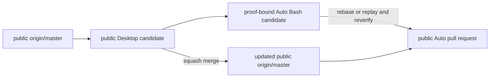

# Proof-Bound Auto Bash Public Forward-Port Design

**Status:** historical
**Accepted:** 2026-08-13
**Source review:** public YHC Desktop candidate at `a6c478c`, reviewed
2026-08-13
**Adoption:** `project-native`

> **Ownership:** the public-history-safe baseline, observable permission
> contract, engine authority, cross-entrypoint propagation, and promotion gates
> for forward-porting proof-bound Auto Bash into YHC

A maintainer reading this specification should be able to implement P51.2
without importing private Git history, confusing a display projection with
authorization, or giving one client a broader permission result than another.
Update this specification if Guest containment proof, permission settlement,
ProjectGraph durable identity, supported entrypoints, or the publication
boundary changes.

## Decision

Forward-port proof-bound Auto Bash as a YHC-native permission slice now, stacked
on the public Desktop candidate instead of waiting for that candidate to merge.
The implementation branch begins at public commit `a6c478c`; after the Desktop
pull request lands, the complete slice is rebased or replayed onto the resulting
public `origin/master` and every affected gate is rerun.

The forward-port carries behavior, tests, and independently written public
documentation. It does not cherry-pick, merge, or publish a private commit,
private branch, private repository URL, private implementation diary, or
private build evidence. The public Go module remains `github.com/abietic/yhc`
and the CLI remains `cmd/yhc`.

The existing P51.1 Darwin Guest binding is the only containment source. Auto
mode may skip the routine Bash permission request only when QueryEngine can
bind the exact canonical action to a complete, available Darwin Seatbelt proof
and revalidate the same action, root, proof, and binding immediately before
dispatch. A deliberately narrow literal `rm`/`rmdir` critical-path guard still
requires a fresh live `AllowOnce` decision.

This decision supersedes the earlier candidate plan where a broad destructive
risk classifier controlled the containment shortcut. Commands not recognized
by the narrow critical-path guard are not newly blocked or prompted by that
guard. Complete Guest proof admits them; incomplete or unavailable proof uses
the existing fail-closed or Auto fallback behavior described below.

## What counts as complete

The forward-port is complete only when all of these outcomes hold:

1. Ordinary canonical Bash in `ModeAuto` runs without a permission request only
   with the exact complete Guest proof defined by this specification.
2. Literal critical `rm`/`rmdir` targets require a live decision for that exact
   invocation, and only `AllowOnce` can authorize them.
3. Explicit deny and ask, Plan containment, tool selection, schema and custom
   validation, and required Guest availability retain authority ahead of the
   shortcut.
4. Stored rules, session grants, always grants, bypass, dont-ask, classifier or
   reviewer output, and request coalescing cannot satisfy a critical request.
   For this recognized critical subset only, Bypass still requires the live
   `AllowOnce`, while DontAsk denies because it cannot open that interaction.
5. ProjectGraph checkpoint and restart preserve the decision constraint and
   reject stale, mismatched, or forged decisions.
6. Plain, TUI, ACP, foreground and background Child Agents, AppServer, Desktop,
   and Web UI project the same allowed choices and receive the same engine
   settlement result.
7. A final action, root, proof, binding, or registry-generation mismatch returns
   `sandbox_binding_expired` before tool execution is acquired or submitted,
   without an ambient retry.
8. Guest Bash continues to inherit `os.Environ()` and `TMPDIR` unchanged. The
   feature does not claim credential isolation or hard memory, descriptor, or
   process-count enforcement.
9. The public migration, repository, real Darwin, Desktop, and publication
   gates pass on the same committed candidate tree.

## Scope and exclusions

### Included

- exact Guest execution identity and proof-bound action admission;
- narrow literal critical-path recognition for `rm` and `rmdir`;
- an engine-owned `AllowOnce`-only decision constraint;
- ordinary coordinator, ProjectGraph persistence, runtime replay, and Child
  Agent propagation;
- Plain, TUI, ACP, AppServer, Desktop, and Web UI presentation and settlement;
- pre-dispatch root, proof, binding, and registry-generation revalidation;
- public-native architecture, guide, migration, verification, history, and
  publication evidence; and
- deterministic and real Darwin regression coverage.

### Excluded

- cherry-picking or naming private implementation commits or build evidence;
- treating arbitrary destructive-command recognition as a sandbox boundary;
- prompting or denying commands merely because the narrow critical recognizer
  cannot understand their shell syntax;
- Linux or Windows containment enforcement;
- ambient fallback, one-shot permission-driven sandbox escalation, or sandbox
  disabling through a tool input, prompt response, project setting, hook, ACP,
  AppServer, or Web UI field;
- environment sanitization or rewriting `TMPDIR`;
- hard memory, file-descriptor, or process-count enforcement;
- reviewer enforcement, classifier redesign, or a measured security-recall
  claim; and
- changing non-critical Default, Plan, AcceptEdits, DontAsk, Bypass, or Bubble
  semantics beyond the pre-existing required Guest availability rule. The
  recognized critical Bash subset is the sole mode exception: Bypass cannot
  skip its live `AllowOnce`, and DontAsk denies it without prompting.

## The branch is stacked but the public history remains independent

The branch topology is intentionally temporary:

Until the Desktop pull request lands, the proof-bound branch is based on its
public tip and the Auto pull request must target that public Desktop branch if
opened. After Desktop lands, the Auto branch targets `master`. The move must
not copy the old publication manifest or reuse verification from the former
base; `PUBLICATION_MANIFEST.json`, diff-bound checks, and merge evidence are
regenerated on the new committed tree.

## Engine-owned authorization model

### Containment identity is local execution authority

`PermissionActionDescriptor` receives a detached execution identity only from
the QueryEngine-owned Guest binding and ShellManager. Tool input, model output,
hooks, permission adapters, and protocol clients cannot populate it. The
identity binds at least:

- canonical built-in `Bash` action and canonical input;
- tool-registry capability generation;
- Guest process class;
- policy and binding digests;
- adapter capability generation;
- Darwin Seatbelt adapter and `workspace-write` profile;
- `degraded` aggregate state and ambient-environment credential mode;
- adapter, runtime, and combined enforcement axes; and
- the canonical root identity.

The required combined axes are filesystem read, filesystem write, network
denial, root identity, descendant confinement, descendant cleanup, wall time,
and bounded output. Memory, file-descriptor, and process-count axes remain
absent by accepted design. Aggregate `degraded` is never reinterpreted as fully
enforced.

### Decision constraint is authority; grant scopes are presentation

Define a small engine-owned typed constraint whose zero value preserves
ordinary permission behavior and whose constrained value permits only
`AllowOnce`, denial, cancellation, or timeout. It belongs on the canonical
permission request, event, ProjectGraph interrupt, durable runtime decision,
and every identity or digest that binds those values.

`PermissionPresentation.GrantScopes` is derived from that constraint. It is not
an authorization source. For a constrained request, an available presentation
may truthfully contain only `AllowOnce`; unavailable or forged presentation
still degrades to the existing bounded fail-closed projection. Engine
settlement independently rejects `AllowSession` and `AllowAlways`, even if a
client forges a response or presents a stale UI.

The constraint also disables use and production of session or always grants
and permission-request coalescing. A critical invocation always owns one fresh
human round and cannot ride another request's decision.

## Decision order

QueryEngine uses one ordering across every entrypoint:

1. Construct and validate the registered canonical action and its current
   Guest execution identity.
2. Reject unselected or invalid Guest Bash before permission evaluation.
3. Apply Plan containment and explicit deny rules.
4. Recognize a literal critical Bash target. If matched, bypass rules, grants,
   Bypass mode, and other non-live authorities that could authorize execution,
   then request a constrained live `AllowOnce`; `DontAsk` denies because
   interaction is unavailable. This is the only P51.2 mode-semantics exception.
5. Apply the existing non-critical rule, mode, exact grant, read/search,
   memory, and contained Write/Edit decisions in their current order.
6. If the exact non-critical Bash action has complete Guest proof in
   `ModeAuto`, mark it as proof-bound and allow it without classifier or prompt.
7. Otherwise retain the current Auto capability gate, reviewer shadow,
   classifier, fallback-to-prompting, and denial behavior.
8. Rebuild the settled action after a PreToolUse rewrite and repeat the entire
   decision. No decision or proof survives changed canonical input.
9. Immediately before `AcquireExecution`, rebuild the action, recapture and
   revalidate the root, revalidate ShellManager's pinned execution identity,
   and compare every bound field. Any mismatch returns
   `sandbox_binding_expired` with zero tool execution.

This order means the critical guard is narrow by construction. Unsupported
shell syntax, interpolation, redirection, pipes, or unknown commands do not
match it and are not newly sandbox-blocked. They receive the same proof-bound
or existing Auto fallback treatment as other non-critical Bash.

## Narrow critical-path contract

The recognizer accepts only a small tokenizable subset of simple Bash commands
and separators. It recognizes literal `rm` or `rmdir`, optionally through the
literal `command` or `builtin` wrapper, and checks literal targets after option
processing. It matches:

- `/`;
- a direct child of `/`;
- a volume root or direct volume child under `/Volumes`;
- exact user home, `~`, or a literal path resolving to it; and
- `*` or a terminal literal directory `/*` all-entry target, including a
  relative parent that resolves from the canonical workspace root.

Quotes and ordinary escapes may preserve literal targets. Variable expansion,
command substitution, globs other than the accepted terminal `/*`, pipelines,
redirection, unsupported operators, and malformed quoting make the recognizer
return unknown, which is a non-match rather than a deny. The recognizer is a
permission-interaction guard, not a general destructive classifier or an
execution policy.

## Persistence and entrypoint projection

Engine/runtime state remains the source of truth. The TUI and other clients
only project it.

| Boundary | Required behavior |
|---|---|
| Ordinary coordinator | Clone and validate the constraint; disable grant coalescing; enforce it again at settlement. |
| ProjectGraph | Persist it in the interrupt and runtime decision; bind it into invocation and decision digests; retain it through cold restart and replay. |
| Plain/headless/Goal | Reconstruct all request identity fields and display/accept only decisions permitted by the constraint. |
| TUI | Carry it through thread-attention state and the active permission dialog; unavailable accelerators and options cannot return a persistent decision. |
| ACP | Advertise only `AllowOnce` plus rejection for a constrained request and reject an impossible client outcome. |
| AppServer | Include it in broker cloning, callback/event conflict digest, public projection, and exact settlement validation. |
| Desktop/Web UI | Render buttons from validated server scopes; accept an available single-scope presentation; never infer authority from tool text. |
| Child Agent | Derive its own equal-or-narrower Guest proof and generate the same constraint in the child QueryEngine; parent adapters cannot broaden it. |

For AppServer, `permissionRequestDigest` must distinguish constrained from
unconstrained requests with the same outward tool identity. Conflicting
callback and event projections fail closed rather than coalescing. The Web UI
can remain data-driven, but its validator must recognize both the ordinary
three-scope presentation and the constrained available one-scope presentation.

## Failure semantics and rollback

| Condition | Observable result | Forbidden result |
|---|---|---|
| Guest binding unavailable | No proof-bound shortcut; existing Auto fallback may ask or deny, and any eventual launch fails with the existing typed sandbox-unavailable result | Proof-bound admission, process start, or ambient execution retry |
| Critical request with session/always response | Deny with a bounded constraint error | Persistent grant or execution |
| Stale or forged durable decision | Reject without settlement | Resume or request coalescing |
| Proof, root, binding, action, or registry drift | `sandbox_binding_expired` before acquisition/submission | Shell write, process start, or ambient retry |
| Incomplete proof on non-critical Auto Bash | Existing Auto classifier/prompt/fail-closed path | Treat aggregate `degraded` as sufficient |
| Sandbox denies an operation after start | Normal sandboxed command failure | Automatic authority expansion |

Rollback removes the proof-bound Auto shortcut and the critical decision
constraint as one permission slice while retaining P51.1 Darwin Seatbelt
containment. Public persisted data remains readable because the new constraint
uses a bounded typed value and the zero value preserves old requests; rollback
must still refuse any unresolved constrained decision it cannot validate.

## Verification and promotion

Implementation is test-first. Focused tests must cover:

- exact complete and incomplete proof matrices;
- the literal critical corpus and unknown-syntax non-match corpus;
- rules, grants, bypass, dont-ask, classifier, reviewer, and coalescing
  attempts against a critical request;
- PreToolUse rewrites from routine to critical and routine to routine;
- ProjectGraph live interrupt, checkpoint restart, replay, and forged durable
  session/always decisions;
- Plain, TUI, ACP, AppServer, Desktop/Web UI, foreground Child, and background
  Child projections;
- AppServer digest conflict and forged protocol responses;
- critical `ModeBypass` requiring live `AllowOnce` and critical `ModeDontAsk`
  denying without a prompt;
- proof, root, binding, action, and registry-generation drift returning the
  exact `sandbox_binding_expired` result at a controllable pre-acquire barrier,
  with zero `AcquireExecution` calls; and
- the same drift classes at a controllable ShellManager submission barrier,
  with zero persistent-shell stdin writes and zero new process starts; and
- unchanged environment and `TMPDIR` propagation.

Only real Darwin Seatbelt execution may prove containment. At least one
interactive and one non-interactive supported entrypoint must demonstrate that
ordinary Bash writes inside the workspace without a permission request while
parent-root escape is denied. Prompt-reduction counts are deterministic fixture
evidence, not reviewer accuracy or universal safety evidence.

The public delivery path has two checkpoints on this stacked branch:

1. **Design and admission:** publish this specification, promote P51.2 as the
   sole `Ready` migration slice through a migration-native contract, render the
   queue, and refresh the publication manifest. This checkpoint changes no
   runtime behavior.
2. **Implementation and closeout:** implement the coherent permission slice,
   update current architecture and operator facts, add public verification and
   history records, remove the completed queue row, and refresh the publication
   manifest again.

Each checkpoint follows the repository workflow selected by `make change-plan`,
including `make verify-focused`, a scoped commit, committed-tree
`make verify-merge`, and `make change-evidence-ready`. The implementation
checkpoint additionally requires focused race tests, real Darwin tests,
relevant PTY and Desktop checks, full build/lint/test checks, and
`make verify-publication`. Remote CI, unsigned Desktop package smoke, and
physical UI acceptance are reported separately.

## Public source owners

| Boundary | Current source owner | Forward-port consequence |
|---|---|---|
| Permission ordering and final dispatch | `QueryEngine.evaluateInvocationPolicy`, `promptForTool`, and `toolExecutor` in `engine/engine.go` | Add critical live prompt, proof-bound admission, and final identity revalidation without moving policy into clients. |
| Canonical action identity | `PermissionActionDescriptor` in `engine/permission_action.go` | Bind detached Guest execution identity and admission reason. |
| Interaction settlement | `PermissionPromptRequest` and `PermissionCoordinator` in `engine/permission_interaction.go` | Own the typed constraint and reject persistent decisions/coalescing. |
| Durable interruption | `projectGraphHITLRequest` in `engine/graph_hitl.go` and runtime permission items | Persist and digest the constraint across restart. |
| Guest proof | `Binding` in `engine/containment/binding.go` and `ShellManager` in `tools/bash_shell.go` | Expose and revalidate an exact value identity without leaking roots or environment values. |
| Desktop permission bridge | `permissionBroker` in `server/appserver/permission_broker.go` | Digest, project, and validate the authoritative constraint. |
| Browser projection | `internal/webui/assets/view_models.mjs` and `app.mjs` | Accept and render the constrained available scope set. |
| Public release identity | `quality/publication.yaml` and `PUBLICATION_MANIFEST.json` | Keep every new path classified and regenerate the final public tree identity. |
