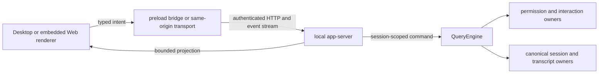

# YHC Desktop Workbench Forward-Port Design

**Status:** active-plan
**Accepted:** 2026-08-13
**Source review:** approved private-archive Desktop tip and public YHC
`origin/master`, both reviewed 2026-08-13
**Adoption:** `adapt` and `project-native`

> **Ownership:** the public-history boundary, YHC identity and state adaptation,
> Desktop runtime contract, dependency clearance, and promotion gates for
> forward-porting the approved Desktop workbench into public YHC

A maintainer reading this specification should be able to forward-port the
Desktop workbench without publishing private Git history, creating a second
Agent runtime, or allowing the Desktop process to write legacy state. Update
this specification if the public identity, session-admission owner, app-server
trust boundary, Node dependency policy, or release-artifact scope changes.

## Decision

Forward-port the approved Desktop workbench as a YHC-native product surface.
Start from the current public `master`, move only reviewed source expression,
tests, and license evidence, and create new public commits with the public
repository's author and verification policy.

The workbench keeps the useful three-surface layout demonstrated by
[T3 Code at `e4abc31`](https://github.com/pingdotgg/t3code/tree/e4abc31):
project and session navigation, a central conversation and composer, and an
Activity/Changes inspector. This is a user-experience reference, not an
architecture dependency. YHC retains its own `QueryEngine`, transcript,
permission, provider, session, and worktree owners.

The private Desktop branch must not be merged, rebased, cherry-picked, or
pushed to the public remote. Its reachable history and author metadata are
outside the public release boundary. Implementation uses an owner-aware final
tree comparison and reviews every transferred path against the current public
tree.

## What counts as complete

The forward-port is complete only when all of these outcomes hold:

1. The native application and embedded Web surface identify themselves as
   YHC and launch the `yhc` backend from `cmd/yhc`.
2. A user can configure an allowlisted provider, create a session, send and
   cancel turns, reconnect, and continue an existing canonical session.
3. Selecting a saved session reconstructs durable chat history without
   creating a `QueryEngine`, opening an event stream, acquiring a lease, or
   invoking a provider. The first explicit user request owns activation.
4. Assistant Markdown renders through a bounded DOM allowlist. User, tool,
   system, and reasoning text remains literal, and model text gains no HTML,
   navigation, storage, or Electron authority.
5. Ordinary permission, `AskUserQuestion`, Plan review, and repeated-tool
   intervention use distinct typed projections and exact-request,
   exactly-once settlement.
6. Activity contains a bounded operational summary rather than raw transport
   events, assistant prose, reasoning, answers, Plan feedback, or tool input.
7. New state is written only beneath canonical `.yhc` roots. Legacy
   `.eino-agent` sessions remain read-only until the existing explicit import
   admission succeeds.
8. Desktop, Go, publication, privacy, vulnerability, license, SBOM, and package
   smoke gates pass on the same committed tree.
9. The source and unsigned local package can be reviewed without claiming that
   signing, notarization, or public distribution is complete.

## Scope and exclusions

### Included

- the Electron host, preload bridge, package metadata, icons, and packaging
  scripts under `desktop/`;
- the embedded renderer and its tests under `internal/webui/`;
- the loopback app-server and protocol under `server/appserver/`;
- the `yhc serve app` command and the smallest shared runtime changes required
  for typed interactions, semantic Activity, durable history, and first-send
  activation;
- Desktop owners in the iteration policy, public CI, npm dependency updates,
  publication classification, provenance, and third-party notice evidence;
  and
- one current architecture document and one user guide after implementation
  proves the public composition.

### Excluded

- publishing or preserving the private branch's commit graph, author metadata,
  private branch names, build evidence, or historical implementation diary;
- `node_modules`, package output, staged backend binaries, `.app`, DMG, ZIP,
  blockmap, log, transcript, profile, or local state files;
- replacing `QueryEngine`, adding a provider-driver layer, or forking T3 Code;
- embedded terminal, file explorer, browser preview, remote relay, mobile app,
  or automatic permission semantics;
- generic JSON-Schema authorization UI or inferred interaction kinds;
- Developer ID provisioning, signing credentials, notarization, update feeds,
  or a GitHub Release; and
- automatic mutation, deletion, lease acquisition, or resume of legacy
  `.eino-agent` state.

## Public identity is canonical at every new boundary

New Desktop identifiers use the current identity owner rather than scattering
legacy literals.

| Boundary | Canonical value | Compatibility rule |
|---|---|---|
| Product and window title | `YHC` | No new Eino-Agent UI alias |
| Go module | `github.com/abietic/yhc` | No old module alias |
| Command and staged backend | `yhc` | No Desktop-only old binary lookup |
| Desktop package | `yhc-desktop` | New, unpublished identifier |
| Application ID | `com.abietic.yhc.desktop` | New, unpublished identifier |
| Backend override | `YHC_BIN` | No new `EINO_AGENT_BIN` alias |
| Preload bridge | `yhcDesktop` | Renderer-internal; no compatibility layer |
| Renderer storage prefix | `yhc.desktop.*` | Do not read old unpublished keys |
| Browser session and CSRF names | YHC-prefixed | Same-origin contract remains unchanged |
| Project and user state | `.yhc` | Legacy state follows existing read/import rules |

The implementation should use [`internal/identity`](../../../internal/identity/identity.go)
and [`internal/statepath`](../../../internal/statepath/paths.go) where the value
is a product or persistence contract. Test fixtures may use descriptive names
but must not imply that legacy state is writable.

The existing private icon contains the old product initial. It is not forwarded
as the public YHC icon. A project-owned YHC icon must be generated from a
documented vector source and verified in the packaged application.

## The app-server must be the only Desktop runtime authority

The implemented renderer must remain an unprivileged projection. It may own draft text, sheet and
tab visibility, scroll position, and a paging cursor. It cannot authorize a
tool, reconstruct durable truth, resolve a provider, or resume a runtime.

The app-server must bind to an ephemeral loopback address and reject any Host
authority other than the listener's exact normalized loopback host and port.
Loopback reachability is not authentication.

The Go child generates a fresh,
cryptographically random process capability at each start and emits it exactly
once in a size-bounded bootstrap line over the parent-owned stdout pipe. It
must not accept the capability through argv, an environment variable, a file,
or an HTTP bootstrap route.

The Electron main process parses and retains it in
memory, sends it as a bearer on backend requests, and never forwards it to the
renderer, preload return values, logs, diagnostics, or persistent storage.

The server compares bearer values in constant time. A missing or invalid
bearer is rejected before an API handler runs. Backend exit or restart aborts
streams, clears the main-process bootstrap, invalidates every browser session,
and creates a new capability; a capability from any prior child cannot access
the replacement server.

Browser access begins only when the trusted Electron main process uses its
bearer to request a short-lived, single-use pairing token. That token appears
only in a same-origin URL fragment, is exchanged from the exact listener
Origin, and becomes an HttpOnly, SameSite-Strict, path-scoped browser cookie
plus a separate CSRF token returned to the browser renderer.

Safe methods
require the valid cookie and reject cross-site fetch metadata or a mismatched
Origin. State-changing methods additionally require the exact Origin and the
matching YHC-prefixed CSRF header.

Pairing tokens, sessions, and CSRF tokens are
bounded, random, expiry-checked, and cleared at server shutdown.

Electron exposes only fixed preload operations and performs authenticated
HTTP and event-stream work in the main process. Navigation, new-window
creation, arbitrary IPC, Node integration, and renderer filesystem access must
remain denied. Negative tests cover a non-loopback listener, wrong Host,
cross-site or missing Origin where required, missing and stale bearer, expired
or replayed pairing, missing cookie or CSRF, untrusted IPC sender, and a bearer
from a stopped child.

Provider setup will be a Desktop-host capability, not a second provider runtime.
The main process may persist only validated provider metadata and an encrypted
key when platform secure storage is available. It passes a decrypted key only
to the backend child environment, never argv, renderer state, IPC responses,
local storage, or logs. The Go backend still owns provider construction.

## Saved history must not bypass YHC session admission

All canonical transcript paths are resolved by the existing session and state
owners. New code must not join a working directory with a hard-coded
`.eino-agent/transcripts` suffix.

The history-only path must perform bounded, read-only discovery from a trusted
catalog descriptor. It may parse and project a durable transcript without
starting a runtime. On the first explicit user request for a canonical row, the
server calls
[`session.AdmitDefaultSessionResume`](../../../engine/session/admission.go),
acquires the live lease from the admitted canonical transcript directory,
constructs [`QueryEngine`](../../../engine/engine.go), and submits the
normalized prompt.

If a row resolves only to legacy state, the Desktop may project its history
read-only and explain that import is required. Send remains unavailable. An
explicit **Import and continue** action, separate from Send, must present and
record the user's stopped-producer attestation. Only that action may extract
the value-only `LegacySessionImportTarget`, obtain the canonical user roots,
and call
[`session.ImportSessionForResume`](../../../engine/session/migration.go) with
`ConfirmLegacyStopped`.

After a successful or already-committed import, the
server calls `AdmitDefaultSessionResume` again; only that second canonical
admission enables Send. Import cancellation or failure creates no live engine
or lease, leaves the draft intact, and leaves legacy bytes and metadata
unchanged. A failure before a complete recoverable commit must not create a
visible canonical session.

The Desktop must never attach, lease, or write a legacy transcript. Ambiguous,
replaced, non-resumable, malformed, or stale descriptors fail closed without
altering either store. Tests assert that selecting, drafting, sending, retrying,
or racing a legacy row without the separate attestation does not create `.yhc`,
change legacy bytes or modification times, acquire a lease, construct
`QueryEngine`, open an event stream, or call a provider.

Canonical activation must be request-idempotent. Concurrent or retried first-send requests
for the same client turn coalesce or replay one receipt; conflicting payloads
are rejected. A failed activation releases its reservation and leaves the
draft and durable history available for a deliberate retry.

## Typed interactions expose only their own authority

The protocol assigns a stable interaction kind at its producing owner. The
renderer never guesses kind from tool text, and a generic permission fallback
cannot grant question, Plan-review, or repeated-tool authority.

| Kind | Required user control | Forbidden control |
|---|---|---|
| Permission | Allow or deny within the engine-projected scopes | Question answers or Plan actions |
| Question | Validated option selection or bounded custom answer | Allow-session or always-allow |
| Plan review | Approve, revise with bounded feedback, or deny | Generic permission persistence |
| Repeated tool | Continue or stop the exact guarded attempt | Cross-request or always-allow grant |

Every request carries immutable identity and presentation fields, a revision,
and an attempt when applicable. Settlement must match the selected session,
request, kind, source, revision, and pending interaction. Duplicate settlement
replays one terminal result; stale or cross-kind settlement is rejected.

Activity is a separate projection. It coalesces bounded operational milestones
such as turn lifecycle, tool lifecycle, terminal status, and attention state.
It excludes raw protocol names and all model/user content. Changes remains a
tracked-worktree diff projection and does not infer file truth from Activity.

## Assistant Markdown has a construction boundary

[Marked `18.0.9`](https://github.com/markedjs/marked/tree/v18.0.9) is vendored
only as an MIT-licensed tokenizer. YHC code maps an allowlist of lexer tokens
to DOM nodes using element construction and text assignment. It does not use
Marked's HTML compiler, `innerHTML`, `outerHTML`, `DOMParser`, contextual
fragments, or a sanitizer as an authority substitute.

Raw HTML and unknown token shapes render as literal text. Links are limited to
credential-free absolute HTTP(S) destinations and receive fixed external-link
attributes; invalid, relative, `file:`, `data:`, and `javascript:` destinations
remain text. Images never load. Streaming and restored assistant messages use
the same projection and resource bound.

Marked's retained license and notice are tracked beside the vendored assets and
in the root `NOTICE`. All other npm packages remain package-manager
dependencies; generated `node_modules` is not tracked.

## Public dependency and CI policy expands with the product

The current public dependency gates cover Go only. A shipped Electron runtime
cannot be excluded merely because npm records it under `devDependencies`.

The implementation adds:

- a pinned Node version and lockfile-driven `npm ci` in local and CI gates;
- Desktop unit, renderer, transport, Electron-security, and package smoke tests;
- full-tree `npm audit` at the accepted severity threshold;
- npm license inventory and CycloneDX SBOM coverage for the shipped dependency
  closure, with deterministic review evidence;
- npm Dependabot coverage for `desktop/`;
- explicit publication rules for project-owned Desktop/app-server/Web UI files
  and the separately licensed Marked assets; and
- scanner handling for canonical npm registry URLs and lockfile integrity
  fields without a directory- or rule-wide privacy waiver.

The remote `Required gates` aggregate must depend on Desktop verification for
code changes that can affect the packaged surface. JavaScript/Electron CodeQL
coverage is evaluated during implementation; an unsupported CodeQL setup does
not replace npm audit or the Electron security contract tests.

## Implementation slices and rollback

Implementation proceeds in this order:

1. **Public seam and governance:** add public tests for YHC identity, canonical
   state, publication classification, Node dependency policy, and CI routing.
2. **Runtime and app-server:** forward-port the smallest shared engine changes
   and the app-server protocol, adapting session admission before renderer work.
3. **Renderer and host:** forward-port the embedded Web UI and Electron host,
   then apply YHC identity, icon, storage, and package changes.
4. **Current documentation:** add the architecture owner and user guide only
   after production wiring is demonstrable.
5. **Promotion:** run diff-bound focused gates, commit, run clean committed-tree
   merge and publication gates, package and inspect an unsigned local app, then
   push only the public topic branch for review.

Each slice should be independently reviewable even when the PR remains one
cohesive Desktop product change. If a shared runtime change cannot preserve
TUI, plain CLI, ACP, and MCP behavior, stop and split or reject it rather than
hiding the regression behind Desktop scope.

Before the topic branch is pushed, rollback is branch deletion. After a PR is
open, rollback is closing the PR or reverting the public squash commit through
the protected workflow. Neither rollback path mutates the private archive or
legacy local state.

## Promotion evidence and claim boundary

The exact final commit must pass:

- `make change-plan` and `make verify-focused` while the diff is under review;
- Desktop tests, syntax checks, full npm audit, npm license/SBOM checks, and a
  local package smoke test;
- affected Go tests plus repository formatting, lint, test, build, contract,
  race, PTY, E2E, boundary, and documentation gates selected by policy;
- publication policy, privacy scan, secret scan, vulnerability, license, SBOM,
  manifest, materialized-tree, and clean-tree checks;
- `make verify-merge` and `make change-evidence-ready` after the final commit;
  and
- public pull-request `Required gates` and CodeQL before any merge decision.

A fresh packaged-app run must cover provider setup or ambient provider
readiness, new session, one streaming Markdown response, saved-history
selection without activation, first-send activation, one typed interaction,
cancel, restart, and absence of renderer/main-process diagnostics. This is
local product evidence, not code-signing evidence.

This iteration may create and push a topic branch and open a pull request. It
does not merge `master`, create a GitHub Release, or claim distribution
readiness. Signing, notarization, update delivery, and release artifact license
bundling require a separate accepted design and authorization.
