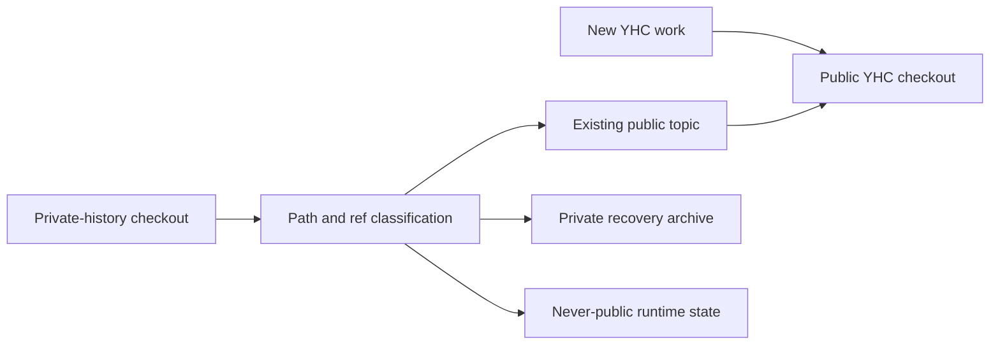

# Public YHC Canonical Cutover Design

**Status:** active-plan
**Last verified:** 2026-08-15
**Design direction:** approved 2026-08-15
**Written review:** pending
**Adoption:** `project-native`

> **Ownership:** local development-home cutover from the private-history
> checkout to the clean public YHC checkout, including task continuity,
> recovery inventory, exclusion rules, archive preconditions, and promotion
> evidence; product feature behavior remains owned by current architecture and
> each feature's accepted design

## Decision

The clean public `abietic/yhc` repository becomes the only home for new product
iterations. The private-history checkout remains unchanged as a recovery source
until every retained change, stash, dirty worktree, and active process has been
classified and preserved. It is archived only after that evidence passes.

This is an allowlisted content and workspace cutover, not a directory copy, Git
remote rewrite, or history merge. Private Git objects, refs, stashes, runtime
state, transcripts, artifacts, and ignored reference snapshots never enter the
public repository merely because they exist in the old checkout.

Desktop PR #14 is explicitly deferred. This cutover must not merge, close,
rebase, retarget, or delete that PR or its source branch. The public Auto
Permission branch may continue through a stacked Draft PR and independent
review, but it must not merge while its Desktop base remains unmerged.

## Reader Task And Freshness

A maintainer reading this specification must be able to decide:

- which checkout accepts new work;
- which existing task state remains usable during the transition;
- which private material is already represented by a public topic branch;
- which material is archive-only or forbidden from publication;
- what blocks the private checkout from being renamed; and
- which evidence proves that the cutover did not lose work or weaken the
  clean-history boundary.

Refresh the dated snapshot before any branch rewrite, project-entry change,
archive move, worktree cleanup, or remote operation. Update this design if the
public repository identity, private archive identity, Desktop deferral, Auto
Permission dependency, or no-history-transfer rule changes.

## Evidence Snapshot

The following observations are a 2026-08-15 snapshot, not permanent current
state:

| Surface | Observed state | Design consequence |
|---|---|---|
| Public default branch | `origin/master` contains the merged SBOM cleanup through `7ab5b619` | New independent work starts from this public ref or its verified successor. |
| Desktop | PR #14 is Draft, green, and headed by `f22d8c4` | Preserve it without merging or rewriting it in this cutover. |
| Auto Permission | Public branch `codex/feat/proof-bound-auto-bash` is headed by `4cd09bd` and stacked on Desktop | Review only its Desktop-to-Auto delta; do not treat all branch commits as independent Auto work. |
| Private P51.2 | The private implementation reached private `master` through PR #358 | Use the public forward-port; never replay the private history into YHC. |
| Codex project entry | The saved project still points at the private-history checkout | Add and verify the public project before retiring the old entry. |
| Local recovery state | The private checkout and several linked worktrees contain dirty paths and stashes | Inventory and archive them; never clean or overwrite them to make the cutover appear complete. |

The source-of-truth publication boundary is the historical
[`YHC public release design`](2026-08-09-yhc-public-release-design.md). Current
publication rules and reproducible checks are owned by
[`docs/publication/`](../../publication/README.md) and
[`quality/publication.yaml`](../../../quality/publication.yaml).

## Scope And Non-Goals

### In scope

- make the public checkout the default Codex project for future YHC work;
- retain existing task history and let already-started work reach an explicit
  terminal state without forcing a working-directory change;
- create a path-level and ref-level recovery manifest for private dirty state,
  stashes, branches, and worktrees;
- preserve already-forward-ported work through its public branch instead of
  replaying private commits;
- prepare an independently reviewable stacked Draft PR for Auto Permission when
  authentication and its existing verification evidence permit;
- record exact preconditions for renaming the private checkout into a private
  archive; and
- re-run the clean public publication boundary after the final public changes.

### Explicitly deferred or excluded

- merging, closing, rebasing, retargeting, or deleting Desktop PR #14;
- forcing the private Desktop branch and public Desktop branch to become
  file-for-file identical;
- merging Auto Permission while its accepted base remains unmerged;
- applying a stash or private branch wholesale to the public checkout;
- copying `.yhc/`, transcripts, WorkBoard state, credentials, ignored
  `.reference/` targets, build artifacts, or private operational output;
- publishing `PROJECT_GUIDE.md`, the local permission audit draft, or the local
  E2E harness rewrite without a separate source-backed review;
- migrating the private todo/workboard transcript-mode branch merely because it
  has no public counterpart; and
- deleting or pruning any branch, worktree, stash, archive, or task thread.

## Canonical Topology

The public and private repositories remain separate object stores and separate
workspace roles:



The old checkout's `origin` remains the private archive remote. Changing it to
the public remote would leave private objects reachable locally and create an
accidental-push path; it is therefore forbidden.

## Content Classification

Every retained private item receives exactly one decision before archive
promotion:

| Class | Action | Evidence |
|---|---|---|
| Already forward-ported | Keep the public topic as owner; retain private source only for audit | Public branch, observable-contract comparison, focused tests |
| Candidate public delta | Re-express on a fresh public branch after source, privacy, and behavior review | Path allowlist, provenance result, public-base tests |
| Private recovery material | Record status, ref, checksum, and recovery location; do not publish | Archive manifest and restore check |
| Never public | Keep only in private archive or user-owned runtime storage | Explicit exclusion and publication scan |
| Unresolved | Block archive completion and public promotion | Named owner and next decision |

The current decisions are:

- P51.2/Auto Permission: **already forward-ported** through the public
  `proof-bound-auto-bash` topic;
- Desktop/WebUI: **already forward-ported**, with a later bounded security and
  regression audit allowed to identify candidate public deltas;
- local permission-audit and E2E modifications: **private recovery material**
  until separately reviewed;
- `PROJECT_GUIDE.md`, local artifacts, stashes, and dirty worker trees:
  **private recovery material** by default;
- `.yhc/`, transcripts, credentials, private todo/workboard roots, private
  publication branches, and ignored reference snapshots: **never public**.

Blob or patch inequality does not by itself create migration scope. Current YHC
behavior, public production wiring, tests, and an accepted observable gap are
required before a private difference becomes a candidate public delta.

## Branch And Pull-Request Order

The cutover proceeds without merging Desktop:

1. Leave PR #14 and `codex/feat/desktop-workbench` unchanged and Draft.
2. Verify that `codex/feat/proof-bound-auto-bash` is exactly the Desktop tip plus
   the intended Auto Permission delta.
3. If repository authentication is available, open an explicitly stacked Draft
   PR whose base is the Desktop topic branch. Mark it blocked on PR #14 and do
   not merge it.
4. Continue independent cutover documentation, recovery inventory, and Codex
   project-entry work from current public `origin/master` on separate short-lived
   branches.
5. When the user later authorizes a Desktop decision, refresh the graph. If
   Desktop is squash-merged, rebuild Auto Permission from the new public
   `master`, rerun exact diff-bound evidence, and supersede or retarget the
   stacked Draft only after its review surface remains Auto-only.

No step cherry-picks a private SHA or adds the private repository as a public
remote.

## Task And Codex Project Continuity

Adding the public checkout as a saved Codex project happens before removing or
renaming the private entry. The transition obeys these rules:

1. Existing tasks keep their history and current working directory until their
   active turn completes.
2. A task already operating on a public topic may finish and report there even
   if its historical task metadata names the private project.
3. Every newly created YHC task uses the public saved project and a public
   worktree or checkout.
4. The private project entry remains visible as private history until the
   current migration task and every explicitly retained task are idle.
5. Before removing the private project entry, verify that the public project is
   discoverable and can create a disposable public worktree from its default
   branch without copying private state.
6. Resuming a historical private task after cutover requires an explicit
   public-project handoff; it must not silently recreate work in the archive.

The saved-project change does not prove Git migration. Git remotes, branches,
worktrees, publication evidence, and task state are verified independently.

## Recovery Manifest And Archive Promotion

The recovery manifest is stored outside the public repository and contains no
file bodies, prompts, transcripts, credentials, or secret-derived values. For
each retained item it records only the minimum recovery metadata:

- source checkout or worktree identifier;
- branch or detached HEAD;
- porcelain status and path class;
- stash identifier without stash contents;
- file size and checksum for allowlisted non-secret recovery files;
- process-CWD occupancy result;
- classification, owner, and restore disposition; and
- archive root and manifest checksum.

Checksums are omitted for credentials, transcripts, and other secret-bearing
runtime files; those paths are recorded only as excluded categories and counts.

The manifest uses a versioned machine-readable envelope rather than a prose
checklist. Schema version 1 contains `captured_at`, public and private refs,
archive mappings, and separate `worktrees`, `dirty_paths`, `stashes`,
`processes`, and `classifications` arrays.

Each record has a stable `record_id` derived from its kind, canonical source
identifier, and ref or stash identity.
The verifier rejects duplicate IDs, missing source inventory IDs, unknown
classifications, inconsistent aggregate counts, and a manifest checksum that
does not match the archived envelope. This is the exact-once rule behind the
inventory gate; a human count is not sufficient.

The private checkout may be renamed into its archive location only when all of
the following hold immediately before the move:

- no process has its CWD in the checkout or any linked worktree being moved;
- no process holds an open file descriptor beneath those roots, based on an
  exact-root `lsof` snapshot, and every associated Codex task is idle or
  explicitly handed off;
- every dirty path, stash, branch, worktree, and prunable registration appears
  exactly once in the manifest;
- every candidate public delta is either represented by a public branch or
  explicitly retained as unresolved private recovery material;
- the private remote still resolves only to the private archive repository;
- the public checkout and saved project are usable without the old path; and
- the archive destination is explicit, collision-free, and recoverable.

The manifest freezes an old-to-new path mapping for the main checkout and every
retained linked worktree. The move uses exact renames, preserving the main
checkout's Git common directory and every retained linked-worktree root. After
the move, run `git worktree repair PATH...` from the moved main checkout, where
each `PATH` is the manifest-recorded current location of a retained linked
worktree.

Then, for every retained worktree, compare `HEAD`, porcelain status,
branch or detached identity, and `git rev-parse --git-common-dir` with the
manifest; `git worktree list --porcelain -z` must enumerate the same record-ID
set.

If repair or any comparison fails, stop before changing the saved project or
declaring the archive usable. Reverse the exact path mapping, run `git worktree
repair` from the restored main checkout with the original linked-worktree
paths, and re-establish the pre-move inventory. Cleanup or pruning is a
separate, later authorization; an archive move does not imply deletion.

## Failure Semantics

- A dirty or unknown path is preserved and blocks destructive cleanup; it is
  never discarded to satisfy a count.
- A process whose CWD or open file descriptors resolve beneath a move target
  blocks the archive move. This gate does not claim to detect a dormant process
  that stores an old path without opening it; task handoff and saved-project
  retirement prevent ordinary future writes through that route.
- Missing or invalid GitHub authentication blocks PR creation or mutation; it
  does not justify bypassing review or changing remotes.
- A branch whose public delta cannot be isolated remains Draft and unmerged.
- A publication-policy, secret, provenance, license, or object-intersection
  finding blocks public promotion.
- Failure to verify the public Codex project leaves the old saved project and
  path in place.
- A mismatch between manifest counts, archive contents, refs, stashes, or
  worktree registrations stops the cutover and preserves both locations.

## Verification And Promotion Gates

### Specification and implementation changes

Each public-repository change follows
[`docs/contributing/verification.md`](../../contributing/verification.md):

```bash
make change-plan
make verify-focused
# commit the reviewed explicit paths
make verify-merge
make change-evidence-ready
```

Documentation-only changes also run `make docs-check` and `git diff --check`.
No clean result from a private worktree substitutes for public-tree evidence.

### Cutover acceptance

The cutover is accepted only when evidence separately establishes:

1. **Public Git:** new work and any retained feature delta exist on public
   topic branches based on a verified public ref; no private commits or refs
   were transferred.
2. **Publication:** `make verify-publication` passes on the clean committed
   public tree, a materialized no-`.git` tree passes
   `make verify-publication-tree`, and an anonymous clone exposes only the
   intended public graph and content.
3. **Task continuity:** retained tasks are idle or intentionally handed off,
   and their public outputs remain reachable.
4. **Codex routing:** the public saved project is discoverable and creates new
   work in the public repository; the private entry no longer accepts ordinary
   iteration.
5. **Recovery:** manifest counts and checksums match the archive, every stash
   and dirty worktree remains recoverable, all retained linked worktrees resolve
   the moved Git common directory, and the final preflight found no CWD or open
   file descriptor beneath a moved path.
6. **Remote boundary:** the public checkout points only to `abietic/yhc`; the
   archive points only to the private-history repository.
7. **Deferred work:** Desktop PR #14 remains Draft and unmerged unless a later
   explicit user decision changes that state.

Remote CI, live-provider checks, PTY evidence, Desktop physical acceptance, and
signed/notarized distribution evidence remain separate claims. This cutover
does not promote an ad-hoc Desktop package to a public release.

## Rollback

Before archive promotion, rollback is simply to keep both saved projects and
both checkout paths unchanged. Public topic branches are additive and the
private history remains authoritative for recovery.

After a successful archive rename, rollback moves the exact archived checkout
and its matching Git administrative data back to the manifest-recorded path,
but only after the same no-CWD, open-file, and collision preflight. It then runs
`git worktree repair` with every original linked-worktree path and compares the
restored record-ID set, refs, statuses, and common directory with the pre-move
manifest. No rollback rewrites the public Git graph or applies private stashes
to it.

If a stacked Auto Permission Draft proves invalid, close or supersede that Draft
without deleting its reviewed public branch. Desktop PR #14 remains unaffected.

## Related Owners

- [`YHC public release design`](2026-08-09-yhc-public-release-design.md): clean
  history, repository topology, identity compatibility, and original promotion
  boundary.
- [`Darwin sandbox and Auto Permission design`](2026-08-07-darwin-sandbox-auto-permission-design.md):
  Auto Permission behavior and safety contract, not repository cutover order.
- [`Publication guide`](../../publication/README.md): current public-tree
  classification and reproducible release checks.
- [`Verification guide`](../../contributing/verification.md): public diff-bound
  focused and committed-tree evidence.
- [`Project direction`](../../../PROJECT_DIRECTION.md): public YHC product scope
  and reference-adoption policy.
